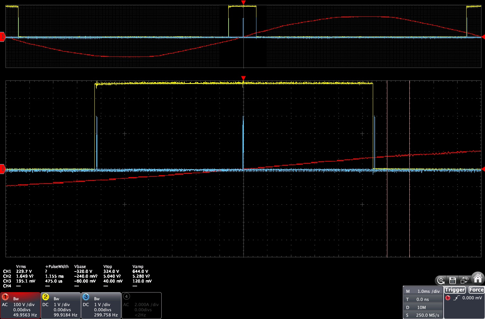
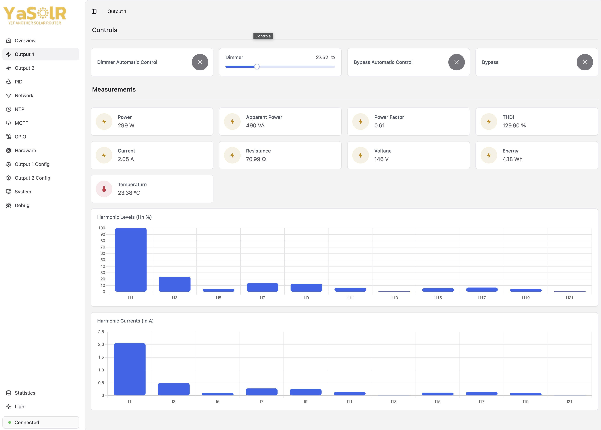
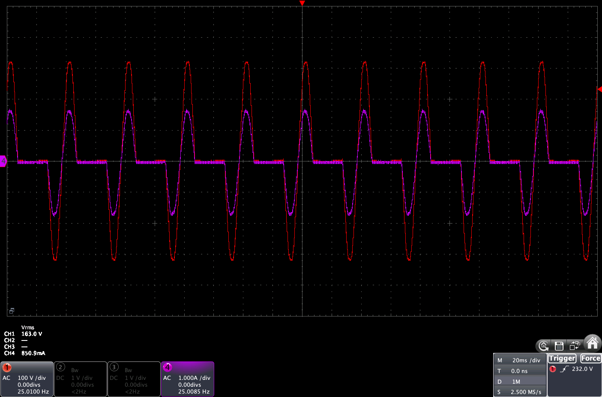
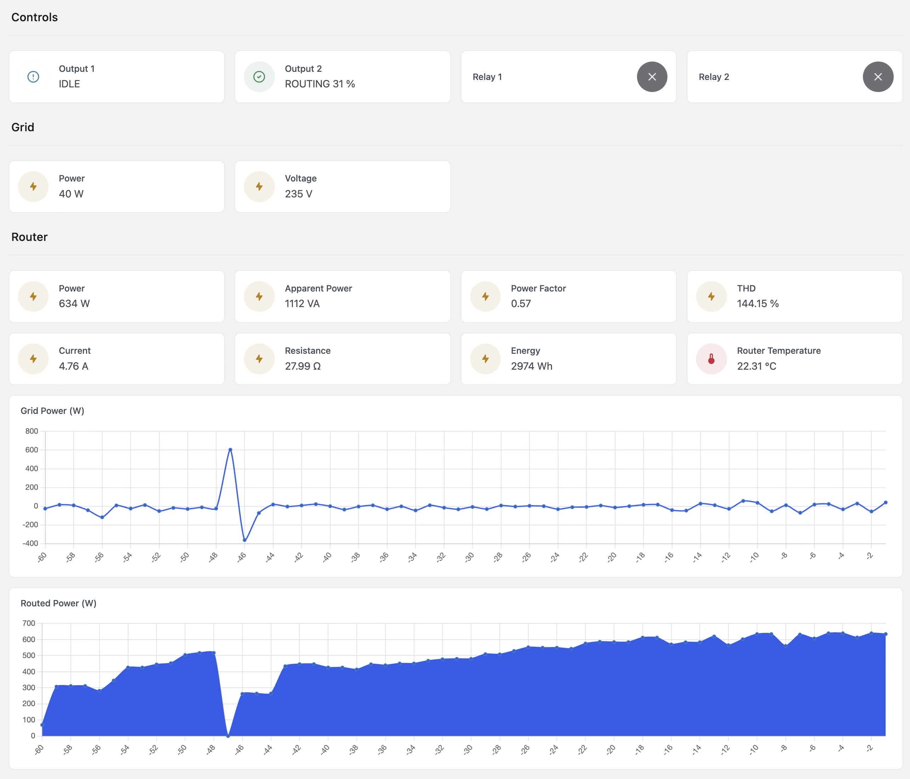
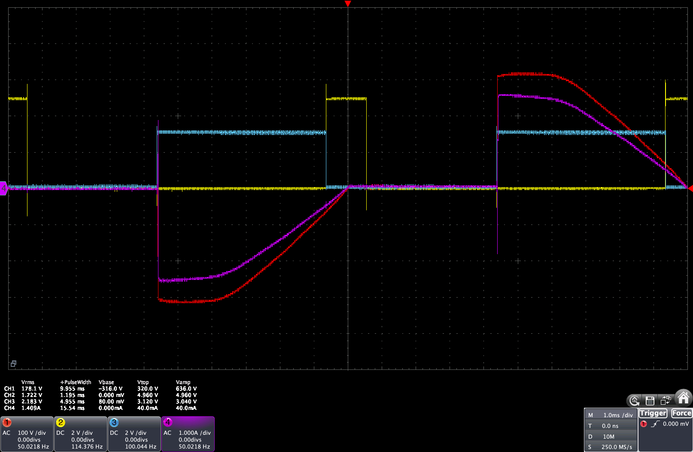
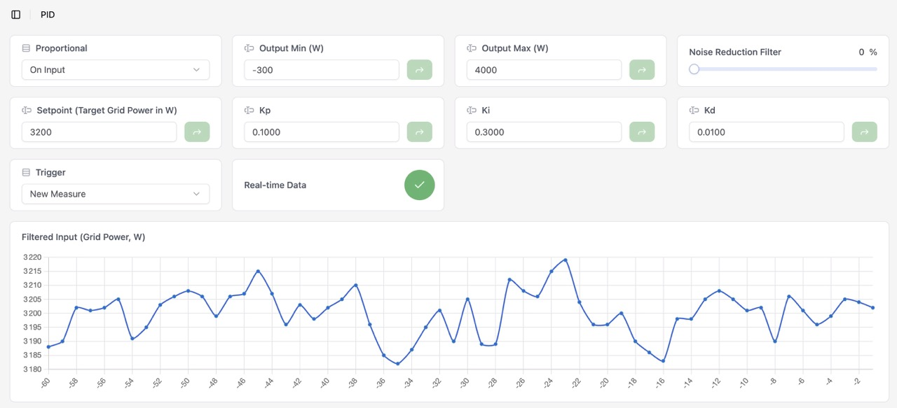
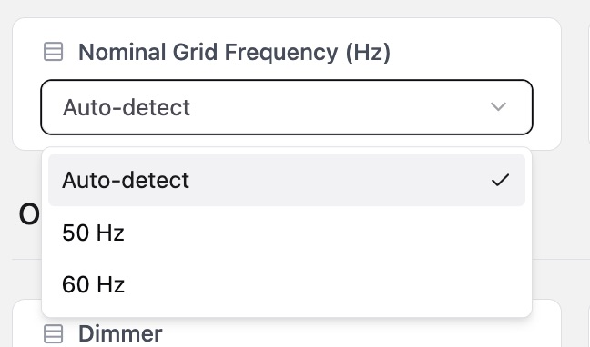
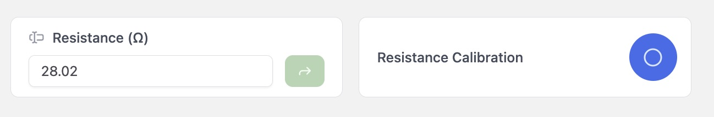
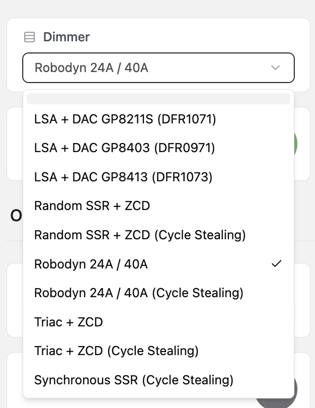

# YaSolR Benefits

YaSolR is the most efficient Open-Source Solar Router firmware available.
There is simply no match.

## About the author

YaSolR is developed by a professional software engineer with more than 20 years of experience in low level systems and concurrency.
As a highly skilled ESP32 / Arduino Core developer, Mathieu ([GitHub Profile](https://github.com/mathieucarbou)) has made countless ESP32 projects and written several blog articles related to ESP32 development.
He is specialized in solar routing / diversion and libraries around electricity and network management for ESP32 / Arduino.

In 2025, Mathieu was nominated twice as being one of the [top Arduino Library maintainer of the year](https://forum.arduino.cc/t/arduino-open-source-report-2025) ([PDF Report](https://mathieu.carbou.me/ArduinoOpenSourceReport2025.pdf)), both as individual and as part of the ESP32Async organization for the work done on the Async WebServer libraries.

Amongst them:

- [Beelance](https://beelance.carbou.me): Autonomous and remotely connected weight scale for beehives
- [Home Assistant Solar Router](https://yasolr.carbou.me/blog/2024-09-05_ha_diverter)
- [MycilaDataLogger](https://mathieu.carbou.me/MycilaDataLogger): ESP32 firmware to connect an ESP32 to an existing ESP32 to view the Serial logs including crashes and stack traces remotely through a web interface
- [MycilaDimmer](https://mathieu.carbou.me/MycilaDimmer): ESP32 / Arduino Library to control TRIAC, Random SSR, Voltage Regulator with DfRobot DAC or PWM
- [MycilaDS18](https://mathieu.carbou.me/MycilaDS18): ESP32 / Arduino Library for Dallas / Maxim Temperature Integrated Circuits
- [MycilaESPConnect](https://mathieu.carbou.me/MycilaESPConnect): Simple & Easy Network Manager with Captive Portal for ESP32 supporting Ethernet
- [MycilaHADiscovery](https://mathieu.carbou.me/MycilaHADiscovery): Simple and efficient Home Assistant Discovery library for Arduino / ESP32
- [MycilaJSY](https://mathieu.carbou.me/MycilaJSY): Arduino / ESP32 library for the JSY1031, JSY-MK-163, JSY-MK-193, JSY-MK-194, JSY-MK-227, JSY-MK-229, JSY-MK-333 families single-phase and three-phase AC bidirectional meters from Shenzhen Jiansiyan Technologies Co, Ltd.
- [MycilaJSYApp](https://mathieu.carbou.me/MycilaJSYApp): Arduino / ESP32 Web Application for JSY devices
- [MycilaMQTT](https://mathieu.carbou.me/MycilaMQTT): A simple and efficient MQTT/MQTTS client for Arduino / ESP32 based on Espressif API
- [MycilaPulseAnalyzer](https://mathieu.carbou.me/MycilaPulseAnalyzer): ESP32 / Arduino Library to analyze pulses from a Zero-Cross Detection circuit
- [MycilaPZEM](https://mathieu.carbou.me/MycilaPZEM): Arduino / ESP32 library for the PZEM-004T v3 and v4 Power and Energy monitor
- [MycilaSafeBoot](https://mathieu.carbou.me/MycilaSafeBoot): MycilaSafeBoot is a Web OTA recovery partition for ESP32 / Arduino allowing for a bigger application partition
- [MycilaShutterSpeedTester](https://mathieu.carbou.me/MycilaShutterSpeedTester): ESP32 firmware to measure camera shutter speeds
- [MycilaTaskManager](https://mathieu.carbou.me/MycilaTaskManager): Arduino / ESP32 Task Manager Library
- [MycilaUtilities](https://mathieu.carbou.me/MycilaUtilities): PID algorithm, utils stuff for Arduino / ESP32 like Time, String functions, CircularBuffer, etc
- [MycilaWebSerial](https://mathieu.carbou.me/MycilaWebSerial): WebSerial is a Serial Monitor for ESP32 that can be accessed remotely via a web browser
- [Shelly Pro Solar Router](https://yasolr.carbou.me/blog/2024-07-01_shelly_solar_diverter)
- [YaS☀️lR (Yet another Solar Router)](https://yasolr.carbou.me)
- and many more you will find on my ([GitHub Profile](https://github.com/mathieucarbou))...

I am also actively maintaining the well known Async WebServer libraries called ESPAsyncWebServer as part of [ESP32Async](https://github.com/ESP32Async) organization with the help of the Arduino Core and WLED leads:

- [AsyncTCP](https://github.com/ESP32Async/AsyncTCP): AsyncTCP is a library for ESP32 Arduino that facilitates the use of TCP connections in an asynchronous way
- [ESPAsyncWebServer](https://github.com/ESP32Async/ESPAsyncWebServer): WebSocket, SSE, Authentication, Arduino Json 7, File Upload, Static File serving, URL Rewrite, URL Redirect, etc

## Quality of development

YaSolR is built as a professional Open-Source project on GitHub: <https://github.com/mathieucarbou/YaSolR> and makes use of the best development practises in terms of project infrastructure and continuous integration.

YaSolR is not built with Arduino IDE and `*.ino` files: these are typically used by inexperienced programmers who want to quickly create a proof of concept.
Arduino IDE and `*.ino` files are not suitable for a serious project and cause a lot of issues that inexperienced programmers are unaware of.

If you see a big project developed with Arduino IDE and `*.ino` files, you can be sure that the code quality is poor and that the developer lacks experience, which will lead to a bad experience for you as a user and also in terms of project maintenance.

## Speed and reactivity

For a Solar Router to be efficient, the adjustment to the grid power must take place as fast as possible after the measurement arrives on the system.
This implies

- a fast measurement speed (the faster the better)
- a fast adjustment speed (the faster the better)

**YaSolR is the only router capable of taking about 20 measurements per second, processing them to adjust the power to the grid at least 3 times per second, and doing all of this with a very low latency.**

Other routers usually react each second or even every 2 seconds.

## Correct ISR Management

**YaSolR is the only Solar Router firmware built with a focus on correct ISR (Interrupt Service Routine) management**, ensuring that all critical operations are handled efficiently and without conflicts.

A Solar Router needs to trigger the SSR or TRIAC at a precise moment, on the order of microseconds.
To do that, some functions need to be placed in what we call IRAM (Instruction RAM) to be executed directly from RAM and not from flash memory, which is much slower, and to avoid being impacted by any flash operation.

Inexperienced developers simply annotate their ISR methods with `ARDUINO_ISR_ATTR` or `IRAM_ATTR` thinking they will be executed from RAM, but that alone is not sufficient.
A lot more work is required, and the correct approach is usually only known by experienced developers who understand how to properly manage ISRs and validate their behavior with an oscilloscope.

### How to test if your router is correctly handling ISR

- Connect an incandescent light bulb to the output of the router (ideally it would be an oscilloscope instead)
- Activate the routing and manually set the duty cycle to different levels (like 25%, then 50%)
- At the same time, do a constant refresh with caching disabled (in developer mode or with cmd+r) of the web interface to make the router serve the web files from flash at the same time it is routing
- The light must not flicker at all, or just barely. If it does, it means that the flash operations are interfering with the ISR execution with which are signs of a bad ISR management, which can lead to an inefficient routing.

## Phase Control Comparison

### 12-bits resolution with LUT table

**YaSolR is the only solar router firmware using a 12-bits resolution (0-4096) with a 200 values power LUT table** to precisely control at a Watt level a load of more than 4000W.
It also does interpolation within the LUT values to be even more precise.

Other routers usually rely on the RobotDyn library which only supports a 0–100 range with a very small and imprecise power LUT.

### Correct Zero-Cross Detection

**YaSolR is the only Solar Router firmware using an advanced library to analyze ZC pulses to remove any spurious effects and find the correct 0V crossing point**, which is crucial for the efficiency of a Solar Router.

Other routers simply trigger at the rising edge of the pulse, which can happen way before the actual 0V crossing point, leading to an inefficient routing.

YaSolR uses [MycilaPulseAnalyzer](https://mathieu.carbou.me/MycilaPulseAnalyzer) and [MycilaDimmer](https://mathieu.carbou.me/MycilaDimmer), the only 2 existing libraries correctly making use of this technic to find the right moment of the 0V crossing, as you can see here.
This allows a more precise routing for higher and lower duty cycle values.

#### How to test if your router is correctly reading the ZC pulses

- Connect an incandescent light bulb to the output of the router (ideally it would be an oscilloscope instead)
- Activate the routing and manually change the dimmer gradually from 0 to 100% and observe the light behavior
- The light should transition smoothly from 0 to 100% without any flickering or sudden changes in brightness. If you see flickering or sudden changes, it means that the router is not correctly analyzing the ZC pulses and is likely triggering at the wrong moment, which can lead to an inefficient routing.

### No Flickering with Phase Control

**YaSolR is the only Solar Router firmware that can guarantee no flickering on the load when the routing is active**, which is a common issue with other routers that can cause power spikes and inefficient dimming.

Thanks to [MycilaPulseAnalyzer](https://mathieu.carbou.me/MycilaPulseAnalyzer) and [MycilaDimmer](https://mathieu.carbou.me/MycilaDimmer), when used with a good ZCD module, YaSolR will produce a stable power output with no flickering.

### Harmonics Analysis and Control

**YaSolR is the only solar router firmware including mechanisms to help you visualize and lower harmonics to comply with regulations**.

## Cycle Stealing Comparison

Most routers out there are using a window system, divided in slots, to determine if a cycle has to be on or off.
This window system causes a slowdown and lack or reactivity of the router, and is not precise because each slot is mapped to a quantity of power.
So these routers usually oscillate around the setpoint (0 W) and have a very low accuracy.

Some routers working on half cycle are also creating DC imbalance on the grid which is forbidden.

I didn't want such bad implementation on YaSolR (often called burst fire or wave control, "train d'onde" or "multi-sinus").
They can also cause some voltage flickering.

I wanted something that reacts fast on duty cycle changes (so no window system), that is not creating DC imbalance on the grid and also has no flickering.

**YaSolR is the only Open-Source solar router firmware supporting Cycle Stealing**, implemented with a **First-Order Delta-Sigma Modulator (Bresenham's algorithm)** to optimally distribute ON/OFF half-cycles.
Crucially, it enforces **DC balance**: for every positive half-cycle consumed, a matching negative half-cycle is also consumed, preventing DC offset on the grid which could saturate transformers or trip breakers.
And also, it is designed to be highly reactive and not window-based, so that it can react to duty cycle changes very fast.

Here is an example of the effect of Cycle Stealing on the voltage and current for a 50% duty cycle, you can see that the voltage is stable and there is no flickering, and that the current is also stable and at the right level.

Here is a screenshot of the YaSolR web interface showing the effect of Cycle Stealing on the grid power, to show you how good the reactivity and precision of the routing is with Cycle Stealing.

## Oscilloscope Tested

**YasolR is the only Solar Router firmware extensively tested with a 4-channel isolated oscilloscope to ensure that the triggering of the SSR or TRIAC is done at the right moment and with the right timing**.

YaSolR is built on proven libraries for the dimmer control:

- [MycilaPulseAnalyzer](https://mathieu.carbou.me/MycilaPulseAnalyzer): ESP32 / Arduino Library to analyze pulses from a Zero-Cross Detection circuit
- [MycilaDimmer](https://mathieu.carbou.me/MycilaDimmer): ESP32 / Arduino Library to control TRIAC, Random SSR, Voltage Regulator with DfRobot DAC or PWM |

These libraries are the result of years of development and testing with an oscilloscope to ensure that the triggering is done at the right moment and with the right timing, which is crucial for the efficiency of a Solar Router.

## PID algorithm with filtering

**YaSolR is the only solar router firmware using a PID algorithm with filtering** to control the routing, that you can tune with a live view and supports many options to decide how the PID triggers and which PID algorithm to use.

Other solar routers usually don't provide a PID system or tuning view with as many options as YaSolR.

## 50 / 60 Hz Frequency Support

**YaSolR is the only solar router firmware supporting both 50 Hz and 60 Hz frequencies, with frequency auto-detection**.

Other solar routers usually only support 50 Hz, which can be a problem for users in 60 Hz countries.

## Resistance Calibration

**YaSolR offers a resistance calibration feature** to calibrate the resistance of the load, which is required to have a precise control at a Watt level.

## Huge Hardware Support

**YaSolR is part of the rare routers to support big voltage regulators with DAC control**, which are more efficient and generate less heat than SSRs, and are becoming more popular in the Solar Router community.

**YaSolR supports a wide range of hardware**, making it compatible with most existing Solar Router builds.

This includes:

- **ESP32 boards**: ESP32-DevKitC, ESP32-S3-DevKitC-1, Olimex ESP32-GATEWAY, Olimex ESP32-POE, T-ETH-Lite ESP32 S3, Waveshare ESP32-S3 ETH, WT32-ETH01, and many more
- **Ethernet**: Multiple boards with native Ethernet support for a more reliable and stable connection
- **Dimmers**: Random SSR (Phase Control & Cycle Stealing), Synchronous SSR (Cycle Stealing), RobotDyn 24A/40A, Voltage Regulators with DAC
- **Grid measurement devices**: JSY-MK-163/193/194/227/229/333, PZEM-004T v3/v4, Shelly EM, MQTT, Victron Modbus TCP
- **Temperature sensors**: DS18B20 (Dallas 1-Wire)
- **Displays**: SSD1306, SH1106, SH1107 I2C OLED
- **ZCD sources**: Dedicated ZCD modules (Daniel S.), RobotDyn built-in ZCD, JSY-MK-194G integrated ZCD, BM1Z102FJ IC

Other routers are usually tied to a specific hardware combination and require significant modifications to support different components.

## Ethernet Support

**YaSolR is one of the few Solar Router firmwares supporting Ethernet**, providing a more reliable and stable network connection than Wi-Fi alone.

Ethernet is especially useful in environments where Wi-Fi signal is weak or unstable, and it eliminates any risk of disconnection during critical routing operations.

## MQTT, REST API and Home Assistant Integration

**YaSolR provides first-class support for MQTT, a REST API and Home Assistant** auto-discovery, making it easy to integrate the router into any home automation system.

Other routers usually offer limited or no support for these integrations, requiring manual configuration or additional middleware.

## Remote JSY Support

**YaSolR supports remote JSY meters** through [MycilaJSYApp](https://mathieu.carbou.me/MycilaJSYApp), allowing the measurement device to be placed far from the ESP32 board and connected over the network.

This is particularly useful when the electrical panel is in a different room or when the router needs to be close to the load.

## EV Charging Station Compatibility

**YaSolR is designed to be compatible with EV charging stations**, allowing users having an EV Box capable of charging over the solar excess power to still do it and set some sort of priority over routing.

The power sharing can be done through MQTT or REST API.

## Compatible with multiple Solar Router installations

**YaSolR is designed to be compatible with multiple Solar Router installations in the same home**, allowing users to manage multiple loads and optimize their self-consumption across different circuits.

The power sharing between routers is done through MQTT.

## Output Sharing

YaSolR supports many mechanism to share the output power between multiple outputs, including:

- limiting the dimmer level (%) - [ref](manual.md#dimmer-configuration)
- limiting the output based on a temperature sensor - [ref](manual.md#dimmer-configuration)
- limiting the output power (W) - [ref](manual.md#excess-configuration)
- sharing the power between outputs with a configurable ratio - [ref](manual.md#excess-configuration)
- automatic relay triggering - [ref](manual.md#relay-automatic-control)
- virtual excess power (used with a second router) - [ref](manual.md#ev-charging-box-compatibility-with-virtual-grid-power)
