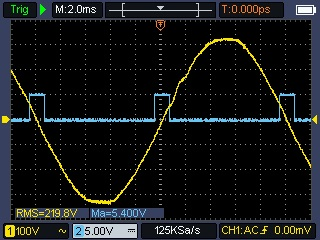
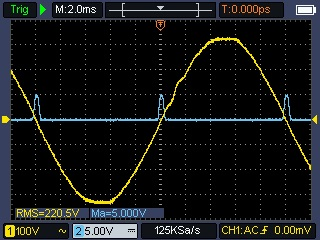
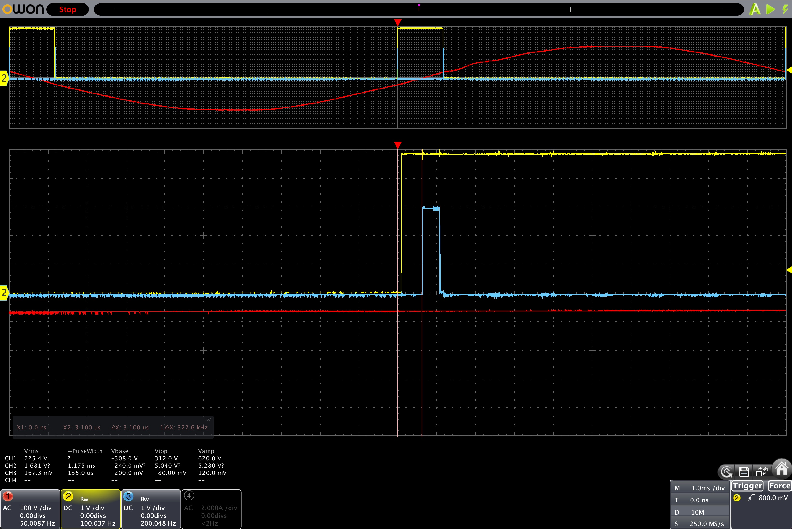

_Date: 2024-07-31_

# Zero-Cross Pulse Detection

This article is a follow-up of the previous one: [The Importance of a good ZCD circuit](2024-07-24_the_importance_of_a_good_zcd_circuit).

As a reminder of the [overview page](../overview#zero-cross-detection-zcd), here is an oscilloscope view of the pulses from a dedicated ZCD module and the Robodyn:

|                                     **Dedicated ZCD circuit**                                      |                                              **Robodyn ZCD circuit**                                               |
| :------------------------------------------------------------------------------------------------: | :----------------------------------------------------------------------------------------------------------------: |
| [](../assets/img/measurements/Oscillo_ZCD.jpeg) | [](../assets/img/measurements/Oscillo_ZCD_Robodyn.jpeg) |

Robodyn has a very low quality pulse with a large rise time, and as such, it can create noise and false positives when detected by a MCU.

Let's consider the following code executed each time the ESP32 would detect an edge. The code will output a 3.3V pulse on the GPIO `_pinOutput` for 1µs when the pulse is detected.

```cpp
void IRAM_ATTR simulateISR() {
  digitalWrite(_pinOutput, HIGH);
  delayMicroseconds(1);
  digitalWrite(_pinOutput, LOW);
}
```

Here is the oscilloscope view of the output pulse from a dedicated ZC module:

[](../assets/img/measurements/Oscillo_zc_isr_output_delay.jpeg)

- In yellow: the ZCD pulse
- In blue: the output pulse, triggered once the ZC pulse is detected

We can see that there is a 3us delay for the ESP32 to detect the rise, trigger the interrupt and output the voltage.

Now, look at what is happening with a low quality ZC pulse:

[](../assets/img/measurements/Oscillo_zc_robodyn_isr_output_delay.jpeg)

The slow rise causes the ESP to detect a sequence of several ZC pulses until the ZC pulse voltage is high enough.

And this sequence of 5 more false positive detections is happening twice per ZC pulse: at the rising edge and at the falling edge.

Hopefully this is possible to account for that in software, but this is not the best solution because software interrupt can be delayed, or subject to bugs.

The effect is that a badly detected ZC pulse will cause a misfiring of the TRIAC (wrong time and wrong duration), which will cause "power flickering": too much power consumed or at the opposite too little.

## Zero-Cross Pulse Analysis

I've made a little Arduino library called [MycilaPulseAnalyzer](https://github.com/mathieucarbou/MycilaPulseAnalyzer) to analyze the ZC pulse quality.

This library will output the period (min, max, avg) and pulse length (min, max, avg) of the ZC pulse.
