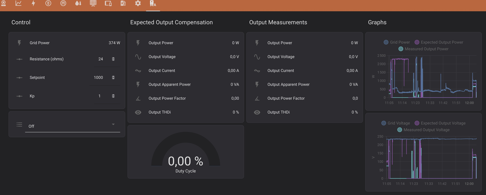
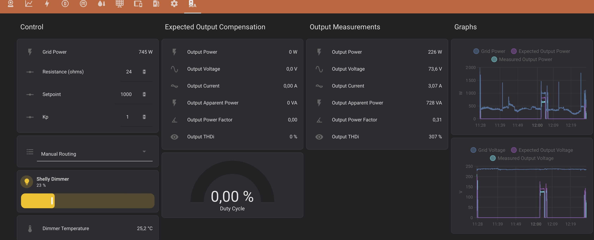

_Date: 2024-09-05_

_I've put the YaSolR project in pause for a few days to work on this very cool and awesome Home Assistant / Shelly integration..._

# Home Assistant Diverter / Router

|  |  |

- [What is a Solar Router / Diverter ?](#what-is-a-solar-router--diverter-)
- [Home Assistant Solar Diverter Features](#home-assistant-solar-diverter-features)
- [Download](#download)
- [Hardware](#hardware)
- [Wiring](#wiring)
- [Screenshots](#screenshots)
- [Help and Support](#help-and-support)

## What is a Solar Router / Diverter ?

A _Solar Router_ allows to redirect the solar production excess to some appliances instead of returning it to the grid.
The particularity of a solar router is that it will dim the voltage and power sent to the appliance in order to match the excess production, in contrary to a simple relay that would just switch on/off the appliance without controlling its power.

A _Solar Router_ is usually connected to the resistance of a water tank and will heat the water when there is production excess.

A solar router can also do more things, like controlling (on/off) the activation of other appliances (with the grid normal voltage and not the dimmed voltage) in case the excess reaches a threshold. For example, one could activate a pump, pool heater, etc if the excess goes above a specific amount, so that this appliance gets the priority over heating the water tank.

A router can also schedule some forced heating of the water tank to ensure the water reaches a safe temperature, and consequently bypass the dimmed voltage. This is called a bypass relay.

## Home Assistant Solar Diverter Features

- **Home Assistant Integration**
- **PID Controller**
- **Routing Modes** (`OFF` / `Automatic` / `Manual`)

It is possible to further enhance with temperature sensor, relays, etc, all managed from Home Assistant.

## Download

Download, doc and screenshots are at:

- **[Home Assistant Solar Router](https://gist.github.com/mathieucarbou/f9215b311a9018623c1579ab5c2cad7a)**

## Hardware

All the components can be bought at [https://www.shelly.com/](https://www.shelly.com/), except the voltage regulator, where you can find some links [on my website](../build#voltage-regulators)

| [Shelly Dimmer 0/1-10V PM Gen3](https://www.shelly.com/products/shelly-0-1-10v-dimmer-pm-gen3) | [Shelly Plus Add-On](https://www.shelly.com/fr/products/shop/shelly-plus-add-on) | [Temperature Sensor DS18B20](https://www.shelly.com/fr/products/shop/temperature-sensor-ds18B20) | Voltage Regulator - [Loncont LSA-H3P50YB](https://fr.aliexpress.com/item/32606780994.html) - [LCTC DTY-220V40P1](https://fr.aliexpress.com/item/1005005008018888.html) |
| :-----------------------------------------------------------------------------------: | :------------------------------------------------------------------------------: | :----------------------------------------------------------------------------------------------: | :--------------------------------------------------------------------------------------------------------------------------------------------------------------------------: |
|                                     |                                     |                                                      |                                                           |

Some additional hardware are required depending on the installation.
**Please select the amperage according to your needs.**

- A 2A breaker for the Shelly electric circuit
- A 16A or 20A breaker for your water tank (resistance) electric circuit
- A 25A relay or contactor for the bypass relay (to force a heating) for the water tank electric circuit
- A protection box for the Shelly

See also [YaSolR Build page](https://yasolr.carbou.me/build#voltage-regulators) for some references and heat sinks.

## Wiring

The wiring is quite simple and can be done by anyone with some basic knowledge of electricity.

It is the same as for the [Shelly Solar Diverter](2024-07-01_shelly_solar_diverter.md).

## Screenshots

**Mode OFF**

**Mode AUTOMATIC**

**Mode MANUAL**

**Example when running with a setpoint of 1000 W**

## Help and Support

- [Forum photovoltaïque](https://forum-photovoltaique.fr/viewtopic.php?t=72838)
- [Discussions](https://gist.github.com/mathieucarbou/f9215b311a9018623c1579ab5c2cad7a) (on Gist)
- [Issues](https://gist.github.com/mathieucarbou/f9215b311a9018623c1579ab5c2cad7a) (on Gist)
