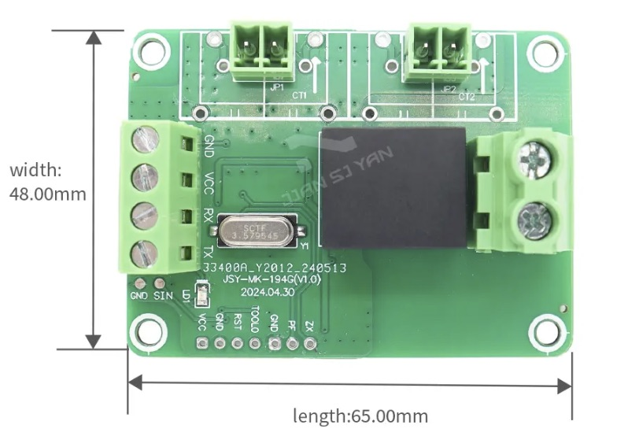
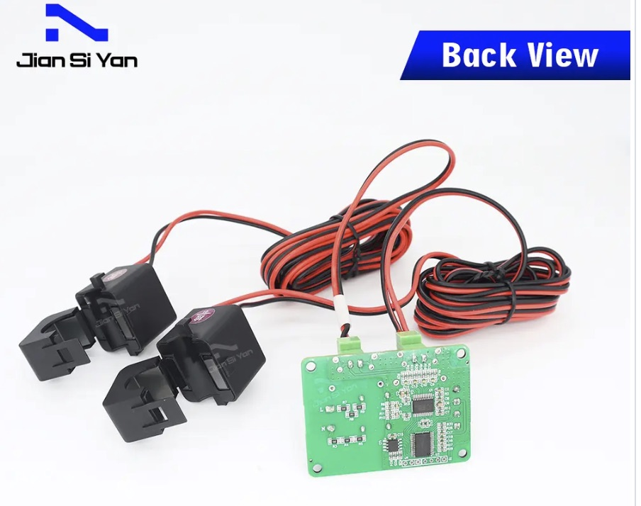
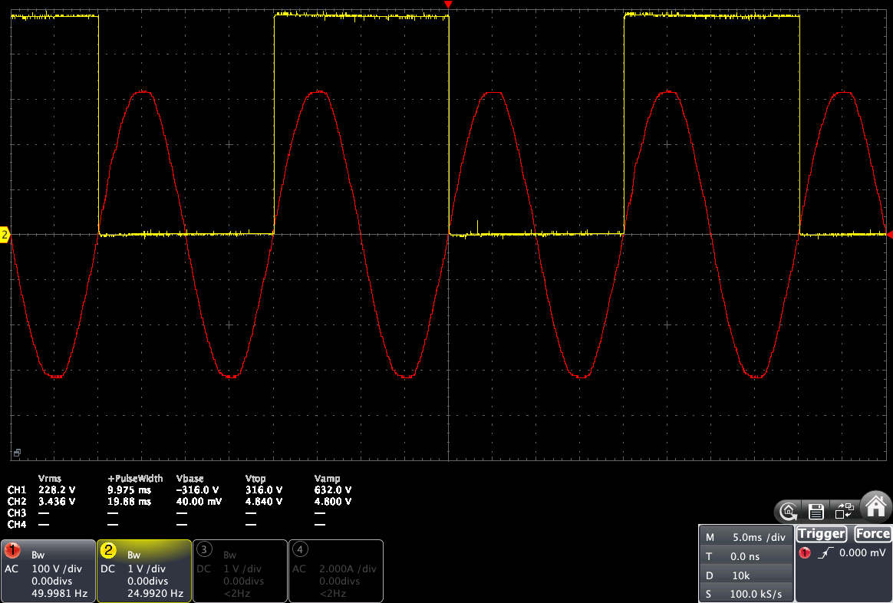
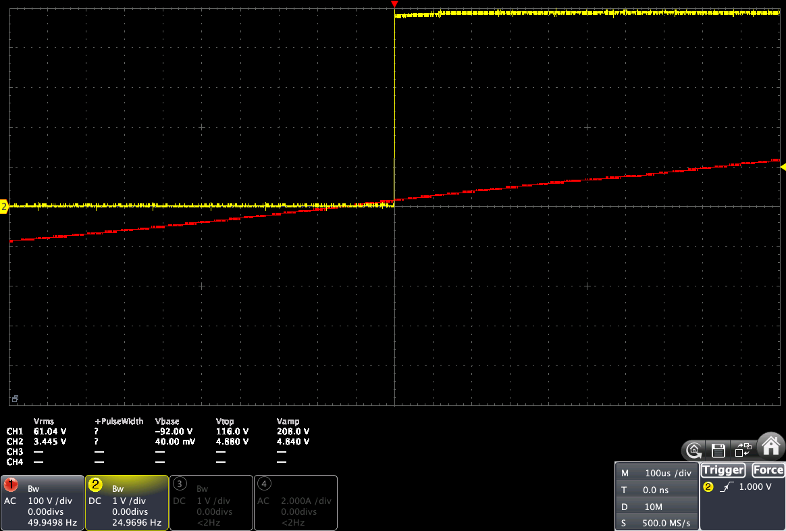

_Date: 2024-11-07_

# JSY-MK-194G

The [JSY-MK-194G](https://www.jsypowermeter.com/jsy-mk-194g-ac-single-phase-bidirectional-power-energy-meter-module-with-2-split-core-cts-product/) from [Shenzhen Jiansiyan Technologies Co, Ltd.](https://www.jsypowermeter.com) is an update of the JSY-MK-194T.

|  |  |

- The board connectors are improved, especially for the AC side
- The back of the board is now covered with an isolation layer
- Some new pins are now available on the board, the most interesting one being the Zx pin.

This JSY version is totally compatible with the previous one and is supported by the [MycilaJSY](https://github.com/mathieucarbou/MycilaJSY) library, which supports and automatically discovers these JSY models:

- JSY-MK-163T
- JSY-MK-194T
- JSY-MK-194G
- JSY-MK-333

## Zx pin (Zero-Cross)

The JSY is still using the [RENERGY RN8209G](https://mathieu.carbou.me/MycilaJSY/RENERGY-RN8209G.pdf) chip.

The Zx pin exposes the zero-cross signal of Renergy RN8209G.

When the JSY is powered by +5V, the Zx pin will output a 5V square pulse with a pulse width of 20 ms for 50 Hz and with a rising edge synchronized with the zero-cross of the grid.

## Applications of the Zero-Cross pin

Having a Zero-Cross capability on the JSY is very interesting for many applications like Solar routers.
They usually rely on poorly made devices such as RobotDyn which contains a TRIAC coupled wth a bad ZCD circuit.
To replace such device with a more reliable Random SSR, one would need to add the missing piece: a Zero-Cross Detection circuit.

Now that the JSY has one, it is possible to build a Solar routeur using a precise phase control with only a JSY-MK-194G and a Random SSR.

For that to work, the logic to triggering the SSR should happen before the voltage passes the zero point, which is usually what is happening in a normal ZCD circuit.

Example with the RobotDyn: its pulse is centered around zero, so the event is triggered before the zero is crossed, so that the micro-controller has the time to react and set the command for the next semi-period.

But in the case of the JSY-MK-194G, rising edge happens exactly at the zero-cross.
So the difference is that:

- either the micro-controller uss this signal to react at the next period (and loose 20 ms)
- or the micro-controller will have to maintain a timer responsible to trigger the ZC event and then sync this timer with the ZC signal.

We can see below with a 100 us / div timebase that the rising edge of the JSY-MK-194G Zx pulse is at the zero-cross positive point (shifted around 100 us on the right).
So the micro-controller will have to trigger the ZC event at the zero-cross negative point, and shift the timer to the left by ~ 200 us.

Hopefully, for you I have made a library, [MycilaPulseAnalyzer](https://github.com/mathieucarbou/MycilaPulseAnalyzer), which is capable of analyzing Zero-Cross pulses and this library is meant to detect automatically different kind of pulses:

- Standard ZCD circuits like the one on the RobotDyn or the [ZCD module from Daniel S.](https://www.pcbway.com/project/shareproject/Zero_Cross_Detector_a707a878.html)
- ZCD circuits based on the BM1Z102FJ chip like the [ZCD module from Rajkumar S](https://www.electronics-lab.com/project/ac-voltage-zero-cross-detector/)

And soon this library will be able to detect the Zx pulse from the JSY-MK-194G, and automatically sync the Zero-Cross interrupts.
