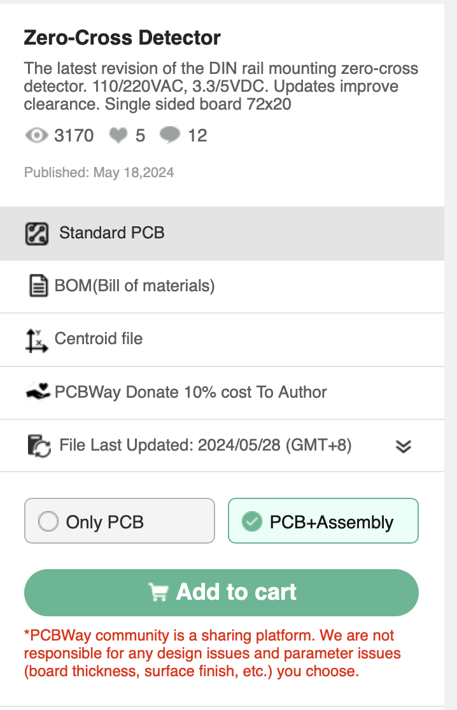
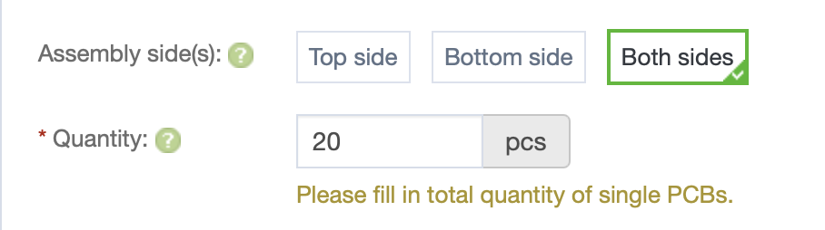
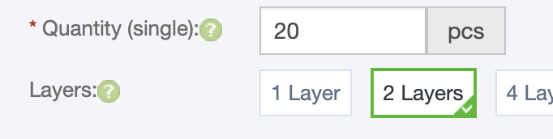
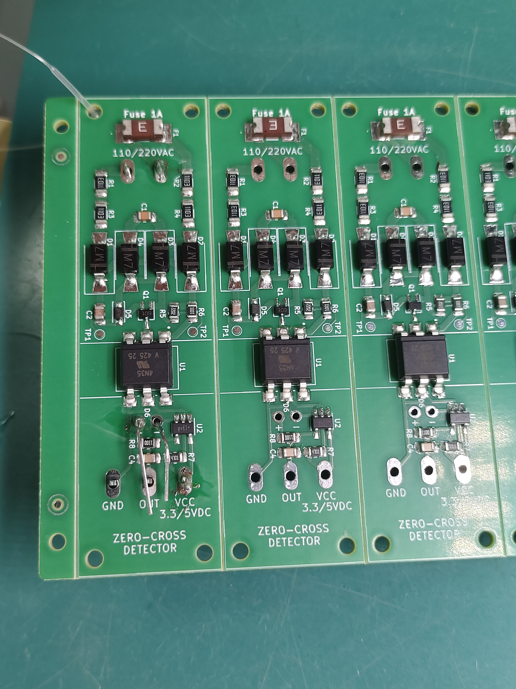
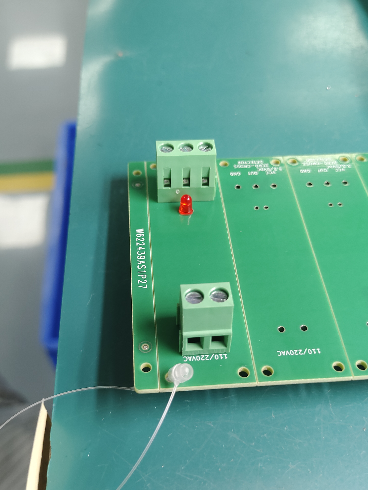
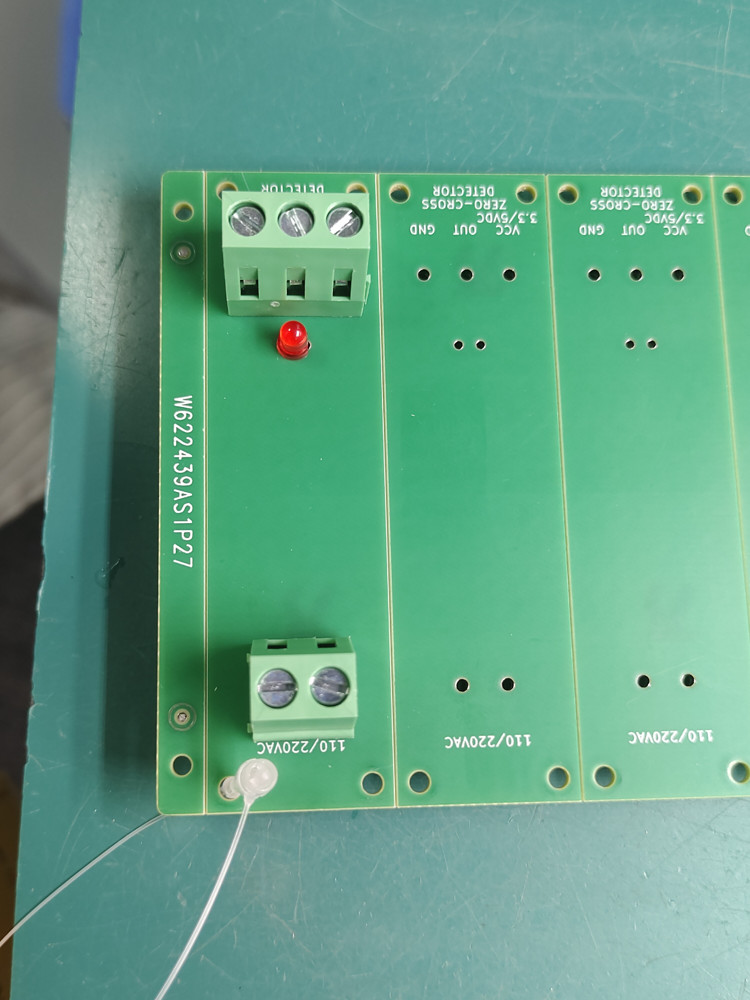

_Date: 2026-05-06_

# PCBWay Zero-Cross Detector module

This blog article explains how to get a batch of Zero-Cross Detector modules from [PCBWay](https://www.pcbway.com).

The ZCD module is a community shared project hosted by PCBWay here: [https://www.pcbway.com/project/shareproject/Zero_Cross_Detector_a707a878.html](https://www.pcbway.com/project/shareproject/Zero_Cross_Detector_a707a878.html)

Each time you buy a module, you support the project and its development.
The author receives a small commission from the sales.

**I strongly advise to use PCBWay service: it worked well for me since years and the process with the community project is easy and all integrated.**
Several shipping options are also available to not have to dealy with csutom duties and taxes and integrate them as part of the order.

1. Go to the project page and click on the "Add to cart" button to order your ZCD module. Do not forget to select Assembly service if you need to.
2. Select the quantity of boards to create and asemble (there are 2 places). I suggest no less than 20 to get a better price per board.

| | | |
|---|---|---|
| [](./zcd/step1.png) | [](./zcd/step2.png) | [](./zcd/step3.png) |

Then confirm, select the shipping options and add to your cart.

To simplify the process, you can send them a message asking them to replicate using my order of 20 boards assembled:

```
G1492544
 - Board: Product No.: W622439AS1P25
 - Assembly: T-1P26W622439A
```

The order will go through a review process and PCBWay will ask you to confirm a quoted BOM with all the prices of the components and assembly if selected.

[Quoted BOM example](./Quoted_BOM.xls)

Then they will proceed and ask you to confirm the pictures of the assembled result:

| | | |
|---|---|---|
| [](./zcd/1.jpg) | [](./zcd/2.jpg) | [](./zcd/3.jpg) |

Here are below some reference files of the project:

- [BOM (not quoted)](./zcd/zerocross_2024_BOM.xls)
- [Gerber files](./zcd/zerocross_2024-gerber16.zip)
- [Centroid files](./zcd/zerocross_2024-pos16.zip)

And if you need a DIN Rail enclosure for the ZCD module:

- [UPM-01 DIN Rail Mount for PCB 72mm x 20mm](https://aliexpress.com/item/4000272944733.html)
