# How to Build Your Router

Here is below some build examples to give you an idea of the different options and components you can use to build your router.
Depending on the components you choose, you will be able to use different routing algorithms (phase control, cycle stealing) and have different precision and performance.

All these builds can be [upgraded](#to-upgrade-your-router) further with more components.

If you are using the APPER board, you can [migrate from APPER to YaSolR](#migration-from-apper-to-yasolr) quite easily.

You can also set up a [Remote JSY](#remote-jsy-with-mycila-jsy-app) with [Mycila JSY App](http://mathieu.carbou.me/MycilaJSYApp/) to send the grid data remotely to one or several YaSolR routers.

And if you do not like YaSolR, here are some other solar router alternatives I made:

- [Shelly Solar Diverter](./blog/2024-07-01_shelly_solar_diverter)
- [Home Assistant Solar Diverter](./blog/2024-09-05_ha_diverter.md)

## Build Examples

- [The Recycler](#the-recycler): reuse your existing Shelly EM or Shelly 3EM to build a router
- [The Minimalist](#the-minimalist): the cheapest and easiest to build
- [The Elegant](#the-elegant): an improved version of the Minimalist using a random SSR and the new JSY-MK-194G with an integrated ZCD
- [The Elite](#the-elite): for people who want the flexibility to use phase control and cycle stealing, with high precision using a dedicated hardware ZCD and a random SSR
- [The Professional](#the-professional): probably the best and safest solution out there with minimal moving pieces

### The Recycler

Reuse your existing Shelly EM or Shelly 3EM to build a router with:

- Standard Synchronous SSR: used for dimming (**cycle stealing only**)
- Shelly EM or MQTT is used to measure the grid power and voltage

|                                  ESP32                                   |                       Standard Synchronous SSR                        |                          Shelly EM or 3EM                           |
| :----------------------------------------------------------------------: | :-------------------------------------------------------------------: | :-----------------------------------------------------------------: |
|  |  |  |

> ##### WARNING
>
> - Supports **Cycle Stealing** only (not Phase Control)
> - Not as precise as a JSY (MQTT delays)
> - Not as precise as using Phase Control
>
{: .block-warning }

### The Minimalist

The _Minimalist_ build uses inexpensive and easy to use components to start a router.

- Standard Synchronous SSR: used for dimming (**cycle stealing only**)
- Grid (and output ?) measurement done with a JSY (local or remote)

|                                  ESP32                                   |                       Standard Synchronous SSR                        |                                   JSY                                    |
| :----------------------------------------------------------------------: | :-------------------------------------------------------------------: | :----------------------------------------------------------------------: |
|  |  | 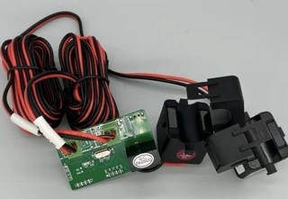 |

> ##### WARNING
>
> - Supports **Cycle Stealing** only (not Phase Control)
> - Not as precise as using Phase Control
>
{: .block-warning }

### The Elegant

This is an improved version of the _Minimalist_ build using the new JSY-MK-194G which has an integrated ZCD and a random SSR.

- A Random SSR is used for the dimming (using **phase control** or **cycle stealing**)
- JSY-MK-194G is used both for the Zero-Cross Detection, and to measure the grid power and voltage and the router output

|                                  ESP32                                   |                              Random SSR                               |                               JSY-MK-194G                                |
| :----------------------------------------------------------------------: | :-------------------------------------------------------------------: | :----------------------------------------------------------------------: |
|  |  |  |

> ##### TIP
>
> - The **JSY-MK-194G has an integrated ZCD** and can be used with a Random SSR directly without the need of an external ZCD module.
> - Supports **Phase Control** and **Cycle Stealing**
>
{: .block-tip }

> ##### WARNING
>
> The JSY-MK-194G Zero-Cross Detection circuit is software-based and not as good as a dedicated hardware ZCD, so it can be less precise and will produce more power flickering (like RobotDyn dimmers).
{: .block-warning }

### The Elite

The _Elite_ build is for people who want the flexibility to use phase control and cycle stealing, with high precision using a dedicated hardware ZCD and a random SSR.

- A Random SSR is used for the dimming (using **phase control** or **cycle stealing**)
- A dedicated hardware ZCD circuit is used for the Zero-Cross Detection
- JSY-MK-194G is used both for the Zero-Cross Detection, and to measure the grid power and voltage and the router output

|                                  ESP32                                   |                              Random SSR                               |                           ZCD Module                           | JSY                                                                      |
| :----------------------------------------------------------------------: | :-------------------------------------------------------------------: | :------------------------------------------------------------: | ------------------------------------------------------------------------ |
|  |  |  |  |

> ##### TIP
>
> - Supports **Phase Control** and **Cycle Stealing**
> - The dedicated hardware ZCD will be more precise and produce less power flickering than the software-based ZCD of the JSY-MK-194G or RobotDyn dimmers.
>
{: .block-tip }

### The Professional

The _Professional_ build uses a Voltage Regulator to control the power routing.
This is probably the most reliable and efficient solution, but it is more complex to set up and wire.
Voltage regulators like the LSA or LCTC have an integrated hardware based ZCD circuit to trigger at the right time based on the input voltage control.

The big advantage of a DFRobot DAC module is that it allows to control a LSA directly through the ESP32 and without the need of a ZCD module.

- A voltage regulator (LSA or LCTC) is used for the dimming (**phase control only**)
- A [DFRobot DAC](https://www.dfrobot.com/blog-13458.html) is used to control the voltage regulator: DFR0971 (GP8403), DFR1073 (GP8413), DFR1071 (GP8211S)
- Grid (and output ?) measurement done with a JSY (local or remote)

|                                  ESP32                                   |                           Voltage Regulator                            |                            DFRobot DAC                            | JSY                                                                      |
| :----------------------------------------------------------------------: | :--------------------------------------------------------------------: | :---------------------------------------------------------------: | ------------------------------------------------------------------------ |
|  |  | 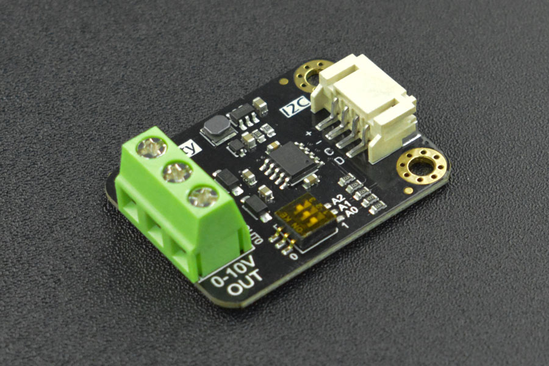 |  |

> ##### TIP
>
> - No ZCD circuit required
> - Precise phase control dimming
>
{: .block-tip }

> ##### WARNING
>
> - More complex to setup
> - A remapping / calibration might be required to find the right values to control the voltage regulator with the DFRobot DAC
> - Cannot use cycle stealing algorithm, only phase control
>
{: .block-warning }

## Hardware Selection

### Supported ESP32 Boards

Here are the boards for which firmwares can be downloaded.
If yours is not listed, just ask: it may be possible to add it.

| **Board**                                                                                                                                                  | **UARTs** | **Ethernet** |
| :--------------------------------------------------------------------------------------------------------------------------------------------------------- | :-------: | :----------: |
| [Denky D4](https://github.com/hallard/Denky-D4)                                                                                                            |     2     |              |
| [ESP-32S](https://www.es.co.th/Schemetic/PDF/ESP32.PDF)                                                                                                    |     1     |              |
| [ESP32-DevKitC](https://docs.espressif.com/projects/esp-idf/en/latest/esp32/hw-reference/esp32/get-started-devkitc.html) (recommended - 3 UARTs)           |     2     |              |
| [ESP32-S3-DevKitC-1](https://docs.espressif.com/projects/esp-idf/en/latest/esp32s3/hw-reference/esp32s3/user-guide-devkitc-1.html) (recommended - 3 UARTs) |     2     |              |
| [Olimex ESP32-GATEWAY](https://www.olimex.com/Products/IoT/ESP32/ESP32-GATEWAY/open-source-hardware)                                                       |     2     |      ✅      |
| [Olimex ESP32-POE](https://www.olimex.com/Products/IoT/ESP32/ESP32-POE/open-source-hardware)                                                               |     2     |      ✅      |
| [T-ETH-Lite ESP32 S3](https://www.lilygo.cc/products/t-eth-lite?variant=43120880779445) (recommended - 3 UARTs)                                            |     2     |      ✅      |
| [TinyPICO](https://www.tinypico.com)                                                                                                                       |     2     |              |
| [Waveshare ESP32-S3 ETH Board](https://www.waveshare.com/wiki/ESP32-S3-ETH)                                                                                |     2     |      ✅      |
| Wemos D1 R32 (`wemos_d1_uno32`)                                                                                                                            |     2     |              |
| Wemos D1 Mini 32 (`wemos_d1_mini32`)                                                                                                                       |     2     |              |
| [WIPI 3](https://docs.pycom.io/datasheets/development/wipy3/)                                                                                              |     2     |              |
| [WT32-ETH01](https://en.wireless-tag.com/product-item-2.html)                                                                                              |     1     |      ✅      |

Remember: UART 0 is often linked to USB port and logging so this is only the number of available UARTS for Serial 1 and Serial 2 that is shown here.

### Which Dimmer to Choose

Here are some pros and cons of each phase control system.
I do not recommend using RobotDyn dimmers.
They are cheap, dangerously wired and not very good for the ZCD and heat dissipation.

**RobotDyn (TRIAC):**

- Pros:
  - cheap and easy to wire
  - 40A model comes with a heat sink and fan
  - All in one device: phase control, ZCD, heat sink, fan
- Cons:
  - limited in load to 1/3 - 1/2 of the announced load
  - 16A / 24A models comes with heat sink which is too small for its supported maximum load
  - no solution ready to attach them on a DIN rail.
  - The heat sink often has to be upgraded, except for the one on the 40A model which is already good for small loads below 2000W.
  - The ZCD circuit [is less accurate](https://github.com/fabianoriccardi/dimmable-light/wiki/About-dimmer-boards) and pulses can be harder to detect [on some boards](https://github.com/fabianoriccardi/dimmable-light/wiki/Notes-about-specific-architectures#interrupt-issue)
  - You need to go over some modifications to ([improve wiring / soldering and heat sink](https://sites.google.com/view/le-professolaire/routeur-professolaire))
  - You might need to replace the Triac or move it

**Random Solid State Relays:**

- Pros:
  - cheap and easy to wire
  - support higher loads
  - can be attached to a DIN rail with standard SSR clips
  - lot of heat sink models available
- Cons:
  - limited in load to 1/3 - 1/2 of the announced load
  - **require an external ZCD module**, heat sink

**Synchronous Solid State Relays:**

- Pros:
  - cheap and easy to wire
  - support higher loads
  - can be attached to a DIN rail with standard SSR clips
  - lot of heat sink models available
- Cons:
  - limited in load to 1/3 - 1/2 of the announced load
  - require heat sink
  - **can only be used with the Cycle Stealing modulation algorithm, not with Phase Control**

**Voltage Regulators:**

Voltage regulators include a ZCD module and a phase control system which can be controlled in many ways.
These are the best option: they are big and robust.
But they require an additional module to control them with an ESP32 (DfRobot DAC).
This is also the option used in the [Shelly Solar Router](./blog/2024-07-01_shelly_solar_diverter).

**Heat Sink:**

In any case, do not forget to correctly dissipate the heat of your Triac / SSR using an appropriate heat sink.
RobotDyn heat sink is not enough and requires some tweaking (like adding a fan or de-soldering the triac and heat sink and placing the triac on a bigger heat sink).

It is best to take a vertical heat sink for heat dissipation.
In case of the RobotDyn 40A, you can install it vertically.

### Which Relay to Choose

**For bypass relays used for outputs**

For bypass relays, you can use electromagnetic relays because they will be used less frequently.
Also, some electromagnetic relay boards have both a NO and NC output to better isolate the dimming circuit and bypass circuit.

**For external Relays**

- If you want to use the relays to automatically switch one of the resistance of the water tank, as described in the [recommendations to reduce harmonics and flickering](./overview#recommendations-to-reduce-harmonics-and-flickering), you must use a SSR because the relay will be switched on and off frequently.
- If you are not using the automatic relay switching, and you either control them manually or through a Home Automation system, you can use electromagnetic relays, providing the relays won't be switched on and off frequently.
- Use a Zero-Cross SSR for resistive loads
- Use a Random SSR for inductive loads (pump, motors)

**Also to consider:**

- You should not use electromagnetic relays to switch a load on and off frequently because they have a limited number of cycles before they fail and they can be stuck.
- Relays have to be controllable through a 3.3V DC signal.
- It is easier to find SSR supporting high loads that can be controlled by a 3.3V DC signal than electromagnetic relays.
- Also, SSR with a DIN Rail clip are easy to install.
- On the other hand, SSR can be more affected by harmonics than electromagnetic relays and they are more expensive.

### How to Choose a Solid State Relay

- Make sure you add a **heat sink** to the SSR or pick one with a heat sink, especially if you use a Random SSR instead of a RobotDyn
- **Type of control**: DA: (DC Control AC)
- **Control voltage**: 3.3V should be in the range (example: 3-32V DC)
- Verify that the **output AC voltage** is in the range (example: 24-480V AC)
- Verify the **SSR amperage**: usually, it should be 2-3 times the nominal current of your resistive load (example: 40A SSR for a 3000W resistance).
  For induction loads, it should be 4-7 times the nominal current.
- **Zero Cross SSR** (which is the default for most SSR): for the bypass relay or external relays with resistive loads, or when using Cycle Stealing modulation routing algorithm
- **Random SSR**: if you choose to not use the RobotDyn but a Random SSR for Phase Control, or external relays with inductive loads (pump, motors)

### To Upgrade Your Router

Here are below what you can add to upgrade your router:

|                                Hardware                                | Description                                                                                                               |
| :--------------------------------------------------------------------: | :------------------------------------------------------------------------------------------------------------------------ |
|  | A bypass relay to avoid using the dimmer when auto bypass is enabled, and an additional relay to control an external load |
|   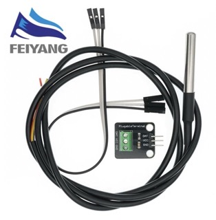   | A temperature sensor to measure the water tank temperature to automatically stop or start the water heating               |
| 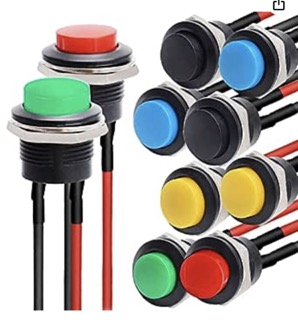  | A push button to restart the router easily                                                                                |
|    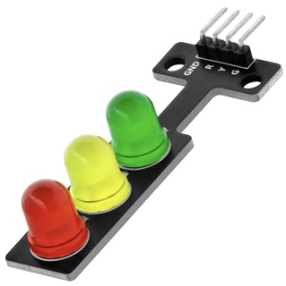     | LEDs to display the system status                                                                                         |
|   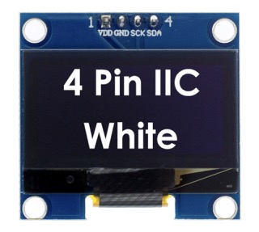    | A display to show the router information                                                                                  |
|  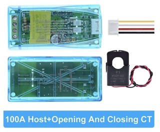  | A PZEM to precisely measure the routed power for each output. Only useful if you have more than one output, or no JSY     |

### Remote JSY with Mycila JSY App

YaSolR supports receiving JSY metrics remotely from [Mycila JSY App](http://mathieu.carbou.me/MycilaJSYApp/) through UDP.

The communication is so fast that using a remote JSY has no impact on performance and is exactly the same as using a JSY connected to the ESP32.
In both cases, the router will be able to react at least 3 times per second.

Refer to [Mycila JSY App](http://mathieu.carbou.me/MycilaJSYApp/) project to find more information about how to wire your JSY.

Here is below some examples of hardware you can use to setup a Remote JSY with Mycila JSY App:

|                        Mean Well HDR-15-5 5V DC                        |                                  ESP32                                   | JSY                                                                      |
| :--------------------------------------------------------------------: | :----------------------------------------------------------------------: | ------------------------------------------------------------------------ |
|  |  |  |

## Wiring

### Powering

> ##### IMPORTANT
>
> Make sure to power the components from the ESP32 3.3V and not directly from the 5V supply.
> This is especially true for the JSY, PZEM, DS18, Display, DAC, ZCD, etc.
>
> Power them through +5V ONLY if your ESP is not able to correctly output 3.3V, or you have some JSY or PZEM read timeout.
> Some PZEM devices also have to be powered by +5V DC.
>
> If powering by +5V DC, you need to use the same +5V DC that is also used to power the ESP32 (same GND).
>
{: .block-important }

In my setup, where I have a lot of components for testing, I have to power these components through +5V DC:

- DAC
- ZCD module
- Relay board

My JSY is powered by the ESP32, and my PZEM (v4) also, but the previous ones (v3) had to be powered by +5V DC.

### Default GPIO

The hardware and GPIO pinout are heavily inspired by [Routeur solaire PV monophasé Le Profes'Solaire](https://sites.google.com/view/le-professolaire/routeur-professolaire) from Anthony.

Most of the features can be enabled or disabled through the app and the GPIO pinout can be changed also through the app in the GPIO page.

[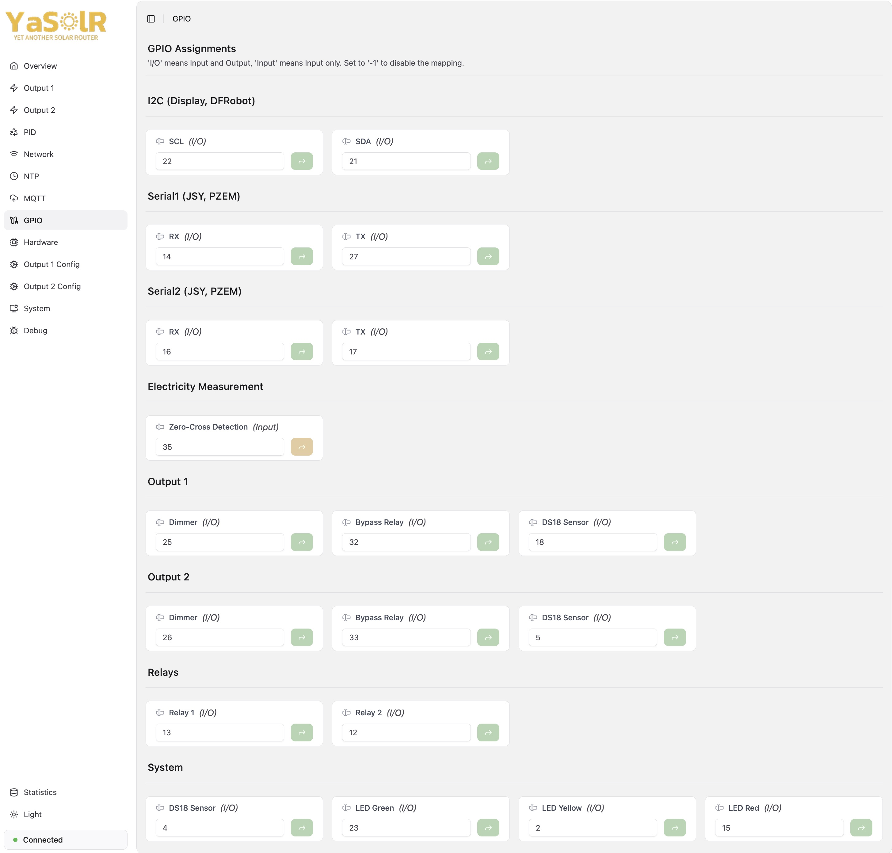](./assets/img/screenshots/app-gpio.jpeg)

Here are below the default GPIO pinout for each board.
`-1` means not mapped, either because this is not possible (for example some boards to not have enough UART to support at the same time JSY and PZEM), or because the mapping is just not defined by default and you need to go in YaSolR GPIO section to define to the pin you want.

**Tested boards:**

| **FEATURE**                     | **ESP32** | **NodeMCU-32S** | **esp32s3** | **wt32_eth01** | **T-ETH-Lite** | **esp32-poe** | **esp32-gateway** | **wipy3** | **tinypico** | **denky_d4** |
| :------------------------------ | :-------: | :-------------: | :---------: | :------------: | :------------: | :-----------: | :---------------: | :-------: | :----------: | :----------: |
| I2C SCL (Display, DFRobot, etc) |    22     |       22        |      9      |       32       |       40       |      -1       |        -1         |    -1     |      -1      |      -1      |
| I2C SDA (Display, DFRobot, etc) |    21     |       21        |      8      |       33       |       41       |      -1       |        -1         |    -1     |      -1      |      -1      |
| JSY Serial2 RX                  |    16     |       16        |     16      |       5        |       18       |      35       |        16         |     4     |      4       |      22      |
| JSY Serial2 TX                  |    17     |       17        |     17      |       17       |       17       |      33       |        17         |    25     |      25      |      21      |
| Light Feedback (Green)          |    23     |       -1        |     -1      |       -1       |       -1       |      -1       |        -1         |    -1     |      -1      |      -1      |
| Light Feedback (Red)            |    15     |       -1        |     -1      |       -1       |       -1       |      -1       |        -1         |    -1     |      -1      |      -1      |
| Light Feedback (Yellow)         |     2     |       -1        |     -1      |       -1       |       -1       |      -1       |        -1         |    -1     |      -1      |      -1      |
| OUTPUT #1 Bypass Relay          |    32     |       32        |     40      |       12       |       20       |      -1       |        -1         |    -1     |      -1      |      -1      |
| OUTPUT #1 Dimmer                |    25     |       25        |     37      |       2        |       19       |      -1       |        -1         |    -1     |      -1      |      -1      |
| OUTPUT #1 Temperature Sensor    |    18     |       18        |     18      |       15       |       3        |      -1       |        -1         |    -1     |      -1      |      -1      |
| OUTPUT #2 Bypass Relay          |    33     |       33        |     33      |       -1       |       15       |      -1       |        -1         |    -1     |      -1      |      -1      |
| OUTPUT #2 Dimmer                |    26     |       26        |     36      |       -1       |       7        |      -1       |        -1         |    -1     |      -1      |      -1      |
| OUTPUT #2 Temperature Sensor    |     5     |        5        |      5      |       -1       |       16       |      -1       |        -1         |    -1     |      -1      |      -1      |
| Push Button (restart)           |    EN     |       EN        |     EN      |       EN       |       EN       |      EN       |        EN         |    EN     |      EN      |      EN      |
| RELAY #1                        |    13     |       13        |     13      |       14       |       5        |      -1       |        -1         |    -1     |      -1      |      -1      |
| RELAY #2                        |    12     |       12        |     12      |       -1       |       6        |      -1       |        -1         |    -1     |      -1      |      -1      |
| System Temperature Sensor       |     4     |        4        |      4      |       4        |       4        |      -1       |        -1         |    -1     |      -1      |      -1      |
| ZCD (RobotDyn, ZCD, JSY-194G)   |    35     |       35        |     35      |       35       |       8        |      -1       |        -1         |    -1     |      -1      |      -1      |
| PZEM-004T v3 Serial1 RX         |    14     |       14        |     14      |       -1       |       -1       |      36       |        -1         |    26     |      26      |      25      |
| PZEM-004T v3 Serial1 TX         |    27     |       27        |     11      |       -1       |       -1       |       4       |        -1         |    27     |      27      |      33      |

### Migration from APPER to YaSolR

Here are some pinout examples reported by users having migrated from APPER to YaSolR.

**With the Wemos D1 R32 (`wemos_d1_uno32`):**

- Output 1 Dimmer: 18
- Output 1 Bypass Relay: 17
- Output 2 Dimmer: 22
- Relay 1: 21
- Relay 2: 5
- System DS18 Sensor: 23
- Zero-Cross Detection (ZCD): 19

**With the Wemos D1 Mini 32 (`wemos_d1_mini32`):**

- Output 1 Dimmer: 18
- Output 1 Bypass Relay: 26
- Output 1 DS18 Sensor: 23
- Zero-Cross Detection (ZCD): 27

### How to Wire RobotDyn Dimmer

The diagram below shows how to wire dimmers based on RobotDyn modules.

You can click on the diagram to open the interactive mode or [download the image](./assets/img/schemas/yasolr_robotdyn.jpeg).

[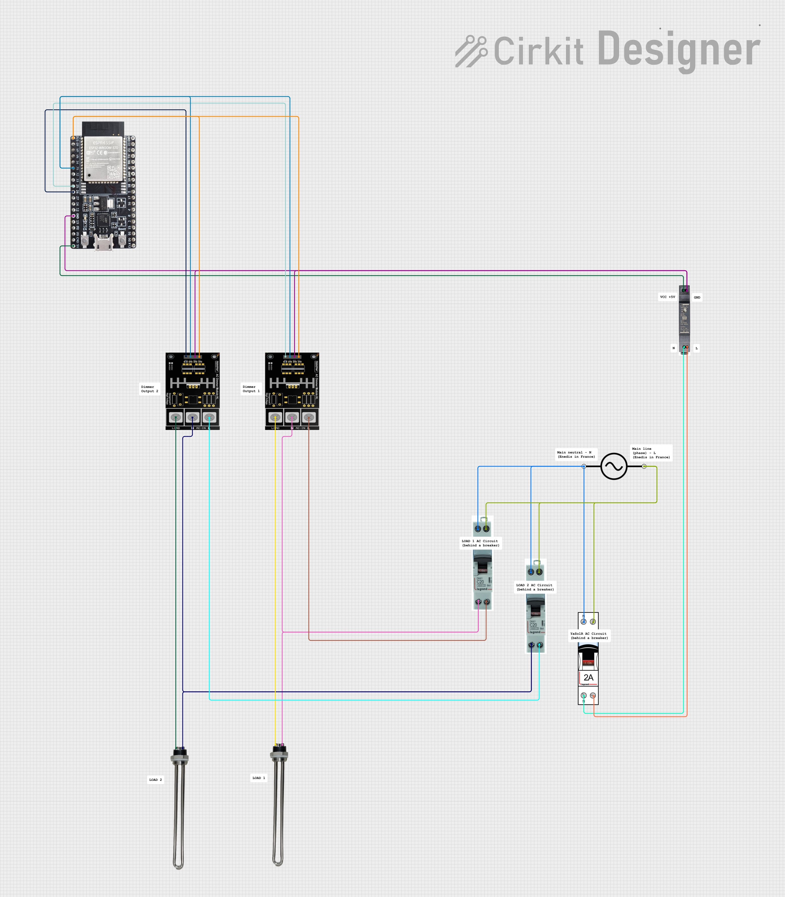](https://app.cirkitdesigner.com/project/5a348c44-3e70-4ced-9420-75cbab118a30?view=interactive_preview)

### How to Wire Random Solid State Relay Dimmer

The diagram below shows how to wire dimmers based on Random Solid State Relay.

You can click on the diagram to open the interactive mode or [download the image](./assets/img/schemas/yasolr_random_ssr.jpeg).

[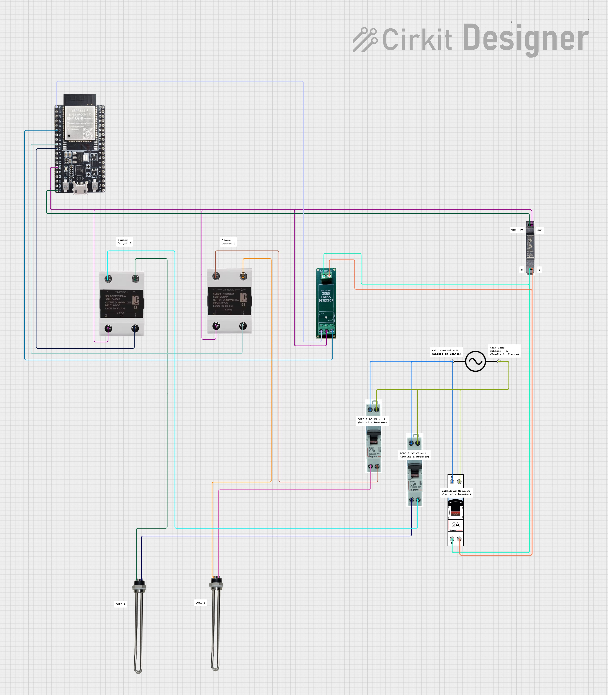](https://app.cirkitdesigner.com/project/af394fa8-dc6e-4785-b0c6-e0a7136aa614?view=interactive_preview)

### How to Wire Voltage Regulator Dimmer and DAC

The diagram below shows how to wire the DFRobot DAC to control a LSA or LCTC voltage regulator:

- LSA / LCTC Voltage Regulators + DAC GP8211S (DFR1071)
- LSA / LCTC Voltage Regulators + DAC GP8403 (DFR0971)
- LSA / LCTC Voltage Regulators + DAC GP8413 (DFR1073)

You can click on the diagram to open the interactive mode or [download the image](./assets/img/schemas/yasolr_dac_lsa.jpeg).

[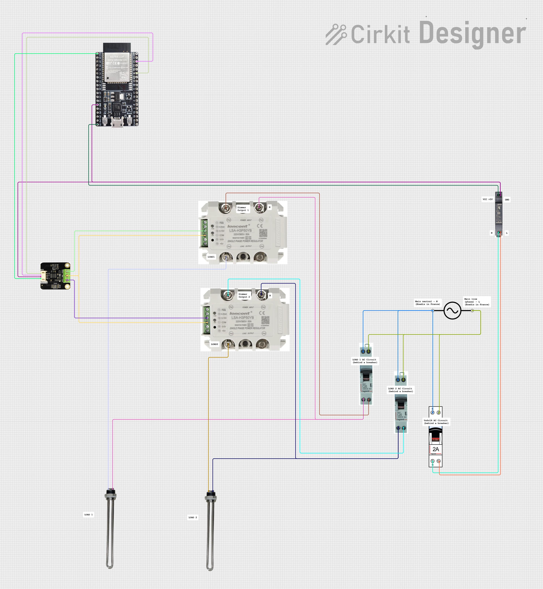](https://app.cirkitdesigner.com/project/0fa9e465-3e88-4420-91d8-cf95e1011474?view=interactive_preview)

### How to Wire Bypass Relay

The diagram below shows how to wire the bypass relays to force heating through the relay without using the dimmer for this output feature.

You can click on the diagram to open the interactive mode or [download the image](./assets/img/schemas/yasolr_bypass_relay.jpeg).

[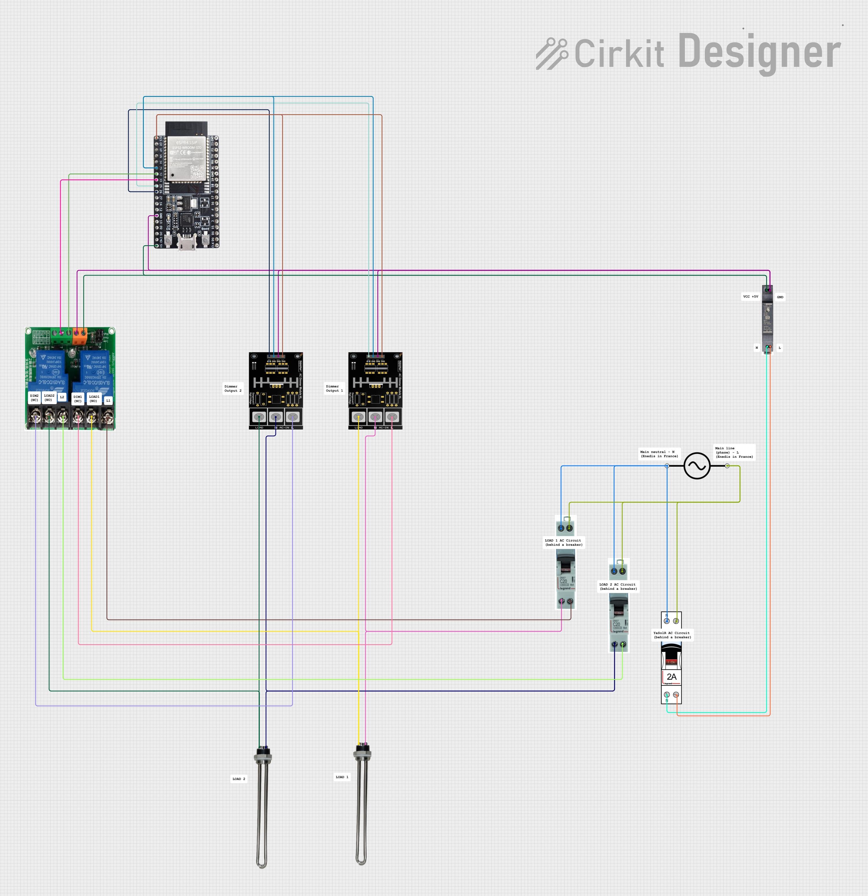](https://app.cirkitdesigner.com/project/b62655da-245f-42e6-a682-452b8bcbe7d5?view=interactive_preview)

### How to Wire JSY and PZEM

The diagram below shows how to wire the following optional YaSolR measurement devices and where to put the clamps:

- PZEM-004T v3
- JSY

You can click on the diagram to open the interactive mode or [download the image](./assets/img/schemas/yasolr_measurements.jpeg).

[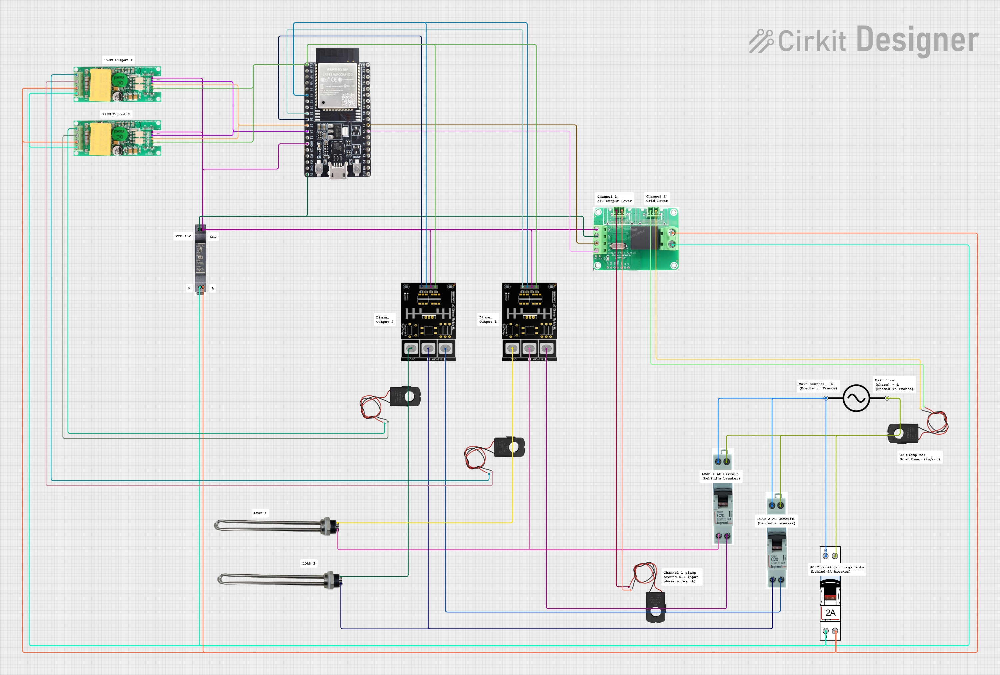](https://app.cirkitdesigner.com/project/cb69313f-3fe0-441f-9db1-0ca880810543?view=interactive_preview)

### How to Wire Accessories

The diagram below shows how to wire the following optional YaSolR accessories:

- push button
- LEDs
- temperature sensors for router, output 1 and output 2
- external relays 1 and 2
- screen

You can click on the diagram to open the interactive mode or [download the image](./assets/img/schemas/yasolr_accessories.jpeg).

[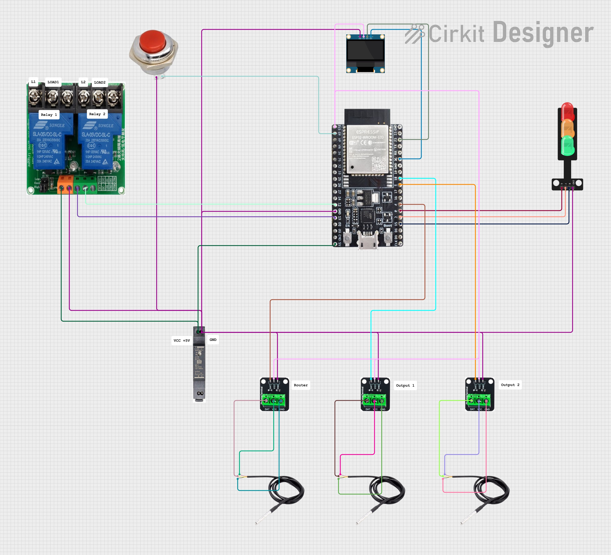](https://app.cirkitdesigner.com/project/d937d685-6328-4653-80a8-f2ac8015baee?view=interactive_preview)

### How to Wire Random SSR with JSY-MK-194G ZCD

The diagram below shows how to wire the Elegant, which is composed of a Random SSR and a JSY-MK-194G which does both the measurement and the Zero-Cross Detection.

You can click on the diagram to open the interactive mode or [download the image](./assets/img/schemas/yasolr_elegant.jpeg).

[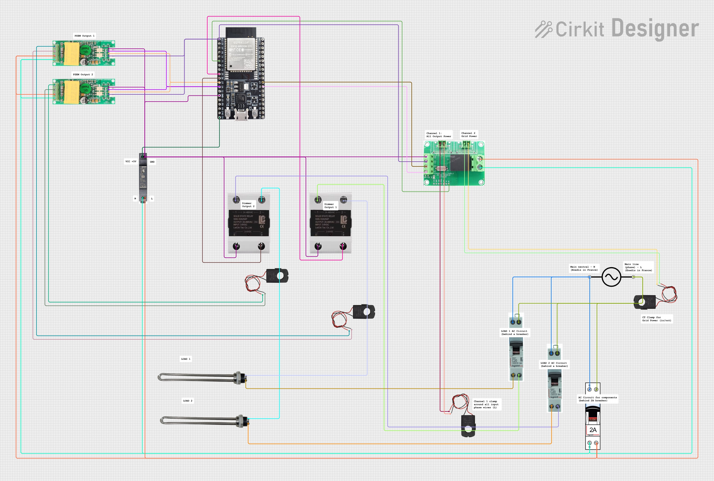](https://app.cirkitdesigner.com/project/8792d83e-10e1-49ff-875c-e6a09ed7660d?view=interactive_preview)

## Where to Buy

Here is the non exhaustive list where to find some hardware to build your router.
Links are provided for reference only, you can find them on other websites.

### ESP32 Boards

Links:

- [Espressif boards](https://www.espressif.com/en/products/devkits) website has some links to some official stores
- [LILYGO T-ETH-Lite ESP32-S3](https://www.lilygo.cc/products/t-eth-lite) (Ethernet)
- [WT32-ETH01](https://aliexpress.com/item/1005004436473683.html) (Ethernet)
- [Waveshare ESP32-S3-ETH](https://www.waveshare.com/wiki/ESP32-S3-ETH) (Ethernet)

Accessories:

- [WiFi Pigtail Antenna](https://aliexpress.com/item/32957527411.html) for ESP32 boards supporting external WiFi antenna

### Dimmers

#### Voltage Regulators

- They support **Phase Control** only.
- They require a DFRobot DAC between the ESP32 and the voltage regulator to control it.
- They include a ZCD circuit, so you can use them without an external ZCD module, even with a Random SSR.
- They are big and robust

Links:

- [Loncont LSA-H3P50YB](https://aliexpress.com/item/32606780994.html)
- [LCTC Voltage Regulator 220V / 60A](https://aliexpress.com/item/1005010533940776.html)

DfRobot DACs to control the voltage regulator:

- [DFR0971 (based on GP8403)](https://www.dfrobot.com/blog-13458.html)
- [DFR1073 (based on GP8413)](https://www.dfrobot.com/blog-13458.html)
- [DFR1071 (based on GP8211S)](https://www.dfrobot.com/blog-13458.html)

Heat Sinks:

- [https://aliexpress.com/item/1005001541419957.html](https://aliexpress.com/item/1005001541419957.html)
- [https://aliexpress.com/item/32823649189.html](https://aliexpress.com/item/32823649189.html)
- [https://aliexpress.com/item/1005003670939186.html](https://aliexpress.com/item/1005003670939186.html)
- [https://aliexpress.com/item/1005001541419957.html](https://aliexpress.com/item/1005001541419957.html)

#### Synchronous Solid State Relays

See [How to Choose a Solid State Relay](#how-to-choose-a-solid-state-relay).

- They support **Cycle Stealing** only.
- Pick a DC Control AC model that can be controlled by a 3.3V DC signal and with an output AC voltage in the range of your grid voltage (example: 24-480V AC).
- The amperage should be 2-3 times the nominal current of your resistive load (example: 40A SSR for a 3000W resistance).

Links:

- [Jotta 60DA](https://aliexpress.com/item/1005003216482476.html)
- [GEYA GSR2-1-60DA](https://aliexpress.com/item/1005004102024120.html)
- [DIN Rail Clips for SSR](https://aliexpress.com/item/1005004396715182.html)

#### Random Solid State Relays

See [How to Choose a Solid State Relay](#how-to-choose-a-solid-state-relay).

- They support **Phase Control** and **Cycle Stealing**.
- They require a [Zero-Cross Detection Module](#zero-cross-detection-modules).
- Pick a DC Control AC model that can be controlled by a 3.3V DC signal and with an output AC voltage in the range of your grid voltage (example: 24-480V AC).
- The amperage should be 2-3 times the nominal current of your resistive load (example: 40A SSR for a 3000W resistance).

Links:

- [LCTC SSR-1DA AP 60A](https://aliexpress.com/item/1005007808561786.html)
- [DIN Rail Clips for SSR](https://aliexpress.com/item/1005004396715182.html)

#### Zero-Cross Detection Modules

Required with a Random SSR only.

Links:

- Any RobotDyn: they include a ZCD circuit, but it is not very good
- [JSY-MK-194G](https://aliexpress.com/item/1005007371816324.html) (this JSY has a built-in ZCD circuit, so you can use it with a Random SSR without the need of an external ZCD module)
- [ZCD module from Daniel S.](https://www.pcbway.com/project/shareproject/Zero_Cross_Detector_a707a878.html) (**recommended**)
  - [UPM-01 DIN Rail Mount for PCB 72mm x 20mm](https://aliexpress.com/item/4000272944733.html) (DIN Rail enclosure for the ZCD module above)

> ##### TIP
>
> I often order batches of this good ZCD module on PCBWay to get them cheaper and split the cost with friends.
> So if you need one, look at the [YaSolR Pro page to see if I have some stock left](https://yasolr.carbou.me/pro#zero-cross-detection-modules)
{: .block-tip }

#### RobotDyn (not recommended)

RobotDyn dimmers include a Zero-Cross Detection circuit, but they are not very good for the ZCD and heat dissipation.
They support **Phase Control** and **Cycle Stealing**.

Links:

- [RobotDyn AC Dimmer 24A/600V](https://www.rbdimmer.com/fr/)
- [RobotDyn AC Dimmer 40A/800V](https://www.rbdimmer.com/fr/)
- [Heat Sink for Random SSR and Triac](https://aliexpress.com/item/1005004879389236.html)

> ##### IMPORTANT
>
> 1. It is possible to switch the TRIAC of an original RobotDyn AC Dimmer with a higher one, for example a [BTA40-800B BOITIER RD-91](https://fr.farnell.com/stmicroelectronics/bta40-800b/triac-40a-800v-boitier-rd-91/dp/9801731) 
>    Ref: [Triacs gradateurs pour routeur photovoltaïque](https://f1atb.fr/fr/triac-gradateur-pour-routeur-photovoltaique/).
> 2. The heat sink must be chosen according to the SSR / Triac. Here is a good video about the theory: [Calcul du dissipateur pour le triac d'un routeur](https://www.youtube.com/watch?v=_zAx1Q2IvJ8) (from Pierre)
> 3. Make sure to [improve the RobotDyn wiring/soldering](https://sites.google.com/view/le-professolaire/routeur-professolaire)
>
{: .block-important }

### Measurement Devices

For grid and/or routing measurements:

- [JSY-MK-163T with 1 clamp](https://aliexpress.com/item/1005010143263253.html) **recommended**
- [JSY-MK-194G with 2 clamps](https://aliexpress.com/item/1005007371816324.html) **recommended**

For grid measurement only:

- [JSY-MK-333G](https://aliexpress.com/item/1005006913043119.html) (3-phase) **recommended**
- [Shelly Pro EM-50](https://www.shelly.com/fr/products/shelly-pro-em-50) (limited: use with MQTT)

For routing measurement only:

- [Peacefair PZEM-004T v3.0 Open CT + USB 100A](https://aliexpress.com/item/33045826345.html)
- [Peacefair PZEM-004T v4.0 Open CT + USB 100A](https://aliexpress.com/item/1005009611591855.html) **recommended**

### Relays

Electromagnetic Relays can be used for the 2 relays and the 2 bypass relays because they will be switched on and off less frequently.
I have tried the electromagnetic relays below and they sometimes get stuck... 
I don't know if this is caused by the poor quality or I got some lemons.
So for a more reliable usage, maybe use a [Synchronous Solid State Relay](#synchronous-solid-state-relays), that you could also use as a replacement for the dimmer if the dimmer fails one day.
Otherwise, if you can find a reliable one, I really like the ability to have both a NO and NC output to better isolate the dimming circuit and bypass circuit.

Links:

- [1 channel 5V](https://aliexpress.com/item/1005005870389973.html)
- [2 channel 5V](https://aliexpress.com/item/1005005870389973.html)
- [4 channel 5V](https://aliexpress.com/item/1005005870389973.html)

### Temperature, LEDs, Displays

Temperature sensor:

- [DS18B20 Temperature Sensor + Adapter](https://aliexpress.com/item/4000143479592.html)

Trafic light LEDs:

- [LEDs](https://www.az-delivery.de/en/products/led-ampel-modul)

I2C OLED Display:

- [SH1106 OLED Display 4 pins 128x64 I2C](https://www.aliexpress.com/item/1005001621782442.html) (**recommended**)
- [SSD1306 OLED Display 4 pins 128x64 I2C](https://www.aliexpress.com/item/32638662748.html) (**not tested**)

### Mounting Accessories

- [Extension board for the ESP32 NodeMCU](https://www.amazon.fr/dp/B0BCWBW4SR) (pay attention to the distance between header, there are different models.)
- [DIN Rail Mount for ESP32 NodeMCU Dev Kit C](https://aliexpress.com/item/1005005096107275.html) (pay attention to the distance between header, there are different models.)
- [Mean Well HDR-15-5](https://aliexpress.com/item/1005007308653370.html) (5V DC 2.4A DIN Adapter) to power the ESP32
