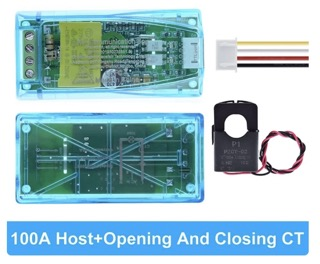

# How to build your router

- [Build Examples](#build-examples)
  - [The Recycler](#the-recycler)
  - [The Minimalist](#the-minimalist)
  - [The Adventurer](#the-adventurer)
  - [The Elite](#the-elite)
  - [The Professional (🚧)](#the-professional-%F0%9F%9A%A7)
  - [Possible Upgrades](#possible-upgrades)
  - [Remote JSY](#remote-jsy)
  - [Alternative: The Shelly Solar Diverter](#alternative-the-shelly-solar-diverter)
- [Selecting your Hardware](#selecting-your-hardware)
  - [ESP32 Boards](#esp32-boards)
  - [Dimmers: Robodyn, Solid State Relay or Voltage Regulator ?](#dimmers-robodyn-solid-state-relay-or-voltage-regulator-)
  - [Relays: Solid State Relay or Electromagnetic Relay ?](#relays-solid-state-relay-or-electromagnetic-relay-)
  - [How to choose a Solid State Relay ?](#how-to-choose-a-solid-state-relay-)
- [Where to buy ?](#where-to-buy-)
  - [ESP32 Boards](#esp32-boards-1)
  - [Robodyn](#robodyn)
  - [Random and Zero-Cross SSR](#random-and-zero-cross-ssr)
  - [Voltage Regulators](#voltage-regulators)
  - [Electromagnetic Relay](#electromagnetic-relay)
  - [Measurement Devices](#measurement-devices)
  - [Temperature Sensors, LEDs, Buttons, Displays](#temperature-sensors-leds-buttons-displays)
  - [Mounting Accessories](#mounting-accessories)
- [Default GPIO pinout per board](#default-gpio-pinout-per-board)
- [Pictures of some routers](#pictures-of-some-routers)

## Build Examples

YaSolR supports many builds and routing algorithms.
Before building your router, you need to decide which type of hardware you want to use.
Here are below some examples:

- [The Recycler](#the-recycler): reuse your existing Shelly EM or Shelly 3EM to build a router
- [The Minimalist](#the-minimalist): the cheapest and easiest to build
- [The Adventurer](#the-adventurer): for people who want to mitigate the flaws of the Robodyn and do some improvements over the existing Robodyn
- [The Elite](#the-elite): for people who want to use a Random SSR instead of a Robodyn to safely dim more power and have a better Zero-Cross Detection circuit
- [The Professional (🚧)](#the-professional-%F0%9F%9A%A7): probably the best and safe solution out there but requires an additional power source
- [Possible Upgrades](#possible-upgrades): some additional components you can add to your router
- [Remote JSY](#remote-jsy): a standalone application to place in your electrical panel to send the JSY metrics through UDP for remote installations
- [Alternative: The Shelly Solar Diverter](#alternative-the-shelly-solar-diverter): a limited Solar Diverter / Router with Shelly devices and a voltage regulator

### The Recycler

Reuse your existing Shelly EM or Shelly 3EM to build a router!

|                              ESP32-DevKitC                               |                       Robodyn AC Dimmer 40A/800V                       |                          Shelly EM or 3EM                           |
| :----------------------------------------------------------------------: | :--------------------------------------------------------------------: | :-----------------------------------------------------------------: |
|  |  |  |

Notes:

- Robodyn includes Zero-Cross Detection circuit
- Supports **Phase Control** and **Burst mode**
- Advised load not more than 2000W
- Robodyn has poor quality heat sink, soldering and Zero-Cross pulse
- Bypass mode will use the Robodyn dimmer at 100% power
- Reuse your Shelly EM or 3EM and send through MQTT grid power and voltage
- Not as precise as a JSY (MQTT delays)
- You can also use a SSR and ZCD module instead of the Robodyn
- No local measurement in place to measure the routed power (statistics will be empty)

### The Minimalist

The _Minimalist_ build uses inexpensive and easy to use components to start a router.

|                              ESP32-DevKitC                               |                       Robodyn AC Dimmer 40A/800V                       |                     JSY-MK-194T with 2 remote clamps                     |
| :----------------------------------------------------------------------: | :--------------------------------------------------------------------: | :----------------------------------------------------------------------: |
|  |  |  |

Notes:

- Robodyn includes Zero-Cross Detection circuit
- Supports **Phase Control** and **Burst mode**
- Advised load not more than 2000W
- Robodyn has poor quality heat sink, soldering and Zero-Cross pulse
- Bypass mode will use the Robodyn dimmer at 100% power

### The Adventurer

The _Adventurer_ build is for people who are able to mitigate the flaws of the Robodyn 24A to improve it.
The TRIAC can be changed to a BTA40-800B RD91 fixed directly on the heat sink, and the heat sink can be upgraded.
See the [Robodyn](#robodyn) section for more information.

|                              ESP32-DevKitC                               |                       Robodyn AC Dimmer 24A/600V                       |                              Heat Sink                               |                         Triac BTA40-800B RD91                         | JSY-MK-194T with 2 remote clamps                                         |
| :----------------------------------------------------------------------: | :--------------------------------------------------------------------: | :------------------------------------------------------------------: | :-------------------------------------------------------------------: | ------------------------------------------------------------------------ |
|  |  |  |  |  |

Notes:

- Robodyn includes Zero-Cross Detection circuit
- Supports **Phase Control** and **Burst mode**
- Advised load not more than 2000-3000W if correctly wired and dimensioned
- Robodyn has poor quality heat sink, soldering and Zero-Cross pulse
- Bypass mode will use the Robodyn dimmer at 100% power
- Requires to unsolder the heat sink and triac and put a new triac on a new heat sink

### The Elite

The _Elite_ build is for people who want to use a Random SSR instead of a Robodyn to safely dim more power and have a better Zero-Cross Detection circuit more more precising routing.

|                              ESP32-DevKitC                               |                       Random Solid State Relay                        |                              Heat Sink                               |                  Zero-Cross Detection Module                   | JSY-MK-194T with 2 remote clamps                                         |
| :----------------------------------------------------------------------: | :-------------------------------------------------------------------: | :------------------------------------------------------------------: | :------------------------------------------------------------: | ------------------------------------------------------------------------ |
|  |  |  |  |  |

- Dedicated ZCD circuit with a good pulse
- Dedicated Random SSR (models up to 100A)
- Supports **Phase Control** and **Burst mode**
- Bypass mode will use the SSR dimmer set at 100% power
- Other types of Heat Sink are available: the image above is just an example.
  Pick one according to your load.
- All the components can be easily attached onto a DIN rail

### The Professional (🚧)

The _Professional_ build uses a Voltage Regulator to control the power routing.
This is probably the best reliable and efficient solution, but it is more complex to setup and wire.
It requires an additional 12V power supply.

|                              ESP32-DevKitC                               |                           Voltage Regulator                            |                                Heat Sink                                 |                        PWM to Analog Converter                         | JSY-MK-194T with 2 remote clamps                                         |
| :----------------------------------------------------------------------: | :--------------------------------------------------------------------: | :----------------------------------------------------------------------: | :--------------------------------------------------------------------: | ------------------------------------------------------------------------ |
|  |  |  |  |  |

- Supports **Phase Control** and **Burst mode**
- Voltage Regulators are available for big loads
- Heat sink are bigger and better quality: bigger models are also available
- Requires an additional 12V power supply (i.e. Mean Well HDR-15-15 12V DC)
- Bypass mode will use the dimmer set at 100% power
- All the components can be easily attached onto a DIN rail

### Possible Upgrades

Here are below what you can add to upgrade your router:

|                                Hardware                                | Description                                                                                                               |
| :--------------------------------------------------------------------: | :------------------------------------------------------------------------------------------------------------------------ |
|  | A bypass relay to avoid using the dimmer when auto bypass is enabled, and an additional relay to control an external load |
|      | A temperature sensor to measure the water tank temperature to automatically stop or start the water heating               |
|   | A push button to restart the router easily                                                                                |
|         | LEDs to display the system status                                                                                         |
|       | A display to show the router information                                                                                  |
|    | A PZEM to precisely measure the routed power for each output. Only useful if you have more than one output.               |

### Remote JSY

Here are the components below to build a remote JSY and install the [Sender](https://github.com/mathieucarbou/MycilaJSY/tree/main/examples/RemoteUDP) .ino file on a it.
This is a standalone application that looks looks like this and will show all your JSY data, help you manage it, and also send the data through UDP **at a rate of 20 messages per second**.

You can look in the [JSY project](https://oss.carbou.me/MycilaJSY/) to find more information about how to setup remote JSY and the supported protocols.

|                        Mean Well HDR-15-5 5V DC                        |                              ESP32-DevKitC                               | JSY-MK-194T with 2 remote clamps                                         |
| :--------------------------------------------------------------------: | :----------------------------------------------------------------------: | ------------------------------------------------------------------------ |
|  |  |  |

### Alternative: The Shelly Solar Diverter

It is also possible to build a (limited) Solar Diverter / Router with Shelly devices and a voltage regulator.

|  |  |

See this blog post for more information: [Shelly Solar Diverter](./blog/2024-07-01_shelly_solar_diverter)

## Selecting your Hardware

### ESP32 Boards

The full list of ESP32 boards can be found [here](https://docs.platformio.org/en/stable/boards/index.html#espressif-32).
Here are the boards we know are compatible and those we have tested.

| **Board**                        | **Compile** | **Tested** | **Ethernet** | **Typical Name**                                                                                                                        |
| :------------------------------- | :---------: | :--------: | :----------: | :-------------------------------------------------------------------------------------------------------------------------------------- |
| esp32, esp32s, esp32se, esp32sue |     ✅      |     ✅     |              | [ESP32 NodeMCU Dev Kit C](https://docs.platformio.org/en/stable/boards/espressif32/esp32dev.html)                                       |
| esp32c3                          |     ✅      |            |              | [Espressif ESP32-C3-DevKitC-02](https://docs.platformio.org/en/stable/boards/espressif32/esp32-c3-devkitc-02.html)                      |
| esp32s3                          |     ✅      |     ✅     |              | [Espressif ESP32-S3-DevKitC-1-N8 (8 MB QD, No PSRAM)](https://docs.platformio.org/en/stable/boards/espressif32/esp32-s3-devkitc-1.html) |
| lolin32_lite                     |     ✅      |            |              | [WEMOS LOLIN32 Lite](https://docs.platformio.org/en/stable/boards/espressif32/lolin32_lite.html)                                        |
| lolin_s2_mini                    |     ✅      |            |              | [WEMOS LOLIN S2 Mini](https://docs.platformio.org/en/stable/boards/espressif32/lolin_s2_mini.html)                                      |
| esp32_poe                        |     ✅      |            |      ✅      | [OLIMEX ESP32-PoE](https://docs.platformio.org/en/stable/boards/espressif32/esp32-poe.html)                                             |
| wt32_eth01                       |     ✅      |     ✅     |      ✅      | [Wireless-Tag WT32-ETH01 Ethernet Module](https://docs.platformio.org/en/stable/boards/espressif32/wt32-eth01.html)                     |
| lilygo_eth_lite_s3               |     ✅      |     ✅     |      ✅      | [T-ETH-Lite ESP32 S3](https://www.lilygo.cc/products/t-eth-lite?variant=43120880779445)                                                 |
| m5stack-atom                     |     ✅      |            |              | [M5Stack-ATOM](https://docs.platformio.org/en/stable/boards/espressif32/m5stack-atom.html)                                              |
| m5stack-atoms3                   |     ✅      |            |              | [M5Stack AtomS3](https://docs.platformio.org/en/stable/boards/espressif32/m5stack-atoms3.html)                                          |

- _Compile_ means a firmware for this board can at least be built and flashed.
- _Tested_ means someone has verified that firmware is working or partially working on this board.

### Dimmers: Robodyn, Solid State Relay or Voltage Regulator ?

Here are some pros and cons of each phase control system:

**Robodyn (TRIAC):**

- Pros:
  - cheap and easy to wire
  - 40A model comes with a heat sink and fan
  - All in one device: phase control, ZCD, heat sink, fan
- Cons:
  - limited in load to 1/3 - 1/2 of the announced load
  - 16A / 24A models comes with heat sink which is too small for its supported maximum load
  - no solution ready to attach them on a DIN rail.
  - The heat sink often has to be upgraded, except for the one on the 40 model which is already good for small loads below 2000W.
  - The ZCD circuit [is less accurate](https://github.com/fabianoriccardi/dimmable-light/wiki/About-dimmer-boards) and pulses can be harder to detect [on some boards](https://github.com/fabianoriccardi/dimmable-light/wiki/Notes-about-specific-architectures#interrupt-issue)
  - You need to go over some modifications to ([improve wiring / soldering and heat sink](https://sites.google.com/view/le-professolaire/routeur-professolaire))
  - You might need to replace the Triac or move it

**Solid State Relays:**

- Pros:
  - cheap and easy to wire
  - support higher loads
  - can be attached to a DIN rail with standard SSR clips
  - lot of heat sink models available
- Cons:
  - limited in load to 1/3 - 1/2 of the announced load
  - require an external ZCD module, heat sink and/or fan

**Voltage Regulators:**

Voltage regulators include a ZCD module and a phase control system which can be controlled in many ways.
These are the best option, but complex to setup, wire and calibrate and require an additional 12V power supply.

This is the option used in the [Shelly Solar Router](./blog/2024-07-01_shelly_solar_diverter).

**Heat Sink:**

In any case, do not forget to correctly dissipate the heat of your Triac / SSR using an appropriate heat sink.
Robodyn heat sink is not enough and require some tweaking (like adding a flan or de-soldering the triac and heat sink and put the triac on a bigger heat sink).

It is best to take a vertical heat sink for heat dissipation.
In case of the Robodyn 40A, you can install it vertically.

### Relays: Solid State Relay or Electromagnetic Relay ?

**For bypass relays used for outputs**

- For bypass relays, you can use electromagnetic relays because they will be used less frequently.
  Also, some electromagnetic relays boards have both a NO and NC output to better isolate the dimming circuit and bypass circuit.

**For external Relays**

- If you want to use the relays to automatically switch one of the resistance of the water tank, as described in the [recommendations to reduce harmonics and flickering](./overview#recommendations-to-reduce-harmonics-and-flickering), you must use a SSR because the relay will be switched on and off frequently.
- If you are not using the automatic relay switching, and you either control them manually or through a Home Automation system, you can use electromagnetic relays, providing the relays won't be switched on and off frequently.
- Use a Zero-Cross SSR for resistive loads
- Use a Random SSR for inductive loads (pump, motors)

**Also to consider:**

- You should not use electromagnetic relays to switch a load on and off frequently because they have a limited number of cycles before they fail and they can be stuck.
- Relays have to be controllable through a 3.3V DC signal.
- It is easier to find SSR supporting high loads that can be controlled by a 3.3V DC signal than electromagnetic relays.
- Also, SSR with a DIN Rail clip are easy to install.
- On the other hand, SSR can be more affected by harmonics than electromagnetic relays and they are more expensive.

### How to choose a Solid State Relay ?

- Make sure you add a **heat sink** to the SSR or pick one with a heat sink, especially if you use a Random SSR instead of a Robodyn
- **Type of control**: DA: (DC Control AC)
- **Control voltage**: 3.3V should be in the range (example: 3-32V DC)
- Verify that the **output AC voltage** is in the range (example: 24-480V AC)
- Verify the **SSR amperage**: usually, it should be 2-3 times the nominal current of your resistive load (example: 40A SSR for a 3000W resistance).
  For induction loads, it should be 4-7 times the nominal current.
- **Zero Cross SSR** (which is the default for most SSR): for the bypass relay or external relays with resistive loads, or when using Burst modulation routing algorithm
- **Random SSR**: if you chose to not use the Robodyn but a Random SSR for Phase Control, or external relays with inductive loads (pump, motors)

## Where to buy ?

Here is the non exhaustive list where to find some hardware to build your router.
Links are provided for reference only, you can find them on other websites.

- [ESP32 Boards](#esp32-boards-1)
- [Robodyn](#robodyn)
- [Random and Zero-Cross SSR](#random-and-zero-cross-ssr)
- [Voltage Regulators](#voltage-regulators)
- [Electromagnetic Relay](#electromagnetic-relay)
- [Measurement Devices](#measurement-devices)
- [Temperature Sensors, LEDs, Buttons, Displays](#temperature-sensors-leds-buttons-displays)
- [Mounting Accessories](#mounting-accessories)

### ESP32 Boards

|                                                                              |                                                                                                                                                           |
| :--------------------------------------------------------------------------- | :-------------------------------------------------------------------------------------------------------------------------------------------------------- |
|      | ESP32-DevKitC ([ESPRESSIF Official Store](https://fr.aliexpress.com/item/1005004441541467.html)) - Any version will work: 32 NodeMCU, 32s, 32e, 32ue, etc |
|           | ESP32-S3-DevKitC-1/1U ([ESPRESSIF Official Store](https://fr.aliexpress.com/item/1005003979778978.html))                                                  |
|  | [LILYGO T-ETH-Lite ESP32-S3](https://www.lilygo.cc/products/t-eth-lite) (Ethernet)                                                                        |
|         | [WT32-ETH01](https://fr.aliexpress.com/item/1005004436473683.html) v1.4 (Ethernet)                                                                        |
|    | [WiFi Pigtail Antenna](https://fr.aliexpress.com/item/32957527411.html) for ESP32 boards supporting external WiFi antenna                                 |

### Robodyn

|                                                                        |                                                                                                                                                                                                           |
| :--------------------------------------------------------------------- | :-------------------------------------------------------------------------------------------------------------------------------------------------------------------------------------------------------- |
|  | [Robodyn AC Dimmer 24A/600V](https://www.aliexpress.com/item/1005001965951718.html) Includes ZCD, supports **Phase Control** and **Burst mode**                                                           |
|  | [Robodyn AC Dimmer 40A/800V](https://fr.aliexpress.com/item/1005006211999051.html) Includes ZCD, supports **Phase Control** and **Burst mode**                                                            |
|   | Triac BTA40-800B RD91 [here](https://fr.aliexpress.com/item/32892486601.html) or [here](https://fr.aliexpress.com/item/1005001762265497.html) if you want / need to replace the Triac inside your Robodyn |
|    | [Heat Sink for Random SSR and Triac](https://fr.aliexpress.com/item/1005004879389236.html) (there are many more types available: take a big heat sink placed vertically)                                  |

**IMPORTANT NOTES:**

1. It is possible to switch the TRIAC of an original Robodyn AC Dimmer with a higher one, for example a [BTA40-800B BOITIER RD-91](https://fr.farnell.com/stmicroelectronics/bta40-800b/triac-40a-800v-boitier-rd-91/dp/9801731) 
   Ref: [Triacs gradateurs pour routeur photovoltaïque](https://f1atb.fr/fr/triac-gradateur-pour-routeur-photovoltaique/).
2. The heat sink must be chosen according to the SSR / Triac. Here is a good video about the theory: [Calcul du dissipateur pour le triac d'un routeur](https://www.youtube.com/watch?v=_zAx1Q2IvJ8) (from Pierre)
3. Make sure to [improve the Robodyn wiring/soldering](https://sites.google.com/view/le-professolaire/routeur-professolaire)

### Random and Zero-Cross SSR

| **Random and Zero-Cross SSR**                                           |                                                                                                                                                                                                                                                                                                                                          |
| :---------------------------------------------------------------------- | :--------------------------------------------------------------------------------------------------------------------------------------------------------------------------------------------------------------------------------------------------------------------------------------------------------------------------------------- |
|    | [LCTC Random Solid State Relay (SSR) that can be controlled by a 3.3V DC signal](https://www.aliexpress.com/item/1005004084038828.html), ([Other LCTC vendor link](https://fr.aliexpress.com/item/1005004863817921.html)). Supports **Phase Control** and **Burst mode**, See [How to choose your SSR ?](#how-to-choose-your-ssr-) below |
|    | [Zero-Cross Solid State Relay (SSR) that can be controlled by a 3.3V DC signal](https://fr.aliexpress.com/item/1005003216482476.html) Supports **Burst mode**, See [How to choose your SSR ?](#how-to-choose-your-ssr-) below                                                                                                            |
|  | [Heat Sink for SSR](https://fr.aliexpress.com/item/32739226601.html) (there are many more types available: take a big heat sink placed vertically)                                                                                                                                                                                       |

| **Zero-Cross Detection**                                       | ZCD module is required with SSR.                                                                                                                                          |
| :------------------------------------------------------------- | :------------------------------------------------------------------------------------------------------------------------------------------------------------------------ |
|  | [Very good ZCD module for DIN Rail from Daniel S.](https://www.pcbway.com/project/shareproject/Zero_Cross_Detector_a707a878.html) (used in conjunction with a Random SSR) |

**Other SSR:**

- [Zero-Cross SSR DA](https://fr.aliexpress.com/item/1005002297502716.html)
- [Zero-Cross SSR DA + Heat Sink + Din Rail Clip](https://www.aliexpress.com/item/1005002503185415.html) (40A, 60A, very high - can prevent closing an electric box)
- [Zero-Cross SSR 120 DA](https://www.aliexpress.com/item/1005005020709764.html) (for very high load)

### Voltage Regulators

|                                                                                            |                                                                                                                                                                                                                                                                                                                                                                                                                                                                    |
| :----------------------------------------------------------------------------------------- | :----------------------------------------------------------------------------------------------------------------------------------------------------------------------------------------------------------------------------------------------------------------------------------------------------------------------------------------------------------------------------------------------------------------------------------------------------------------- |
|                      | [Loncont LSA-H3P50YB](https://fr.aliexpress.com/item/32606780994.html) (also available in 70A and more). Includes ZCD, supports **Phase Control** and **Burst mode**                                                                                                                                                                                                                                                                                               |
|  | [LCTC Voltage Regulator 220V / 40A](https://fr.aliexpress.com/item/1005005008018888.html) or [more models without heat sink but 60A, 80A, etc](https://fr.aliexpress.com/item/20000003997748.html) (also available in 70A and more). Includes ZCD, supports **Phase Control** and **Burst mode**                                                                                                                                                                   |
|                      | [3.3V PWM Signal to 0-10V Convertor ](https://fr.aliexpress.com/item/1005004859012736.html) or [this link](https://fr.aliexpress.com/item/1005006859312414.html) or [this link](https://fr.aliexpress.com/item/1005007211285500.html) or [this link](https://fr.aliexpress.com/item/1005006822631244.html). Required to use the voltage regulators to convert the ESP32 pulse signal on 3.3V to an analogic output from 0-10V (external 12V power supply required) |
|                    | [Heat Sink 10-60A for Voltage Regulators](https://fr.aliexpress.com/item/1005001541419957.html)                                                                                                                                                                                                                                                                                                                                                                    |

### Electromagnetic Relay

|                                                                        |                                                                                                                                                                                                                                                                                                                                                                                        |
| :--------------------------------------------------------------------- | :------------------------------------------------------------------------------------------------------------------------------------------------------------------------------------------------------------------------------------------------------------------------------------------------------------------------------------------------------------------------------------- |
|  | 1-Channel 5V DC / 30A Electromagnetic Relay on DIN Rail Support: [here](https://fr.aliexpress.com/item/1005004908430389.html), [here](https://fr.aliexpress.com/item/32999654399.html), [here](https://fr.aliexpress.com/item/1005005870389973.html), [here](https://fr.aliexpress.com/item/1005005883440249.html)                                                                     |
|  | 2-Channel 5V DC / 30A Dual Electromagnetic Relays on DIN Rail Support: [here](https://fr.aliexpress.com/item/1005004899369193.html), [here](https://fr.aliexpress.com/item/32999654399.html), [here](https://fr.aliexpress.com/item/1005005870389973.html), [here](https://fr.aliexpress.com/item/1005005883440249.html), [here](https://fr.aliexpress.com/item/1005001543232221.html) |

### Measurement Devices

|                                                                          |                                                                                                                                                                                                                                                                                                                                                                                               |
| :----------------------------------------------------------------------- | :-------------------------------------------------------------------------------------------------------------------------------------------------------------------------------------------------------------------------------------------------------------------------------------------------------------------------------------------------------------------------------------------- |
|  | [JSY-MK-194T with 1 fixed tore and 1 remote clamp](https://www.aliexpress.com/item/1005005396796284.html) Used to measure the grid power and total routed power                                                                                                                                                                                                                               |
|  | [JSY-MK-194T with 2 remote clamps](https://fr.aliexpress.com/item/1005005529999366.html) Used to measure the grid power and total routed power                                                                                                                                                                                                                                                |
|      | Peacefair PZEM-004T V3 100A Openable (with clamp) [official](https://fr.aliexpress.com/item/33043137964.html), [with connector](https://fr.aliexpress.com/item/1005005984795952.html), [USB-TTL Cable](https://fr.aliexpress.com/item/1005006255175075.html). Can be used to measure each output individually and more precisely. Several PZEM-004T can be connected to the same Serial port. |
|       | [Shelly EM](https://www.shelly.com/en-fr/products/product-overview/shelly-em-120a/shelly-em-2x-50a) (or any other alternative sending data to MQTT)                                                                                                                                                                                                                                           |

### Temperature Sensors, LEDs, Buttons, Displays

| **Temperature Sensors, LEDs, Buttons**                                |                                                                                                                                                                                     |
| :-------------------------------------------------------------------- | :---------------------------------------------------------------------------------------------------------------------------------------------------------------------------------- |
|     | [DS18B20 Temperature Sensor + Adapter](https://fr.aliexpress.com/item/4000143479592.html) (easier to use to install in the water tank - take a long cable)                          |
|  | Push Buttons [Amazon](https://www.amazon.fr/dp/B0C2Y46BK6) (16mm) [AliExpress](https://fr.aliexpress.com/item/4001081212556.html) (12mm) for restart, manual bypass, reset          |
|        | Traffic lights Lights module for system status [AZ-Delivery](https://www.az-delivery.de/en/products/led-ampel-modul), [AliExpress](https://fr.aliexpress.com/item/32957515484.html) |

| **Screens**                                                        |                                                                                                 |
| :----------------------------------------------------------------- | :---------------------------------------------------------------------------------------------- |
|  | [SSD1306 OLED Display 4 pins 128x64 I2C](https://www.aliexpress.com/item/32638662748.html)      |
|   | [SH1106 OLED Display 4 pins 128x64 I2C](https://www.aliexpress.com/item/1005001621782442.html)  |
|   | [SSD1307 OLED Display 4 pins 128x64 I2C](https://www.aliexpress.com/item/1005003297480376.html) |

### Mounting Accessories

|                                                                                  |                                                                                                                                                                                                                                                                                                                                                                                                                            |
| :------------------------------------------------------------------------------- | :------------------------------------------------------------------------------------------------------------------------------------------------------------------------------------------------------------------------------------------------------------------------------------------------------------------------------------------------------------------------------------------------------------------------- |
|           | [Electric Box](https://www.amazon.fr/gp/product/B0BWFGVV4S)                                                                                                                                                                                                                                                                                                                                                                |
|        | [Extension boards](https://www.amazon.fr/dp/B0BCWBW4SR) (pay attention to the distance between header, there are different models. This one fits the ESP32 NodeMCU above)                                                                                                                                                                                                                                                  |
|           | [DIN Rail Mount for PCB 72mm x 20mm](https://fr.aliexpress.com/item/32276247838.html) for the ZCD module above to mount on DIN Rail. [Alternative link](https://fr.aliexpress.com/item/4000272944733.html)                                                                                                                                                                                                                 |
|  | [DIN Rail Mount for ESP32 NodeMCU Dev Kit C](https://fr.aliexpress.com/item/1005005096107275.html)                                                                                                                                                                                                                                                                                                                         |
|            | [Distribution Module](https://fr.aliexpress.com/item/1005005996836930.html) / [More choice](https://fr.aliexpress.com/item/1005006039723013.html)                                                                                                                                                                                                                                                                          |
|            | [DIN Rail Clips for SSR](https://fr.aliexpress.com/item/1005004396715182.html)                                                                                                                                                                                                                                                                                                                                             |
|            | AC-DC 5V 2.4A DIN Adapter HDR-15-5 [Amazon](https://www.amazon.fr/Alimentation-rail-Mean-Well-HDR-15-5/dp/B06XWQSJGW), [AliExpress](https://fr.aliexpress.com/item/4000513120668.html). Can be used to power the ESP when installed in an electric box on DIN rail. Also if you need, a 12V version s available: [HDR-15-15 12V DC version](https://www.amazon.fr/Alimentation-rail-Mean-Well-HDR-15-5/dp/B07942GFTH?th=1) |
|          | [3D Print enclosure for JSY-MK-194T](https://www.thingiverse.com/thing:6003867). You can screw it on an SSR DIN Rail to place your JSY on a DIN Rail in this enclosure.                                                                                                                                                                                                                                                    |
|             | [Dupont Cable Kit](https://fr.aliexpress.com/item/1699285992.html)                                                                                                                                                                                                                                                                                                                                                         |
|             | [100 ohms 0.1uF RC Snubber](https://www.quintium.fr/shelly/168-shelly-rc-snubber.html) (for Robodyn AC dimmer and Random SSR: can be placed at dimmer output)                                                                                                                                                                                                                                                              |

## Default GPIO pinout per board

The hardware and GPIO pinout are heavily inspired by [Routeur solaire PV monophasé Le Profes'Solaire](https://sites.google.com/view/le-professolaire/routeur-professolaire) from Anthony.
Please read all the information there first.
He did a very great job with some videos explaining the wiring.

Most of the features can be enabled or disabled through the app and the GPIO pinout can be changed also trough the app.

Here are below the default GPIO pinout for each board.

**Tested boards:**

| **FEATURE**                       | **ESP32** | **NodeMCU-32S** | **esp32s3** | **wt32_eth01** | **T-ETH-Lite** |
| :-------------------------------- | :-------: | :-------------: | :---------: | :------------: | :------------: |
| Display CLOCK (CLK)               |    22     |       22        |      9      |       32       |       40       |
| Display DATA (SDA)                |    21     |       21        |      8      |       33       |       41       |
| JSY-MK-194T RX (Serial TX)        |    17     |       17        |     17      |       17       |       17       |
| JSY-MK-194T TX (Serial RX)        |    16     |       16        |     16      |       5        |       18       |
| Light Feedback (Green)            |     0     |        0        |      0      |       -1       |       38       |
| Light Feedback (Red)              |    15     |       15        |     15      |       -1       |       46       |
| Light Feedback (Yellow)           |     2     |        2        |      2      |       -1       |       21       |
| OUTPUT #1 Bypass Relay            |    32     |       32        |     40      |       12       |       20       |
| OUTPUT #1 Dimmer (Robodyn or SSR) |    25     |       25        |     37      |       2        |       19       |
| OUTPUT #1 Temperature Sensor      |    18     |       18        |     18      |       15       |       3        |
| OUTPUT #2 Bypass Relay            |    33     |       33        |     33      |       -1       |       15       |
| OUTPUT #2 Dimmer (Robodyn or SSR) |    26     |       26        |     36      |       -1       |       7        |
| OUTPUT #2 Temperature Sensor      |     5     |        5        |      5      |       -1       |       16       |
| Push Button (restart)             |    EN     |       EN        |     EN      |       EN       |       EN       |
| RELAY #1                          |    13     |       13        |     13      |       14       |       5        |
| RELAY #2                          |    12     |       12        |     12      |       -1       |       6        |
| System Temperature Sensor         |     4     |        4        |      4      |       4        |       4        |
| ZCD (Robodyn or ZCD Sync)         |    35     |       35        |     35      |       35       |       8        |
| PZEM-004T v3 RX (Serial TX)       |    27     |       27        |     11      |       -1       |       -1       |
| PZEM-004T v3 TX (Serial RX)       |    14     |       14        |     14      |       -1       |       -1       |

- `-1` means not mapped (probably because the board does not have enough pins)

**Potential compatible boards, but not tested yet:**

| **FEATURE**                       | **esp32-poe** | **ESP32-C3-DevKitC-02** | **lolin32_lite** | **lolin_s2_mini** | **m5stack-atom** | **m5stack-atoms3** |
| :-------------------------------- | :-----------: | :---------------------: | :--------------: | :---------------: | :--------------: | :----------------: |
| Display CLOCK (CLK)               |      16       |            6            |        22        |         9         |        -1        |         -1         |
| Display DATA (SDA)                |      13       |            7            |        19        |         8         |        -1        |         -1         |
| JSY-MK-194T RX (Serial TX)        |      33       |           20            |        17        |        39         |        -1        |         -1         |
| JSY-MK-194T TX (Serial RX)        |      35       |           21            |        16        |        37         |        -1        |         -1         |
| Light Feedback (Green)            |      -1       |           -1            |        0         |         3         |        -1        |         -1         |
| Light Feedback (Red)              |      -1       |           -1            |        15        |         6         |        -1        |         -1         |
| Light Feedback (Yellow)           |      -1       |           -1            |        2         |         2         |        -1        |         -1         |
| OUTPUT #1 Bypass Relay            |       4       |            2            |        32        |        21         |        -1        |         -1         |
| OUTPUT #1 Dimmer (Robodyn or SSR) |       2       |            1            |        25        |        10         |        -1        |         -1         |
| OUTPUT #1 Temperature Sensor      |       5       |            0            |        18        |        18         |        -1        |         -1         |
| OUTPUT #2 Bypass Relay            |      -1       |            9            |        33        |        33         |        -1        |         -1         |
| OUTPUT #2 Dimmer (Robodyn or SSR) |      -1       |            8            |        26        |        11         |        -1        |         -1         |
| OUTPUT #2 Temperature Sensor      |      -1       |            5            |        5         |         5         |        -1        |         -1         |
| Push Button (restart)             |      EN       |           EN            |        EN        |        EN         |        EN        |         EN         |
| RELAY #1                          |      14       |           -1            |        13        |        13         |        -1        |         -1         |
| RELAY #2                          |      15       |           -1            |        12        |        12         |        -1        |         -1         |
| System Temperature Sensor         |       0       |            4            |        4         |         4         |        -1        |         -1         |
| ZCD (Robodyn or ZCD Sync)         |      36       |            3            |        35        |        35         |        -1        |         -1         |
| PZEM-004T v3 RX (Serial TX)       |      -1       |           -1            |        -1        |        -1         |        -1        |         -1         |
| PZEM-004T v3 TX (Serial RX)       |      -1       |           -1            |        -1        |        -1         |        -1        |         -1         |

- `-1` means not mapped (probably because the board does not have enough pins)
- This mapping table might contain errors

**Minimal requirements:**

- a pin configured to the ZCD system: either the ZC pin of the Robodyn or any pin from any other ZC detection module
- a pin configured to the Phase Control system: PSM pin for the Robodyn or DC + side of the Random SSR

The website display the pinout configured, the pinout layout that is live at runtime and also displays some potential issues like duplicate pins or wrong pin configuration.

## Pictures of some routers

> _TO BE COMPLETED_
