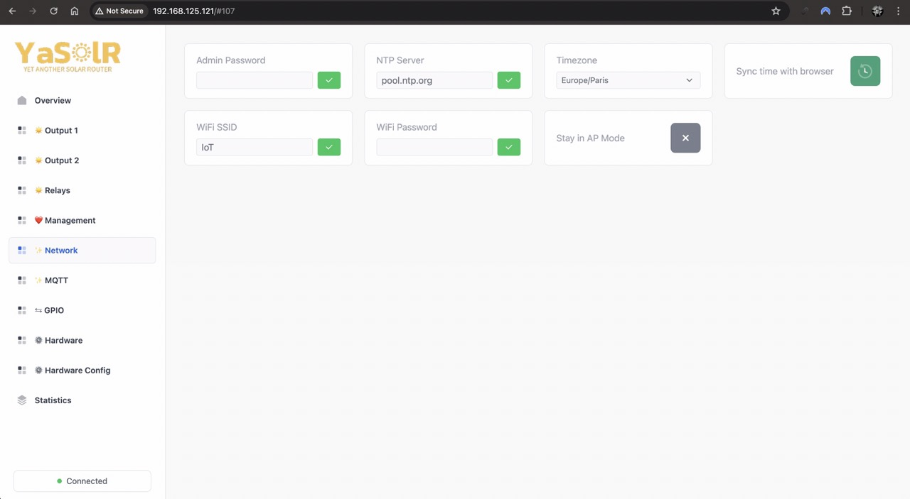

# YaSolR Manual

- [Quick Start](#quick-start)
  - [Initial Firmware Installation](#initial-firmware-installation)
  - [Captive Portal (Access Point) and WiFi](#captive-portal-access-point-and-wifi)
  - [Access Point Mode](#access-point-mode)
- [Dashboard](#dashboard)
  - [`/config` page](#config-page)
  - [`/console` page](#console-page)
  - [`/update` page](#update-page)
  - [`Overview` section](#overview-section)
  - [`Output` sections](#output-sections)
  - [`Relays` section](#relays-section)
  - [`Management` section](#management-section)
    - [Logging](#logging)
  - [`Network` section](#network-section)
  - [`MQTT` section](#mqtt-section)
    - [MQTT as a Grid Source](#mqtt-as-a-grid-source)
    - [Home Assistant Discovery](#home-assistant-discovery)
    - [MQTT as a Temperature Source](#mqtt-as-a-temperature-source)
  - [`GPIO` section](#gpio-section)
  - [`Hardware` section](#hardware-section)
  - [`Hardware Config` section](#hardware-config-section)
    - [Grid Frequency](#grid-frequency)
    - [Display](#display)
    - [Relays](#relays)
    - [Resistance Calibration](#resistance-calibration)
    - [PZEM Pairing](#pzem-pairing)
  - [`PID Controller` section](#pid-controller-section)
  - [`Statistics` section](#statistics-section)
- [Important Hardware Information](#important-hardware-information)
  - [Bypass Relay](#bypass-relay)
  - [Display](#display)
  - [JSY-MK-194T (local)](#jsy-mk-194t-local)
  - [JSY-MK-194T (remote)](#jsy-mk-194t-remote)
  - [LEDs](#leds)
  - [Temperature Sensor](#temperature-sensor)
  - [Zero-Cross Detection](#zero-cross-detection)
  - [Virtual Grid Power / Compatibility with EV box](#virtual-grid-power--compatibility-with-ev-box)
- [Help and support](#help-and-support)

## Quick Start

When everything is wired and installed properly, you can:

1.  Flash the downloaded firmware (see [Initial Firmware Installation](#initial-firmware-installation))
2.  Power on the system to start the application
3.  Connect to the WiFI: `YaSolR-xxxxxx`
4.  Connect to the Captive Portal to setup your WiFi (see: [Captive Portal (Access Point) and WiFi](#captive-portal-access-point-and-wifi))
5.  Go to the [GPIO](#gpio-section) page to verify or change your GPIO settings
6.  Go to the [Hardware](#hardware-section) page to activate the hardware you have
7.  Go to the [Hardware Config](#hardware-config-section) page to configure your hardware settings and resistance values.
    [Resistance Calibration](#resistance-calibration) is really important to do otherwise the router will not work.
8.  Go to the [MQTT](#mqtt-section) page to configure your MQTT settings if needed.
9.  Go to the [Relays](#relays-section) page to configure your relay loads if needed.
10. Go to [Output 1 & 2](#output-sections) pages to configure your bypass options and dimmer settings if needed.
11. Restart to activate everything.
12. Enjoy your YaSolR!

### Initial Firmware Installation

**The firmware file which must be used for a first installation is the one ending with `.FACTORY.bin`.**

Firmware can be downloaded here : [](https://yasolr.carbou.me/download)

Flash with `esptool.py` (Linux / MacOS):

```bash
# Erase the memory (including the user data)
esptool.py \
  --port /dev/ttyUSB0 \
  erase_flash
```

```bash
# Flash initial firmware and partitions
esptool.py \
  --port /dev/ttyUSB0 \
  --chip esp32 \
  --before default_reset \
  --after hard_reset \
  write_flash \
  --flash_mode dout \
  --flash_freq 40m \
  --flash_size detect \
  0x0 YaSolR-VERSION-MODEL-CHIP.FACTORY.bin
```

Do not forget to change the port `/dev/ttyUSB0` to the one matching your system.
For example on Mac, it is often `/dev/cu.usbserial-0001` instead of `/dev/ttyUSB0`.

With [Espressif Flash Tool](https://www.espressif.com/en/support/download/other-tools) (Windows):

> ##### IMPORTANT
>
> Be careful to not forget the `0`
> {: .block-important }


### Captive Portal (Access Point) and WiFi

> ##### TIP
>
> Captive Portal and Access Point address: [http://192.168.4.1/](http://192.168.4.1/)
> {: .block-tip }

A captive portal (Access Point) is started for the first time to configure the WiFi network, or when the application starts and cannot join an already configured WiFi network fro 15 seconds.


The captive portal is only started for 3 minutes, to allow configuring a (new) WiFi network.
After this delay, the portal will close, and the application will try to connect again to the WiFi.
And again, if the WiFi cannot be reached, connected to, or is not configured, the portal will be started again.

This behavior allows to still have access to the application in case of a WiFi network change, or after a power failure, when the application restarts.
If the application restarts before the WiFi is available, it will launch the portal for 3 minutes, then restart and try to join the network again.

In case of WiFi disruption (WiFi temporary down), the application will keep trying to reconnect.
If it is restarted and the WiFi is still not available, the Captive Portal will be launched.

### Access Point Mode

You can also chose to not connect to your Home WiFi and keep the AP mode active.
In this case, you will need to connect to the router WiFi each time you want to access it.

In AP mode, all the features depending on Internet access and time are not available (MQTT, NTP).
You will have to manually sync the time from your browser to activate the auto bypass feature.

## Dashboard

Here are the main links to know about in the application:

- `http://yasolr.local/`: Dashboard
- `http://yasolr.local/console`: Web Console
- `http://yasolr.local/update`: Web OTA (firmware update)
- `http://yasolr.local/config`: Debug Configuration Page
- `http://yasolr.local/api`: [REST API](rest)

_(replace `yasolr.local` with the IP address of the router)_

### `/config` page

This page is accessible at: `http://<esp-ip>/config`.
It allows to see the raw current configuration of the router and edit it.

[](assets/img/screenshots/config.jpeg)

> ##### WARNING
>
> This page should not normally be used, except for debugging purposes.

### `/console` page

A Web Console is accessible at: `http://<esp-ip>/console`.
You can see more logs if you activate Debug logging (but it will make the router react a bit more slowly).

[](assets/img/screenshots/console.jpeg)

### `/update` page

Go to the Web OTA at `http://<esp-ip>/update` to update the firmware over the air:

[](assets/img/screenshots/update.jpeg)

The firmware file which must be used is the one ending with `.OTA.bin`:

`YaSolR-<VERSION>-<MODEL>-<BOARD>.OTA.bin`

### `Overview` section

The overview section shows some global information about the router:

- The temperature is coming from the sensor installed in the router box
- A JSY or PZEM is required to see the measurements

[](assets/img/screenshots/overview.jpeg)

### `Output` sections

The output sections show the state of the outputs and the possibility to control them.

| [](assets/img/screenshots/output1.jpeg) | [](assets/img/screenshots/output2.jpeg) |

- `Status`
  - `Disabled`: Output is disabled (dimmer disabled or other reason)
  - `Idle`: Output is not routing and not in bypass mode
  - `Routing`: Routing in progress
  - `Bypass`: Bypass has been activated manually
  - `Bypass Auto`: Bypass has been activated based on automatic rules
- `Temperature`: This is the temperature reported by the sensor in water tank, if installed

**Energy:**

- `Power`: Routed power.
- `Apparent Power`: Apparent power in VA circulating on the wires.
- `Power Factor`: Power factor (if lower than 1, mainly composed of harmonic component). Ideal is close to 1.
- `THDi`: This is the estimated level of harmonics generated by this output. The lower, the better.
- `Voltage`: The dimmed RMS voltage sent to the resistive load.
- `Current`: The current in Amp sent to the resistive load.
- `Resistance`: The resistance of the load.
- `Energy`: The total accumulated energy routed by this output, stored in hardware (JSY and/or PZEM).

> ##### IMPORTANT
>
> A PZEM is required to see the measurements of each outputs.
> {: .block-important }

**Dimmer Control:**

- `Dimmer Duty Manual Control`: Slider to control the dimmer level manually.
  Only available when the dimmer is not in automatic mode.
  Otherwise the dimmer level is displayed.
- `Dimmer Duty Limiter`: Slider to limit the level of the dimmer in order to limit the routed power.
- `Dimmer Temperature Limiter`: Temperature threshold when the dimmer will stop routing. This temperature can be different than the temperature used in auto bypass mode.
- `Dimmer Automatic Control`: ON/OFF switch to select automatic routing mode or manual control of the dimmer.
  Resistance calibration step is required before using automatic mode.
- `Grid Excess Reserved`: Allows to share the remaining grid excess to the second output.
  Only available in automatic mode.
  For example, if output 1 is set to 60%, then output 1 will take at most 60% of the grid excess (eventually less if 60% of the grid excess exceeds the nominal power of the connected load).
  Output 2 will be dimmed with the remaining excess.

**Bypass Control:**

- `Bypass`: Activate or deactivate bypass(force heating)
  Only available when the bypass is not in automatic mode.
  Otherwise the bypass state is displayed.
- `Bypass Automatic Control`: Activate or deactivate automatic bypass based on hours and/or temperature.

The following settings are visible if `Bypass Automatic Control` is activated.

- `Bypass Week Days`: Days of the week when the bypass can be activated.
- `Bypass Start Time` / `Bypass Stop Time`: The time range when the auto bypass is allowed to start.
- `Bypass Start Temperature`: The temperature threshold when the auto bypass will start: the temperature of the water tank needs to be lower than this threshold.
- `Bypass Stop Temperature`: The temperature threshold when the auto bypass will stop: the temperature of the water tank needs to be higher than this threshold.

> ##### TIP
>
> All these settings are applied immediately and do not require a restart
> {: .block-tip }

### `Relays` section

YaSolR supports 2 additional relays (Electromechanical or SSR, controlled with 3.3V DC) to control external loads, or to be connected to the A1 and A2 terminals of a power contactor.
Relays can also be connected to the other resistance of the water tank (tri-phase resistance) as described in the [recommendations to reduce harmonics and flickering](./overview#recommendations-to-reduce-harmonics-and-flickering), in order to improve the routing and reduce harmonics.
You must use a SSR for that, because the relay will be switched on and off frequently.

> ##### NOTE
>
> Remember that the voltage is not dimmed: these are 2 normal relays
> {: .block-note }

[](assets/img/screenshots/relays.jpeg)

- `Relay X Automatic Control: Connected Load (Watts)`: You can specify the resistive load power in watts connected to the relay.
  If you do so, the relay will be activated automatically based on the grid power.
- `Relay X Manual Control`: ON/OFF switch to control the relay manually.
  Only available when the relay is not in automatic mode.
  Otherwise the relay state is displayed.

> ##### WARNING
>
> Pay attention that there is little to no hysteresis on the relays.
> So do not use the automatic feature to switch non-resistive loads such as pumps, electric vehicle chargers, etc.
> If you need to switch other types of load in a more complex way with some hysteresis or other complex conditions, you can use the MQTT, REST API, Home Assistant or Jeedom to query the `Virtual Power` metric and execute an automation based on this value.
> The automation can then control the router relays remotely. The relays need to be set in `Manual Control`.
> Remember that these relays are not power contactors and should not be used to directly control high power loads like an Electric Vehicle charge, a pump, etc.
> {: .block-warning }

> ##### TIP
>
> - All these settings are applied immediately and do not require a restart
>
> - **For an EV charge control**: see [Virtual Grid Power / Compatibility with EV box](#virtual-grid-power--compatibility-with-ev-box)
>
> - **For a pump**: a contactor is recommended which can be coupled with a Shelly EM to activate / deactivate the contactor remotely, and it can be automated by Home Assistant or Jeedom based on the `Virtual Power` metric of this router, but also the hours of day, days of week, depending on the weather, and of course with some hysteresis and safety mechanisms to force the pump ON or OFF depending on some rules.
>   {: .block-tip }

**Rules of Automatic Switching**

`Grid Virtual Power` is calculated by the router as `Grid Power - Routed Power`.
This is the power that would be sent to the grid if the router was not routing any power to the resistive loads.

`Grid Virtual Power` is negative on export and positive on import.

- The relay will automatically start when `Grid Virtual Power + Relay Load <= -3% of Relay Load`.
  In other words, the relay will automatically start when there is enough excess to absorb both the load connected to the relay plus 3% more of it.
  When the relay will start, the remaining excess not absorbed by the load will be absorbed by the dimmer.

- The relay will automatically stop when `Grid Virtual Power >= 3% of Relay Threshold`.
  In other words, the relay will automatically stop when there is no excess anymore but a grid import equal to or more than 3% of the relay threshold.
  When the relay will stop, there will be some excess again, which will be absorbed by the dimmer.

For a 3000W tri-phase resistance, 3% means 30W per relay because there is 3x 1000W resistances.
For a 2100W tri-phase resistance, 3% means 21W per relay because there is 3x 700W resistances.

### `Management` section

[](assets/img/screenshots/management.jpeg)

- `Configuration Backup`: Backup the current configuration of the router.
- `Configuration Restore`: Restore a previously saved configuration.
- `OTA Firmware Update`: Go to the firmware update page.
- `Restart`: Restart the router.
- `Energy Reset`: Reset the energy stored in all devices (JSY and PZEM) of the router.
- `Factory Reset`: Reset the router to factory settings and restart it.

#### Logging

- `Debug`: Activate or deactivate debug logging.
- `Debug Information`: Outputs useful debug information to give to support.
  **Only available when `Debug` is activated.**
- `Console`: Go to the Web Console page to see the logs

If you need to record the logs during a long period of time to troubleshoot an issue, you can activate `Debug` and then stream the logs into a file using `websocat` from another computer.
Make sure the computer won't g oto sleep!

```bash
> websocat ws://192.168.125.123/wserial > logs.txt
```

> ##### NOTE
>
> The special characters (like `??f??OO`) at the beginning of each line are normal.

### `Network` section

[](assets/img/screenshots/network.jpeg)

- `Admin Password`: the password used to access (there is no password by default):
  - Any Web page, including the [REST API](rest)
  - The Access Point when activated
  - The Captive Portal when the router restarts and no WiFi is available

**Time settings:**

- `NTP Server`: the NTP server to use to sync the time
- `Timezone`: the timezone to use for the router
- `Sync time with browser`: if the router does not have access to Internet or is not able to sync time (I.e. in AP mode), you can use this button to sync the time with your browser.

**WiFi settings:**

- `WiFi SSID`: the Home WiFi SSID to connect to
- `WiFi Password`: the Home WiFi password to connect to
- `Stay in AP Mode`: whether to activate or not the Access Point mode: switching the button will ask the router to stay in AP mode after reboot.
  You will need to connect to its WiFi to access the dashboard again.

**The ESP32 must be restarted to apply the changes.**

### `MQTT` section

[](assets/img/screenshots/mqtt.jpeg)

- `Server`: the MQTT broker address
- `Port`: the MQTT broker port (usually `1883` or `8883` for TLS)
- `Username`: the MQTT username
- `Password`: the MQTT password
- `SSL / TLS`: whether to use TLS or not (false by default). If yes, you must upload the server certificate.
- `Server Certificate`: when using SSL, you need to upload the server certificate.
- `Publish Interval`: the interval in seconds between each MQTT publication of the router data.
  The default value is `5` seconds.
  No need to restart, it is applied immediately.
- `Base Topic`: the MQTT topic prefix to use for all the topics published by the router.
  It is set by default to `yasolr_<ID>`.
  I strongly recommend to keep this default value.
  The ID won't change except if you change the ESP board.

> ##### IMPORTANT
>
> MQTT must be restarted to apply the changes.
> {: .block-important }

#### MQTT as a Grid Source

- `Grid Voltage MQTT Topic`: if set to a MQTT Topic, the router will listen to it to read the Grid voltage.
  **Any measurement device (JSY or JSY Remote) will still have priority over MQTT**.

- `Grid Power MQTT Topic`: if set to a MQTT Topic, the router will listen to it to read the Grid power.
  **It takes precedence over any other source, even a JSY connected to the ESP32**.
  The reason is that it is impossible to know if the second channel of the JSY is really installed and used to monitor the grid power or not.

> ##### IMPORTANT
>
> The ESP32 must be restarted to apply the changes.
> {: .block-important }

MQTT topics are less accurate because depend on the refresh rate of this topic, and an expiration delay of a few seconds is set in order to stop any routing if no update is received in time.
Also, there is **1 minute expiration delay** after which the values will be considered as invalid.

As a general rule, **do not use MQTT as a grid power source if you have a JSY or Remote JSY**.

#### MQTT as a Temperature Source

MQTT can be used to receive temperature data instead of relying on a connected sensor.
There is **1 minute expiration delay** after which the temperature will be considered as invalid.
So this is important to make sure that the topic will be refreshed, otherwise features based on temperature won't work.

- `Output 1 Temperature MQTT Topic`: if set to a MQTT Topic, the router will listen to it to read the temperature linked to output 1
- `Output 2 Temperature MQTT Topic`: if set to a MQTT Topic, the router will listen to it to read the temperature linked to output 2

> ##### IMPORTANT
>
> The ESP32 must be restarted to apply the changes.
> {: .block-important }

#### Home Assistant Discovery

YaSolR supports Home Assistant Discovery: if configured, it will **automatically create a device** for the Solar Router in Home Assistant under the MQTT integration.

| [](assets/img/screenshots/ha_disco_1.jpeg) | [](assets/img/screenshots/ha_disco_2.jpeg) |

- `Home Assistant Integration`: whether to activate or not MQTT Discovery
- `Home Assistant Discovery Topic`: the MQTT topic prefix to use for all the topics published by the router for Home Assistant Discovery.
  It is set by default to `homeassistant/discovery`.
  I strongly recommend to keep this default value and configure Home Assistant to use this topic prefix for Discovery in order to separate state topics from discovery topics.

> ##### IMPORTANT
>
> MQTT must be restarted to apply the changes.
> {: .block-important }

The complete reference of the published data in MQTT is available [here](mqtt).
The published data can be explored with [MQTT Explorer](https://mqtt-explorer.com/).

[{: height="800" }](assets/img/screenshots/mqtt_explorer.jpeg)

**Activating MQTT Discovery in Home Assistant**

You can read more about Home Assistant Discovery and how to configure it [here](https://www.home-assistant.io/docs/mqtt/discovery/).

Here is a configuration example for Home Assistant to move the published state topics under the `homeassistant/states`:

```yaml
# https://www.home-assistant.io/integrations/mqtt_statestream
mqtt_statestream:
  base_topic: homeassistant/states
  publish_attributes: true
  publish_timestamps: true
  exclude:
    domains:
      - persistent_notification
      - automation
      - calendar
      - device_tracker
      - event
      - geo_location
      - media_player
      - script
      - update
```

To configure the discovery topic, you need to go to [http://homeassistant.local:8123/config/integrations/integration/mqtt](http://homeassistant.local:8123/config/integrations/integration/mqtt), then click on `configure`, then `reconfigure` then `next`, then you can enter the discovery prefix `homeassistant/discovery`.

Once done on Home Assistant side and YaSolR side, you should see the Solar Router device appear in Home Assistant in the list of MQTT devices.

### `GPIO` section

This section allows to configure the pinout for the connected hardware and get some validation feedback.

[](assets/img/screenshots/gpio.jpeg)

- Set the value to **-1** to disable the pin.
- Set the input to **blank** and save to reset the pin to its default value.

If you see a warning with `(Input Only)`, it means that this configured pin can only be used to read
data.
It perfectly OK for a ZCD, but you cannot use a pin that can only be read for a relay, DS18 sensor, etc.

> ##### IMPORTANT
>
> If you change one of these settings, please stop and restart the corresponding Hardware.
> {: .block-important }

### `Hardware` section

This section allows to enable / disable some features of the router, and get some feedback in case some activated features cannot be activated.

[](assets/img/screenshots/hardware.jpeg)

All these components are activated **live without the need to restart the router**.

> ##### NOTE
>
> - `Output 1 Relay` / `Output 2 Relay`: these are the SSR or Electromechanical relays connected to the ESP32 and used whn you activate bypass mode.
>   Only activate if you have connected some relays to be used for the output bypass.
>
> - `Relay 1` / `Relay 2`: these are the SSR or Electromechanical relays connected to the ESP32 and used to control external loads.
>   Only activate if you have connected some relays to be used for external loads.
>   {: .block-note }

### `Hardware Config` section

This section allows to further configure some hardware settings and calibrate the resistance values of the loads.

[](assets/img/screenshots/hardware_config.jpeg)

> ##### IMPORTANT
>
> If you change one of these settings in the hardware section, please restart the corresponding hardware or the YaSolR device.
> {: .block-important }

#### Grid Frequency

- `Nominal Grid Frequency`: the nominal grid frequency.

#### Display

- `Display Speed`: the speed at which the display will switch to the next page.
  This setting is applied immediately and does not require a restart.
- `Display Type`: the type of display used.
- `Display Rotation`: the rotation of the display.

#### Relays

- `Output 1 Relay Type (Bypass)`: the relay type for Output 1 Bypass: Normally Open (NO) or Normally Closed (NC).
- `Output 2 Relay Type (Bypass)`: the relay type for Output 2 Bypass: Normally Open (NO) or Normally Closed (NC).
- `Relay 1 Type`: the relay type for Relay 1: Normally Open (NO) or Normally Closed (NC).
- `Relay 2 Type`: the relay type for Relay 2: Normally Open (NO) or Normally Closed (NC).

#### Resistance Calibration

**The router needs to know the resistance value of the load to correctly calculate the dimmer values**.

- `Output 1 Resistance`: the resistance value in Ohms of the load connected to Output 1
- `Output 2 Resistance`: the resistance value in Ohms of the load connected to Output 2

Be careful to put a value that you have correctly measured with a multimeter, or calculated (see formula below).
An approximation will cause the router to not properly work because it won't be able to adjust the exact amount of power to send.

Remember the equation:

```
R = U * U / P
```

where:

- `P` is the _nominal_ power in Watts given by the manufacturer of the resistance
- `U` is the _nominal_ voltage in Volts, usually 230V in Europe and 120V in the US/Canada
- `R` is the resistance in Ohms

**Reading the resistance value from a PZEM or JSY**

If you have a PZEM or JSY device attached, they can help you.
You can set the dimmer in manual mode and set it to 50% and 100% and read the resistance value.
Then you just have to report it in the `Hardware Config` page.

- **PZEM-004T v3:** If you have wired a PZEM-004T v3 connected to each output, it will measure the resistance value when routing.
- **JSY-MK-194T:** If you have a JSY-MK-194T, you can activate the dimmers one by one to 100% and wait for the values to stabilize.
  The router will then display the resistance value in the `Overview` page, thanks to the JSY.

**Using the automatic detection feature** (🚧)

- `Output 1 Resistance Detection`: start the automatic detection of the resistance value of the load connected to Output 1
- `Output 2 Resistance Detection`: start the automatic detection of the resistance value of the load connected to Output 2

This is the easiest way to calibrate the resistance values: when a PZEM or JSY is installed, the router will be able to automatically calculate the resistance.
For that, click on the corresponding buttons and wait a few seconds.
You can at the same time check the statistics on the `Output` or `Overview` sections.
Once done, the resistance value will be put in the corresponding field.
Any previously set value will be erased.

To use this feature, make sure that the resistance will really draw some current.
It won't work if the water heater has already reached its threshold temperature.

#### PZEM Pairing

- `Output 1 PZEM Pairing`: starts the pairing procedure for Output 1 PZEM-004T v3 at address 0x01.
- `Output 2 PZEM Pairing`: starts the pairing procedure for Output 2 PZEM-004T v3 at address 0x02.

Each output supports the addition of a PZEM-004T v3 sensor to monitor the power sent to the resistive load specifically for this output.
Thanks to the PZEM per output, it is also possible to get some more precise information like the dimmed RMS voltage, resistance value, etc.

The PZEM-004T v3 devices has a special installation mode: you can install 2x PZEM-004T v3 devices on the same Serial TX/RX.
To communicate with the right one, each output will use a different slave address.
The initial setup requires to pair each PZEM-004T v3 with the corresponding output.

1. Connect the 2x PZEM-004T v3 devices to the grid (L/N) and install the clamp around the wire at the exit of the dimmer of first output
2. Only connect the terminal wire (+5V, GND, RX, TX) of the first PZEM-004T v3 to pair to Output 1
3. Boot the device and open the console (`http://yasolr.local/console`)
4. Got to the `Hardware` section to activate `Output 1 PZEM`.
   It should be yellow if it has no electricity or if it is not paired.
5. Press the `Output 1 PZEM Pairing` button.
6. Verify that the pairing is successful in the console.
   `Output 1 PZEM` should also be green in the `Hardware` section.
7. **Disconnect this first PZEM-004T v3 from the ESP32**
8. Connect the second PZEM (which has its clamp at the exit of the dimmer of the second output) to the ESP32
9. Press the `Output 2 PZEM Pairing` button.
10. Verify that the pairing is successful in the console.
    `Output 2 PZEM` should also be green in the `Hardware` section.
11. Now that the 2 devices have an address, you can connect them all to the ESP32

You can verify that the pairing is successful by trying to activate the dimmer in the overview page, and see if you get the output power.

This complex pairing procedure is not specific to this router project but is common to any PZEM-004T device when using several PZEM-004T v3 devices on the same Serial TX/RX.
You can read more at:

- [mathieucarbou/MycilaPZEM004Tv3](https://github.com/mathieucarbou/MycilaPZEM004Tv3)
- [mandulaj/PZEM-004T-v30](https://github.com/mandulaj/PZEM-004T-v30)

### `PID Controller` section

> ##### DANGER
>
> For advanced users only.
> {: .block-danger }

This page allows to tune the PID algorithm used to control the automatic routing.
Use only if you know what you are doing and know how to tweak a PID controller.

You can change the PID settings at runtime and the effect will appear immediately.

> ##### TIP
>
> If you find better settings, please do not hesitate to share them with the community.
> {: .block-tip }

[](assets/img/screenshots/pid_tuning.jpeg)

- `Real-time Data`: can be activated to see the PID action in real time in teh graphs.
- `Chart Reset`: click to reset the charts (has no effect on the PID controller).

> ##### IMPORTANT
>
> - Do not leave `Real-time Data` option always activated because the data flow is so high that it impacts the ESP32 performance.
>
> - you are supposed to know how to tune a PID controller. If not, please research on Google.
>   {: .block-important }

Here are some basic links to start with, which talks about the code used under the hood:

- [Improving the Beginner’s PID – Introduction](http://brettbeauregard.com/blog/2011/04/improving-the-beginners-pid-introduction/)
- [Improving the Beginner’s PID – Derivative Kick](http://brettbeauregard.com/blog/2011/04/improving-the-beginners-pid-derivative-kick/)
- [Introducing Proportional On Measurement](http://brettbeauregard.com/blog/2017/06/introducing-proportional-on-measurement/)
- [Proportional on Measurement – The Code](http://brettbeauregard.com/blog/2017/06/proportional-on-measurement-the-code/)

**Default Settings**

- `Proportional Mode`: `On Input`
- `Derivative Mode`: `On Error`
- `Integral Correction`: `Advanced`

To reset the other values to their default value, just click on the validate / enter green button.

**PID Tuning through WebSocket**

When `Real-time Data` is activated, a WebSocket endpoint is available at `/ws/pid/csv` and will stream all the PID data in real time in a `CSV` format when automatic dimmer control is activated.
You can quickly show then and process then in `bash` with `websocat` by typing for example:

```bash
❯  websocat ws://192.168.125.123/ws/pid/csv
pMode,dMode,icMode,rev,setpoint,kp,ki,kd,outMin,outMax,input,output,error,sum,pTerm,iTerm,dTerm
2,1,2,0,800,0.300,0.400,0.200,-10000,10000,780.645,1109.700,19.355,1104.889,7.217,7.742,4.811
2,1,2,0,800,0.300,0.400,0.200,-10000,10000,778.620,1114.453,21.380,1114.048,0.607,8.552,0.405
2,1,2,0,800,0.300,0.400,0.200,-10000,10000,774.128,1126.643,25.872,1125.745,1.347,10.349,0.898
2,1,2,0,800,0.300,0.400,0.200,-10000,10000,786.127,1125.294,13.873,1127.694,-3.600,5.549,-2.400
2,1,2,0,800,0.300,0.400,0.200,-10000,10000,804.696,1116.531,-4.696,1120.245,-5.571,-1.878,-3.714
2,1,2,0,800,0.300,0.400,0.200,-10000,10000,820.285,1104.337,-20.285,1107.455,-4.677,-8.114,-3.118
2,1,2,0,800,0.300,0.400,0.200,-10000,10000,822.300,1097.527,-22.300,1097.930,-0.605,-8.920,-0.403
2,1,2,0,800,0.300,0.400,0.200,-10000,10000,808.928,1101.045,-8.928,1098.370,4.012,-3.571,2.674
2,1,2,0,800,0.300,0.400,0.200,-10000,10000,798.264,1104.396,1.736,1102.264,3.199,0.694,2.133
2,1,2,0,800,0.300,0.400,0.200,-10000,10000,793.393,1107.342,6.607,1106.368,1.461,2.643,0.974
2,1,2,0,800,0.300,0.400,0.200,-10000,10000,785.225,1116.361,14.775,1114.728,2.450,5.910,1.634
2,1,2,0,800,0.300,0.400,0.200,-10000,10000,821.839,1087.686,-21.839,1095.008,-10.984,-8.736,-7.323
```

You can also stream this data directly to a command-line tool that will plot in real time the graphs.
Example of such tools:

- https://github.com/keithknott26/datadash
- https://github.com/cactusdynamics/wesplot

**Demo**

Here is a demo of the real-time PID tuning in action:

[](https://www.youtube.com/watch?v=ygSpUxKYlUE "PID Tuning in YaSolR (Yet Another Solar Router)")

### `Statistics` section

This page shows a lot of statistics and information on the router.

[](assets/img/screenshots/statistics.jpeg)

## Important Hardware Information

### Bypass Relay

Installing a relay for bypass is optional: if installed, the relay will be used to power the heater, and the dimmer will be set to 0.

If not installed, when activating bypass mode, the dimmer will be used and set to 100%.
The advantage is a simple setup, the drawbacks are:

- the dimmer will heat up.
- the power output of he dimmer counts as routed power so the routed power and energy will also contain the bypass power.

In the `Hardware` section, `Output 1 Relay (Bypass)` and `Output 2 Relay (Bypass)` both specify if a relay is installed for the output, on top of the dimmer of course, and if it should be used when bypass is activated.
If no relay is installed, the dimmer will be used and will be set to 100%.

In the `Hardware Config` section, `Output 1 Relay Type (Bypass)` and `Output 2 Relay Type (Bypass)` are used to specify the type of the relay: `Normally Open` or `Normally Closed`.

### Display

Supported displays are any I2C OLED Display of type `SSD1307`, `SH1106`, `SH1107`.

`SH1106` is recommended and has been extensively tested.

[](assets/img/screenshots/display.gif)

The display will look like a carousel with a maximum of 5 pages:

- Global information
- Network information
- Router information with relays
- Output 1 information
- Output 2 information

### JSY-MK-194T (local)

The JSY is used to measure:

1. the total routed power of the outputs combined (optional) with the channel 1 (tore or clamp depending on the model)
2. the grid power and voltage with the clamp of channel 2

The JSY can be replaced by MQTT, reading the power and voltage from MQTT topics.
See [MQTT as a Grid Source](#mqtt-as-a-grid-source).

### JSY-MK-194T (remote)

JSY can also be replaced with a remote JSY **without any impact on routing speed**.
You can install the [Sender](https://github.com/mathieucarbou/MycilaJSY/tree/main/examples/RemoteUDP) .ino file on a ESP32 and connect it to the JSY.
This is a standalone application that looks looks like this and will show all your JSY data, help you manage it, and also send the data through UDP **at a rate of 20 messages per second**.


You can look in the [JSY project](https://oss.carbou.me/MycilaJSY/) to find more information about how to setup remote JSY and the supported protocols.

When using a remote JSY with the router, the following rules apply:

- The voltage will always be read if possible from a connected JSY or PZEM, then from a remote JSY, then from MQTT.
- The grid power will always be read first from MQTT, then from a remote JSY, then from a connected JSY.

> ##### TIP
>
> JSY Remote app is automatically detected on the same network: you don't need to configure anything.
> As soon as the Sender app will start sending data, YaSolR will receive it and display it.
> {: .block-tip }

### LEDs

The LEDs are used to notify the user of some events like reset, restarts, router ready, routing, etc.

| **LIGHTS** | **SOUNDS**       | **STATES**                      |
| :--------: | ---------------- | ------------------------------- |
| `🟢 🟡 🔴` | `BEEP BEEP`      | `STARTED` + `POWER` + `OFFLINE` |
| `🟢 🟡 ⚫` |                  | `STARTED` + `POWER`             |
| `🟢 ⚫ 🔴` | `BEEP BEEP`      | `STARTED` + `OFFLINE`           |
| `🟢 ⚫ ⚫` | `BEEP`           | `STARTED`                       |
| `⚫ 🟡 🔴` | `BEEP BEEP BEEP` | `RESET`                         |
| `⚫ 🟡 ⚫` |                  |                                 |
| `⚫ ⚫ 🔴` | `BEEP BEEP`      | `RESTART`                       |
| `⚫ ⚫ ⚫` |                  | `OFF`                           |

- `STARTED`: application started and WiFi or AP mode connected
- `OFFLINE`: application disconnected from WiFi or disconnected from grid electricity
- `POWER`: power allowed to be sent (either through relays or dimmer)
- `RESTART`: application is restarting following a manual restart
- `RESET`: application is restarting following a manual reset
- `OFF`: application not working (power off)

### Temperature Sensor

The temperature sensors are used to monitor the water tank in order:

- to trigger an automatic heating based on temperature levels (called **auto bypass**).
- to stop the routing if the temperature is too high (called **temperature limiter**).

Supported temperature sensor: `DS18B20`

A temperature sensor can also be used to monitor the router box itself (`Overview` section).

### Zero-Cross Detection

The Zero-Cross Detection (ZCD) module is used to detect the zero-crossing of the grid voltage.
It is required, whether you use a Robodyn or SSR or any routing algorithm (phase control or burst mode).

> ##### TIP
>
> The Robodyn includes a ZCD (its ZC pin).
> Do not forget to activate the ZCD module in the `Hardware` section.
> {: .block-tip }

You can also use a dedicated ZCD module like the one suggested on this website (build menu).

### Virtual Grid Power / Compatibility with EV box

The router exposes through API and MQTT the **Virtual Grid Power**, which is the value of Grid Power you would have if the router was not routing.

You can use this value to inject in the EV box in order to prioritize EV charging over routing to the water tank.

This is usually acceptable to give the EV box a priority over the water tank, because the water tank only need a small amount of routed energy to start heating, while the EV usually requires a threshold to start charging.
So the router will take whatever is not used by the EV box.

> ##### IMPORTANT
>
> `Virtual Grid Power` requires a PZEM or JSY in place to measure the routed power.
> {: .block-important }

## Help and support

- **Facebook Group**: [https://www.facebook.com/groups/yasolr](https://www.facebook.com/groups/yasolr)

- **GitHub Discussions**: [https://github.com/mathieucarbou/YaSolR-OSS/discussions](https://github.com/mathieucarbou/YaSolR-OSS/discussions)

- **GitHub Issues**: [https://github.com/mathieucarbou/YaSolR-OSS/issues](https://github.com/mathieucarbou/YaSolR-OSS/issues)

- **ESP32 Exception Decoder**: [https://maximeborges.github.io/esp-stacktrace-decoder/](https://maximeborges.github.io/esp-stacktrace-decoder/)
