# YaSolR Manual

- [Quick Start](#quick-start)
  - [Firmware First Time Installation](#firmware-first-time-installation)
  - [Firmware Update](#firmware-update)
  - [Captive Portal (Access Point) and WiFi](#captive-portal-access-point-and-wifi)
  - [Access Point Mode](#access-point-mode)
- [YaSolR Application](#yasolr-application)
  - [Overview](#overview)
  - [Output 1 and 2](#output-1-and-2)
  - [Relays](#relays)
  - [PID](#pid)
  - [Network](#network)
  - [NTP](#ntp)
  - [MQTT](#mqtt)
    - [MQTT Configuration](#mqtt-configuration)
    - [MQTT Topic Subscriptions](#mqtt-topic-subscriptions)
    - [Home Assistant Discovery](#home-assistant-discovery)
    - [MQTT API](#mqtt-api)
  - [GPIO](#gpio)
  - [Hardware](#hardware)
    - [Nominal Grid Frequency](#nominal-grid-frequency)
    - [JSY](#jsy)
    - [JSY Remote](#jsy-remote)
    - [Zero-Cross Detection](#zero-cross-detection)
    - [Victron Modbus TCP](#victron-modbus-tcp)
    - [Dimmer Type](#dimmer-type)
    - [Dimmer Range Remapping](#dimmer-range-remapping)
    - [PZEM Pairing](#pzem-pairing)
    - [Bypass Relay](#bypass-relay)
    - [Temperature Sensors](#temperature-sensors)
    - [Relay Types](#relay-types)
    - [Relay Automatic Control](#relay-automatic-control)
    - [LEDs](#leds)
    - [Display](#display)
  - [Output 1 and 2 Config](#output-1-and-2-config)
    - [Resistance Calibration](#resistance-calibration)
    - [Dimmer Configuration](#dimmer-configuration)
    - [Bypass Configuration](#bypass-configuration)
  - [System](#system)
  - [Debug](#debug)
    - [Saving logs](#saving-logs)
    - [Web Console](#web-console)
  - [Statistics](#statistics)
- [Additional Hardware Information](#additional-hardware-information)
  - [EV charging box compatibility with Virtual Grid Power](#ev-charging-box-compatibility-with-virtual-grid-power)
  - [Voltage Regulators (LSA, LCTC, etc)](#voltage-regulators-lsa-lctc-etc)
- [Help and support](#help-and-support)

## Quick Start

When everything is wired and installed properly:

1.  Flash the downloaded firmware (see [Firmware First Time Installation](#firmware-first-time-installation))
2.  Power on the system to start the application
3.  Connect to the WiFI: `YaSolR-xxxxxx`
4.  Connect to the Captive Portal to setup your WiFi (see: [Captive Portal (Access Point) and WiFi](#captive-portal-access-point-and-wifi))
5.  Go to [GPIO](#gpio) to verify or change your GPIO settings
6.  Go to [Hardware](#hardware) to activate and configure the hardware you have
7.  Go to [Output Config](#output-1-and-2-config) to configure the router outputs and calibrate the resistance (see: [Resistance Calibration](#resistance-calibration))
8.  Go to [Network](#network), [NTP](#ntp) and [MQTT](#mqtt) to configure them according to your needed

Do not forget to restart when changing the hardware settings.

### Firmware First Time Installation

**The firmware file which must be used for a first installation is the one ending with `.FACTORY.bin`.**

Firmware can be downloaded here : [](https://yasolr.carbou.me/download)

**With `esptool.py` (Linux / MacOS):**

First erase the memory (including the user data):

```bash
esptool.py erase_flash
```

The flash the complete `FACTORY` firmware file:

```bash
esptool.py write_flash 0x0 YaSolR-VERSION-MODEL-BOARD.FACTORY.bin
```

**With [Espressif Flash Tool](https://www.espressif.com/en/support/download/other-tools) (Windows):**

> ##### IMPORTANT
>
> Be careful to not forget the `0`
{: .block-important }


### Firmware Update

Considering that YaSolR supports many features, this is a big application that is taking a lot of space on the device.
So YaSolR is using a SafeBoot image to allow updating the firmware through the Web OTA.

To update the firmware through OTA, please follow these steps:

1. First [download the new firmware](download). The firmware file which must be used is the one ending with `.OTA.bin` (`YaSolR-<VERSION>-<MODEL>-<BOARD>.OTA.bin`)

2. Go to the management page to restart the device in SafeBoot mode:

[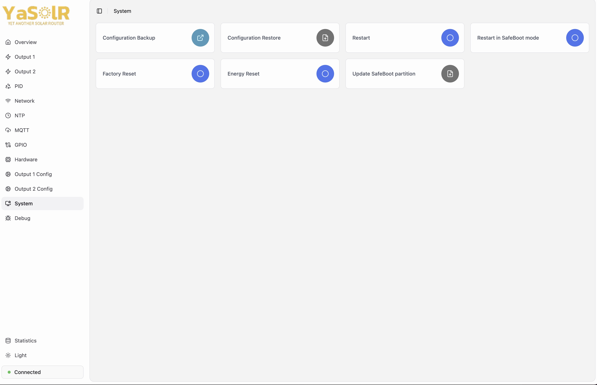](assets/img/screenshots/app-system.jpeg)

3. Once in SafeBoot mode, the device will use your same YaSolR network settings (SSID, static IP address). Otherwise an Access Point with the name `SafeBoot-xxxxxx` that you can connect to.

[](assets/img/screenshots/safeboot-ssid.jpeg)

4. Once connected, open a browser and go to `http://192.168.4.1` (or your configured YaSolR IP address) and you will a simple update page allowing you to upload the new firmware file.

5. After the update is successful, the device will reboot in the updated YaSolR.

### Captive Portal (Access Point) and WiFi

> ##### TIP
>
> Captive Portal and Access Point address: [http://192.168.4.1/](http://192.168.4.1/)
{: .block-tip }

A captive portal (Access Point) is started for the first time to configure the WiFi network, or when the application starts and cannot join an already configured WiFi network fro 15 seconds.


The captive portal is only started for 3 minutes, to allow configuring a (new) WiFi network.
After this delay, the portal will close, and the application will try to connect again to the WiFi.
And again, if the WiFi cannot be reached, connected to, or is not configured, the portal will be started again.

This behavior allows to still have access to the application in case of a WiFi network change, or after a power failure, when the application restarts.
If the application restarts before the WiFi is available, it will launch the portal for 3 minutes, then restart and try to join the network again.

In case of WiFi disruption (WiFi temporary down), the application will keep trying to reconnect.
If it is restarted and the WiFi is still not available, the Captive Portal will be launched for 3 minutes, and the device will reboot after this delay.

### Access Point Mode

You can also chose to not connect to your Home WiFi and keep the AP mode active.
In this case, you will need to connect to the router WiFi each time you want to access it.

In AP mode, all the features depending on Internet access and time are not available (MQTT, NTP).
You will have to manually sync the time from your browser to activate the auto bypass feature.

## YaSolR Application

Here are the main links to know about in the application:

- `http://yasolr.local/`: Dashboard
- `http://yasolr.local/api`: [REST API](rest)
- `http://yasolr.local/config`: Debug Configuration Page (allows to see and edit the raw configuration of the router)
- `http://yasolr.local/console`: Web Console (only in debug mode)

_(replace `yasolr.local` with the IP address of the router)_

The main dashboard is accessible at `http://yasolr.local/` and contains several sections described below.

[](assets/img/screenshots/app-menu.jpeg)

### Overview

The overview section shows some global information about the router:

- The temperature is coming from the sensor installed in the router box
- The electricity measurements are coming from a JSY or PZEM

[](assets/img/screenshots/app-overview.jpeg)

> ##### IMPORTANT
>
> The resistance value that you see in the overview page is an estimation of the global resistance value corresponding to output 1 and output 2 combined together,
> and this value is measured by a JSY or PZEM when routing.
>
> This is **not** the resistance value calibrated for each output in the `Hardware Config` section.
{: .block-important }

### Output 1 and 2

The output sections show the state of the outputs and the possibility to control them.

[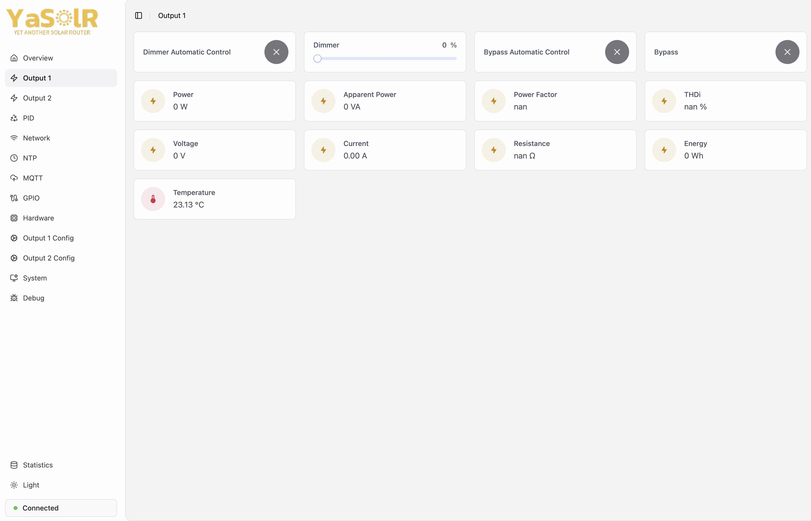](assets/img/screenshots/app-output.jpeg)

- `Status`
  - `Disabled`: Output is disabled (dimmer disabled or other reason)
  - `Idle`: Output is not routing and not in bypass mode
  - `Routing`: Routing in progress
  - `Bypass`: Bypass has been activated manually
  - `Bypass Auto`: Bypass has been activated based on automatic rules
- `Temperature`: This is the temperature reported by the sensor in water tank, if installed

**Energy:**

- `Power`: Routed power.
- `Apparent Power`: Apparent power in VA circulating on the wires.
- `Power Factor`: Power factor (if lower than 1, mainly composed of harmonic component). Ideal is close to 1.
- `THDi`: This is the estimated level of harmonics generated by this output. The lower, the better.
- `Voltage`: The dimmed RMS voltage sent to the resistive load.
- `Current`: The current in Amp sent to the resistive load.
- `Resistance`: The resistance of the load.
- `Energy`: The total accumulated energy routed by this output, stored in hardware (JSY and/or PZEM).

> ##### IMPORTANT
>
> A PZEM is required to see the measurements of each outputs.
{: .block-important }

**Dimmer Controls:**

- `Dimmer Automatic Control`: ON/OFF switch to select automatic routing mode or manual control of the dimmer.
  Automatic mode requires a [Resistance Calibration](#resistance-calibration).
- `Dimmer - %`: Slider to control the dimmer level manually.
  Only available when the dimmer is not in automatic mode.
  Otherwise the dimmer level is displayed.

**Bypass Controls:**

- `Bypass Automatic Control`: Activate or deactivate automatic dimmer bypass (force heating) based on hours and/or temperature.
- `Bypass`: Activate or deactivate dimmer bypass (force heating)
  Only available when the bypass is not in automatic mode.
  Otherwise the bypass state is displayed.

> ##### TIP
>
> All these settings are applied immediately and do not require a restart
{: .block-tip }

### Relays

[](assets/img/screenshots/app-relays.jpeg)

- `Relay X Manual Control`: ON/OFF switch to control the relay manually.
  Only available when the relay is not in automatic mode.
  Otherwise the relay state is displayed.

### PID

> ##### DANGER
>
> For advanced users only.
{: .block-danger }

[](assets/img/screenshots/app-pid_tuning.jpeg)

This page allows to tune the PID algorithm used to control the automatic routing.
Use only if you know what you are doing and know how to tweak a PID controller.

You can change the PID settings at runtime and the effect will appear immediately.

**Default Settings**

- `Proportional Mode`: `On Input`
- `Integral Correction`: `Advanced`
- `Kp`: `0.1`
- `Ki`: `0.2`
- `Kd`: `0.05`
- `Output Min`: `-300`
- `Output Max`: `4000`

Here are some other values that seem to work well depending on the load, ZCD module, etc:

- `Kp`: `0.3`, `Ki`: `0.6`, `Kd`: `0.1`
- `Kp`: `0.3`, `Ki`: `0.4`, `Kd`: `0.1`

> ##### TIP
>
> If you find better settings, please do not hesitate to share them with the community.
>
> If you are using a slower measurement device like MQTT, you might want to try with a higher Kd and Ki.
{: .block-tip }

**Tuning:**

- `Real-time Data`: can be activated to see the PID action in real time in the graphs.
- `Chart Reset`: click to reset the charts (has no effect on the PID controller).

Here are some basic links to start with, which talks about the code used under the hood:

- [Improving the Beginner’s PID – Introduction](http://brettbeauregard.com/blog/2011/04/improving-the-beginners-pid-introduction/)
- [Improving the Beginner’s PID – Derivative Kick](http://brettbeauregard.com/blog/2011/04/improving-the-beginners-pid-derivative-kick/)
- [Introducing Proportional On Measurement](http://brettbeauregard.com/blog/2017/06/introducing-proportional-on-measurement/)
- [Proportional on Measurement – The Code](http://brettbeauregard.com/blog/2017/06/proportional-on-measurement-the-code/)

> ##### IMPORTANT
>
> - Do not leave `Real-time Data` option always activated because the data flow is so high that it impacts the device performance.
>
> - you are supposed to know how to tune a PID controller. If not, please research on Google.
>
{: .block-important }

**Demo**

Here is a demo of the real-time PID tuning in action:

[](https://www.youtube.com/watch?v=ygSpUxKYlUE "PID Tuning in YaSolR (Yet Another Solar Router)")

Note: the WebSocket PID output was removed

### Network

[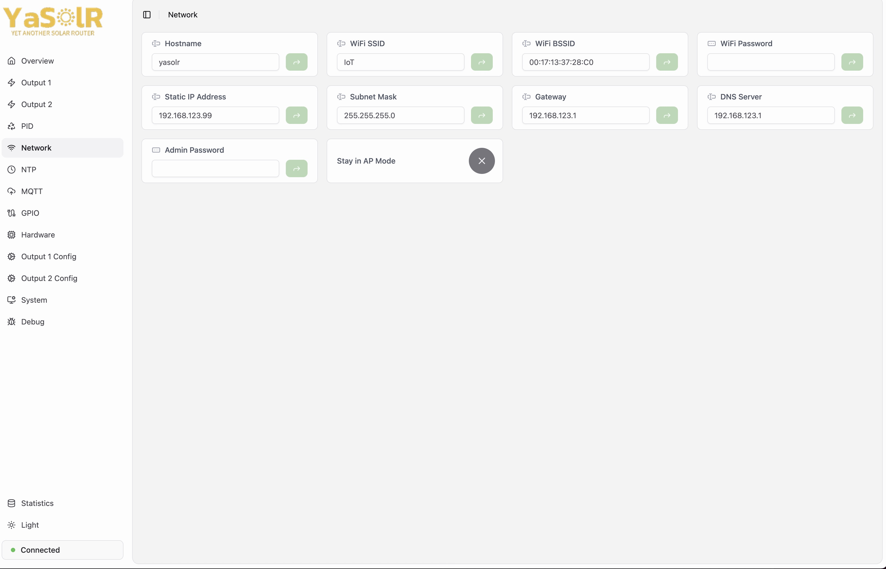](assets/img/screenshots/app-network.jpeg)

- `Admin Password`: the password used to access (there is no password by default):

  - Any Web page, including the [REST API](rest)
  - The Access Point when activated
  - The Captive Portal when the router restarts and no WiFi is available

> ##### WARNING
>
> The password MUST be more than 8 characters long otherwise the device will fail to start AP mode or the Captive Portal for recovery if it needs to.
>
{: .block-warning }

**WiFi settings:**

- `WiFi SSID`: the Home WiFi SSID to connect to
- `WiFi Password`: the Home WiFi password to connect to
- `Stay in AP Mode`: whether to activate or not the Access Point mode: switching the button will ask the router to stay in AP mode after reboot.
  You will need to connect to its WiFi to access the dashboard again.

**Static IP address:**

- `Static IP`: the static IP address to use for the router
- `Gateway`: the gateway to use for the router (usually the router IP address)
- `Subnet Mask`: the subnet mask to use for the network (usually `255.255.255.0`)
- `DNS`: the DNS server to use for the router (usually the router IP address or `8.8.8.8`)

When setting a static IP, the router will try to connect with the static IP and won't use DHCP anymore.

**The device must be restarted to apply the changes.**

> ##### IMPORTANT
>
> When using a board with Ethernet adapter, the static IP setting only applies to the Ethernet adapter, not the WiFi.
> So if a WiFi SSID is configured to connect to, YaSolR will connect to the WiFi and will use DHCP to get an IP address.
{: .block-important }

### NTP

[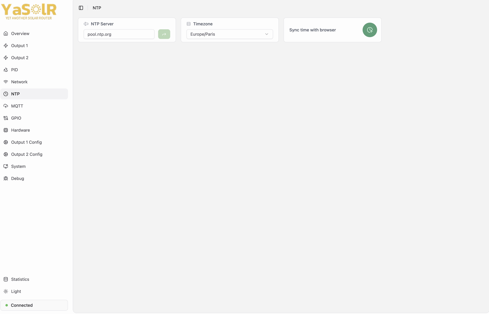](assets/img/screenshots/app-ntp.jpeg)

- `NTP Server`: the NTP server to use to sync the time
- `Timezone`: the timezone to use for the router
- `Sync time with browser`: if the router does not have access to Internet or is not able to sync time (e.g. in AP mode), you can use this button to sync the time with your browser.

**The device must be restarted to apply the changes.**

### MQTT

[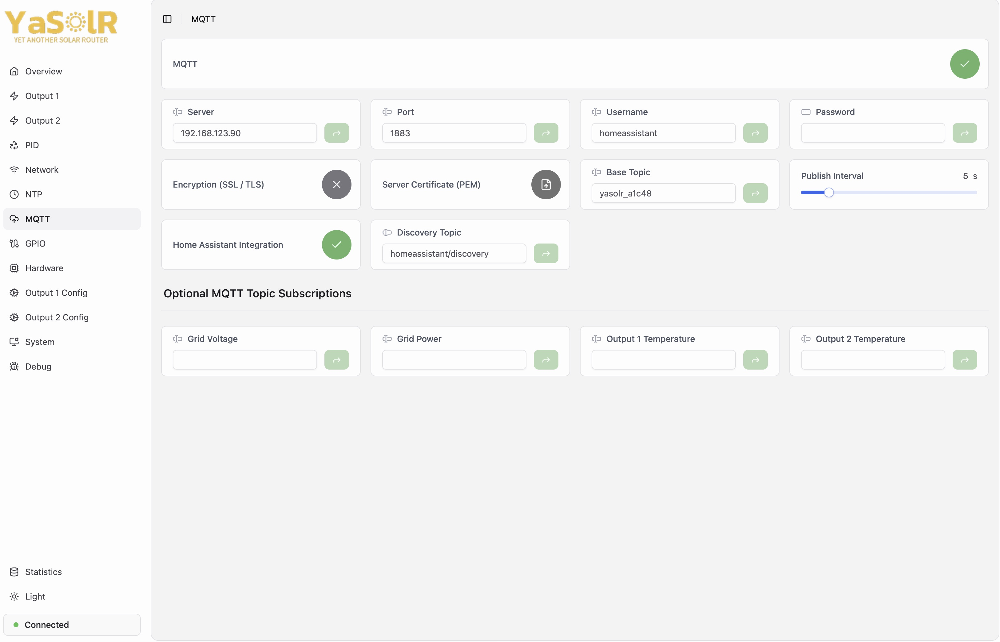](assets/img/screenshots/app-mqtt.jpeg)

#### MQTT Configuration

- `MQTT`: whether to activate or not the MQTT feature
- `Server`: the MQTT broker address
- `Port`: the MQTT broker port (usually `1883` or `8883` for TLS)
- `Username`: the MQTT username
- `Password`: the MQTT password
- `Encryption`: whether to use TLS or not (false by default).
- `Server Certificate`: you can upload the server certificate when using SSL, if the server certificate is self-signed or its authority not in the trusted list of the ESP32.
- `Remove Server Certificate`: removes the installed server certificate.
- `Base Topic`: the MQTT topic prefix to use for all the topics published by the router.
  It is set by default to `yasolr_<ID>`.
  **I strongly recommend to keep this default value.**
  The ID won't change except if you change the device board.
- `Publish Interval`: the interval in seconds between each MQTT publication of the router data.
  The default value is `5` seconds.
  No need to restart, it is applied immediately.

**The device must be restarted to apply the changes.**

> ##### IMPORTANT
>
> - Server certificate must be in PEM format.
>
> - If you are changing to another server, make sure to delete or update the certificate if one is set.
>
{: .block-important }

#### MQTT Topic Subscriptions

If is possible to listen to some MQTT topics to read the grid voltage, grid power and router output temperatures.

- `Grid Voltage`: if set to a MQTT Topic, the router will listen to it to read the Grid voltage.
  YaSolR supports raw values and JSON values like Shelly EM and 3EM.
  **Any measurement device (JSY or JSY Remote) will still have priority over MQTT**.
- `Grid Power`: if set to a MQTT Topic, the router will listen to it to read the Grid power.
  YaSolR supports raw values and JSON values like Shelly EM and 3EM.
  **It takes precedence over any other source, even a JSY connected to the device**.
- `Output 1 Temperature`: if set to a MQTT Topic, the router will listen to it to read the temperature linked to output 1
- `Output 2 Temperature`: if set to a MQTT Topic, the router will listen to it to read the temperature linked to output 2

**Example of configuration with Shelly EM:**

- Grid Voltage topic: `shellyproem50/status/em1:0`
- Grid Power topic: `shellyproem50/status/em1:0`

The Shelly sends this kind of data:

```json
{"id":1,"current":2.681,"voltage":236.7,"act_power":-607.3,"aprt_power":636.0,"pf":0.95,"freq":50.0,"calibration":"factory"}
```

**Example of configuration with Shelly 3EM:**

- Grid Voltage topic: `shelly3em/status/em:0`
- Grid Power topic: `shelly3em/status/em:0`

The Shelly sends this kind of data:

```json
{"id":0,"a_current":0.132,"a_voltage":236.0,"a_act_power":3.9,"a_aprt_power":31.0,"a_pf":-0.53,"b_current":0.594,"b_voltage":236.4,"b_act_power":45.4,"b_aprt_power":140.3,"b_pf":-0.61,"c_current":0.368,"c_voltage":237.8,"c_act_power":54.3,"c_aprt_power":87.5,"c_pf":-0.72,"n_current":null,"total_current":1.094,"total_act_power":103.610,"total_aprt_power":258.799, "user_calibrated_phase":[]}
```

**The device must be restarted to apply the changes.**

MQTT topics are less accurate because depend on the refresh rate of these topic, and an expiration delay of a few seconds is set in order to stop any routing if no update is received in time.
Also, there is **1 minute expiration delay** after which the values will be considered as invalid.

As a general rule, **do not use MQTT as a grid power source if you have a JSY or Remote JSY**.

#### Home Assistant Discovery

YaSolR supports Home Assistant Discovery: if configured, it will **automatically create a device** for the Solar Router in Home Assistant under the MQTT integration.

| [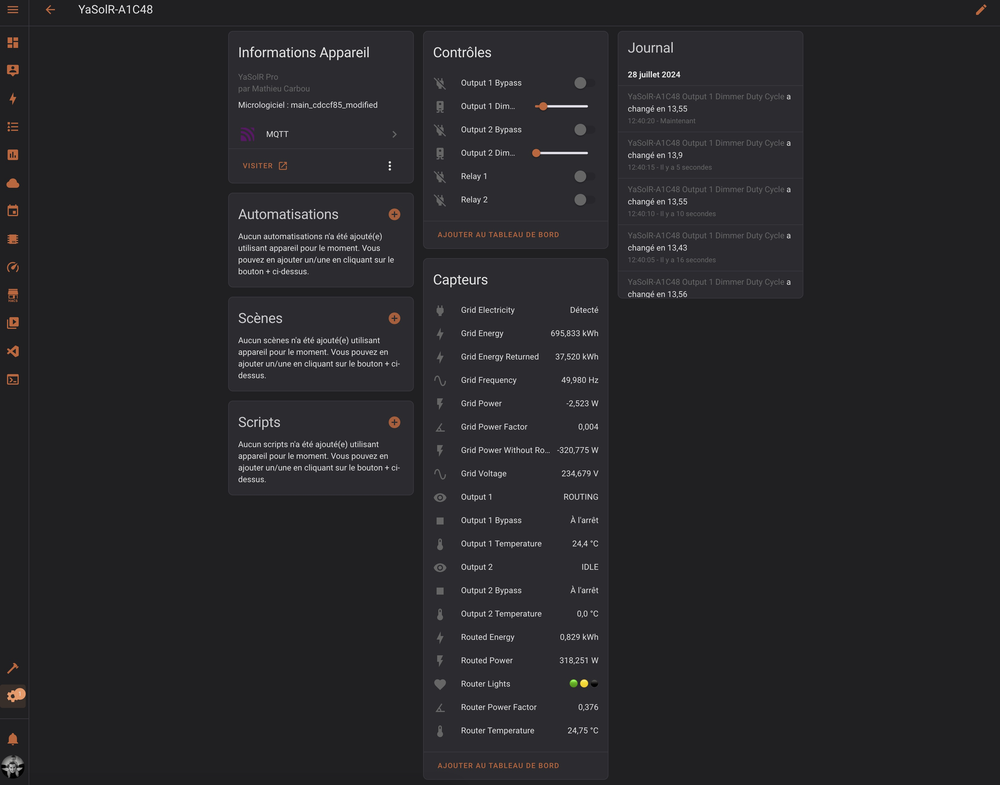](assets/img/screenshots/ha_disco_1.jpeg) | [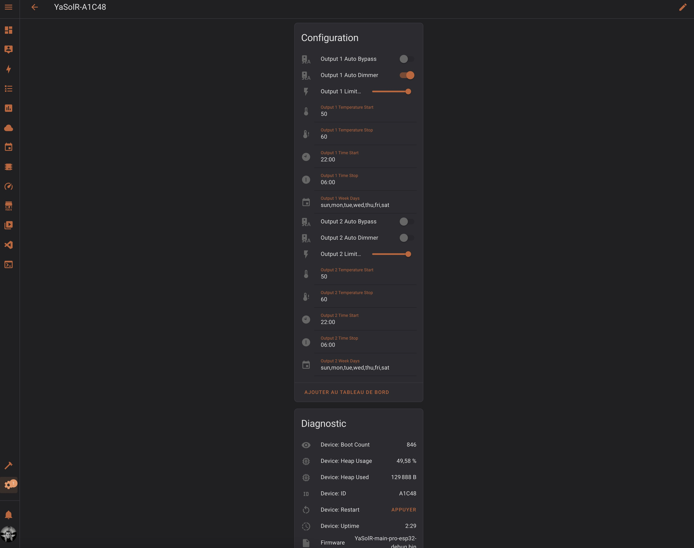](assets/img/screenshots/ha_disco_2.jpeg) |

- `Home Assistant Integration`: whether to activate or not MQTT Discovery
- `Home Assistant Discovery Topic`: the MQTT topic prefix to use for all the topics published by the router for Home Assistant Discovery.
  It is set by default to `homeassistant/discovery`.
  The default Home Assistant Discovery topic prefix is `homeassistant`.
  I strongly recommend to keep the default of the router and configure Home Assistant to use `homeassistant/discovery` for Discovery in order to separate state topics from discovery topics.

**The device must be restarted to apply the changes.**

You can read more about Home Assistant Discovery and how to configure it [here](https://www.home-assistant.io/docs/mqtt/discovery/).
To configure the discovery topic, you need to go to [http://homeassistant.local:8123/config/integrations/integration/mqtt](http://homeassistant.local:8123/config/integrations/integration/mqtt), then click on `configure`, then `reconfigure` then `next`, then you can enter the discovery prefix `homeassistant/discovery`.
Once done on Home Assistant side and YaSolR side, you should see the Solar Router device appear in Home Assistant in the list of MQTT devices.

#### MQTT API

The complete reference of the published data in MQTT is available [here](mqtt).
The published data can be explored with [MQTT Explorer](https://mqtt-explorer.com/).

[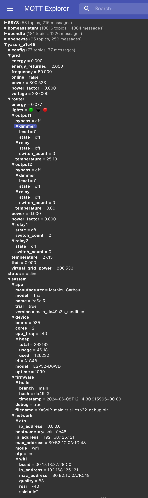](assets/img/screenshots/mqtt_explorer.jpeg)

### GPIO

This section allows to configure the pinout for the connected hardware and get some validation feedback.

[](assets/img/screenshots/app-gpio.jpeg)

- Set the value to **-1** to disable the pin.
- Set the input to **blank** and save to reset the pin to its default value.

If you see a warning with `(Input Only)`, it means that this configured pin can only be used to read
data.
It perfectly OK for a ZCD, but you cannot use a pin that can only be read for a relay, DS18 sensor, etc.

**The device must be restarted to apply the changes.**

### Hardware

This section allows to enable / disable the hardware components of the router, and get some feedback in case some activated features cannot be activated.

[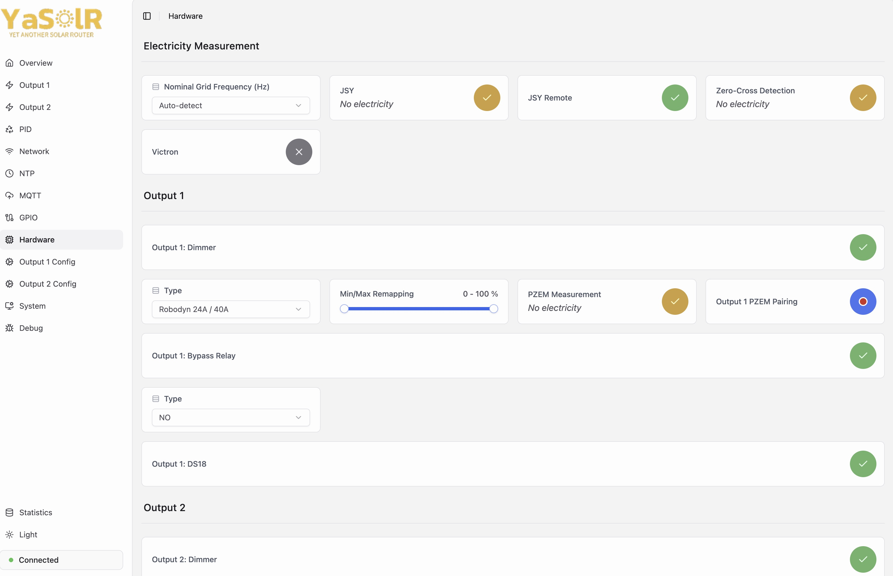](assets/img/screenshots/app-hardware.jpeg)

Make sure to correctly configure all the hardware components you have connected to the router.

**The device must be restarted to apply the changes.**

> ##### NOTE
>
> - `Output 1 Bypass Relay` and `Output 2 Bypass Relay`: these are the SSR or Electromechanical relays connected to the device and used whn you activate bypass mode.
>   Only activate if you have connected some relays to be used for the output bypass. If you did not connect any relay, you can leave them disabled and the bypass mode will not work with the dimmer set at 100%.
>
> - `Relay 1` / `Relay 2`: these are the SSR or Electromechanical relays connected to the device and used to control external loads.
>   Only activate if you have connected some relays to be used for external loads.
>
{: .block-note }

#### Nominal Grid Frequency

`Auto-detect` will automatically detect the grid frequency based on the connected measurement devices, or remote ones, or thanks to the pulse analyzer.
It is recommended to leave the setting to `Auto-detect` unless you have a good reason to force it (no measurement device connected, etc).

If you set it, frequency won't be detected from a measurement device, but will be forced to the value you set.

> ##### NOTE
>
> It can happen that your grid frequency will be switched temporarily to a non standard value (like 51Hz) if a generator is used because of some repair, etc.
> With automatic mode, YaSolR will detect this change and adapt the routing to the new frequency.
>
{: .block-note }

#### JSY

The JSY is used to measure:

1. the total routed power of the outputs combined (optional) with the channel 1 (tore or clamp depending on the model)
2. the grid power and voltage with the clamp of channel 2

The JSY can be replaced by MQTT, reading the power and voltage from MQTT topics.
See [MQTT Topic Subscriptions](#mqtt-topic-subscriptions).

**Wiring:**

- Channel 1 (CT1): all the router outputs should go through it
- Channel 2 (CT2): the grid should go through it

Reason is that on some JSY, channel 1 is a tore on the board while channel 2 is always a clamp.
This is easier to put a clamp around the grid wire.

> ##### NOTE
>
> The JSY-194G labels are wrong for RX and TX, so for this JSY, connect the JSY RX to the board RX and the JSY TX to the board TX.
>
{: .block-note }

#### JSY Remote

JSY can also be replaced with a remote JSY **without any impact on routing speed**.
You can install the [Sender](https://github.com/mathieucarbou/MycilaJSY/tree/main/examples/RemoteUDP) .ino file on a device and connect it to the JSY.
This is a standalone application that looks looks like this and will show all your JSY data, help you manage it, and also send the data through UDP.
The reading rate is about **20-25 messages per second** and sending rate is 3 messages per second (because the JSY exposes 3 new measurements every second).


You can look in the [JSY project](https://mathieu.carbou.me/MycilaJSY/) to find more information about how to setup remote JSY and the supported protocols.

When using a remote JSY with the router, the following rules apply:

- The voltage will always be read if possible from a connected JSY or PZEM, then from a remote JSY, then from MQTT.
- The grid power will always be read first from MQTT, then from a remote JSY, then from a connected JSY.

JSY Remote can be activated in the Hardware section by switching the button called **"JSY Remote"**.

**Wiring:**

- Channel 1 (CT1): all the router outputs should go through it
- Channel 2 (CT2): the grid should go through it

Reason is that on some JSY, channel 1 is a tore on the board while channel 2 is always a clamp.
This is easier to put a clamp around the grid wire.

> ##### TIP
>
> JSY Remote app is automatically detected on the same network: you don't need to configure anything.
> As soon as the Sender app will start sending data, YaSolR will receive it and display it.
{: .block-tip }

#### Zero-Cross Detection

The Zero-Cross Detection (ZCD) module is used to detect the zero-crossing of the grid voltage.

It is required with these types of dimmers:

- LSA / LCTC Voltage Regulators + PWM->Analog 0-10V + ZCD
- Random Solid State Relay + ZCD
- RobotDyn 24/40A
- Triac + ZCD

When activating `Zero-Cross Detection` in the hardware page, YaSolR will first start a pulse analyzer to grab some statistics about the pulse characteristics: period and length.
This characteristics are used to fine-tune the TRIAC firing and they can be viewed in the dashboard, in the statistics section:

- `ZCD: Pulse Width` (will depends on your ZCD module)
- `ZCD: Pulse Period` (should be around 10ms for 50Hz and 8ms for 60Hz)

Once the pulse analysis if finished (it should last around 1 second), the ZCD module will be activated and the router will start routing.

Note that if the electricity is not available when YaSolR starts, the pulse analyser will wait until the electricity is back to start the pulse analysis and then activate the ZCD module.

> ##### IMPORTANT
>
> - RobotDyn includes a ZCD (its ZC pin).
> - RobotDyn has a very bad ZCD circuit. I strongly suggest you use a dedicated ZCD module instead.
>   Please have a look at these blog articles on YaSolR website for more information:
>   - [2024-07-24 - The Importance of a good ZCD circuit](./blog/2024-07-24_the_importance_of_a_good_zcd_circuit)
>   - [2024-07-31 - Zero-Cross Pulse Detection](./blog/2024-07-31_zero-cross_pulse_detection)
>
{: .block-important }

#### Victron Modbus TCP

YaSolR supports connecting to Victron Modbus TCP Server to get the grid power, voltage and frequency.

- Victron: whether to activate or not the Victron Modbus TCP feature
- Victron Modbus TCP Server: the Victron Modbus TCP server IP address
- Victron Modbus TCP Port: the Victron Modbus TCP server port (usually `502`)

#### Dimmer Type

YaSolR supports all these dimmer types:

All the supported dimmer types:

- Zero-Cross Detection based:
  - LSA / LCTC Voltage Regulators + PWM->Analog 0-10V + ZCD
  - Random Solid State Relay + ZCD
  - RobotDyn 24/40A
  - Triac + ZCD
- PWM based:
  - LSA / LCTC Voltage Regulators + PWM->Analog 0-10V
- DAC based:
  - LSA / LCTC Voltage Regulators + DAC GP8211S (DFR1071)
  - LSA / LCTC Voltage Regulators + DAC GP8403 (DFR0971)
  - LSA / LCTC Voltage Regulators + DAC GP8413 (DFR1073)

You need to select the correct dimmer type for your hardware and then restart YaSolR.

Zero-Cross Detection types require to have a ZCD module connected to the router and activated.

**DFRobot DAC modules:**

You can see the full specifications of list of DFRobot DAC modules [here](https://www.dfrobot.com/blog-13458.html).

- Pick one module between the DFR1071, DFR0971 or DFR1073, ideally the DFR1073 because it has 2 channels and 15 bits resolution and higher accuracy.
- Connect the module to the router by using the I2C pins (SDA and SCL, same for the display)
- For DFR0971 and DFR1073 (2-channel): Channel 1 is used for output 1 and channel 2 is used for output 2.
- Leave the selectors on the module to the default position A2-A1-A0 at 0-0-0 (which means address: 0x58, their default address). 
  **Pay attention to that: some modules come with another address configured!**

[](https://www.dfrobot.com/product-2613.html)

#### Dimmer Range Remapping

`Min/Max Remapping` allows to remap where the 0% power is set (`Min`) and where the 100% power is set (`Max`).
When remapped, the new duty range (0-100%) will match values from `Min` to `Max` instead of `0` to `100%`.

This can be used for example to limit the power output of a dimmer, or to remap the pwm signal sent to a voltage regulator.

For example, if you set the range to `10-80%, then the new 0 will match a duty cycle of 10% and the new full power (100%) will match a duty cycle of 80%.

Read more about how to calibrate a voltage regulator in the [Voltage Regulators](#voltage-regulators-lsa-lctc-etc) section.

#### PZEM Pairing

- `Output 1 PZEM Pairing`: starts the pairing procedure for Output 1 PZEM-004T v3 at address 0x01.
- `Output 2 PZEM Pairing`: starts the pairing procedure for Output 2 PZEM-004T v3 at address 0x02.

Each output supports the addition of a PZEM-004T v3 sensor to monitor the power sent to the resistive load specifically for this output.
Thanks to the PZEM per output, it is also possible to get some more precise information like the dimmed RMS voltage, resistance value, etc.

The PZEM-004T v3 devices has a special installation mode: you can install 2x PZEM-004T v3 devices on the same Serial TX/RX.
To communicate with the right one, each output will use a different slave address.
The initial setup requires to pair each PZEM-004T v3 with the corresponding output.

1. Connect the 2x PZEM-004T v3 devices to the grid (L/N) and install the clamp around the wire at the exit of the dimmer of first output
2. Only connect the terminal wire (+5V, GND, RX, TX) of the first PZEM-004T v3 to pair to Output 1
3. Boot the device and open the console (`http://yasolr.local/console`)
4. Got to the `Hardware` section to activate `Output 1 PZEM`.
   It should be yellow if it has no electricity or if it is not paired.
5. Press the `Output 1 PZEM Pairing` button.
6. Verify that the pairing is successful in the console.
   `Output 1 PZEM` should also be green in the `Hardware` section.
7. **Disconnect this first PZEM-004T v3 from the device**
8. Connect the second PZEM (which has its clamp at the exit of the dimmer of the second output) to the device
9. Press the `Output 2 PZEM Pairing` button.
10. Verify that the pairing is successful in the console.
    `Output 2 PZEM` should also be green in the `Hardware` section.
11. Now that the 2 devices have an address, you can connect them all to the device

You can verify that the pairing is successful by trying to activate the dimmer in the overview page, and see if you get the output power.

This complex pairing procedure is not specific to this router project but is common to any PZEM-004T device when using several PZEM-004T v3 devices on the same Serial TX/RX.
You can read more at:

- [mathieucarbou/MycilaPZEM004Tv3](https://github.com/mathieucarbou/MycilaPZEM004Tv3)
- [mandulaj/PZEM-004T-v30](https://github.com/mandulaj/PZEM-004T-v30)

#### Bypass Relay

Installing a relay for bypass is optional: if installed, the relay will be used to power the heater, and the dimmer will be set to 0.

If not installed, when activating bypass mode, the dimmer will be used and set to 100%.
The advantage is a simple setup, the drawbacks are:

- the dimmer will heat up.
- the power output of he dimmer counts as routed power so the routed power and energy will also contain the bypass power.

In the `Hardware` section, `Output 1 Bypass Relay` and `Output 2 Bypass Relay` both specify if a relay is installed for the output, on top of the dimmer of course, and if it should be used when bypass is activated.
If no relay is installed, the dimmer will be used and will be set to 100%. For each you can also select the relay: `Normally Open` or `Normally Closed`.

#### Temperature Sensors

The temperature sensors are used to monitor the water tank in order:

- to trigger an automatic heating based on temperature levels (called **auto bypass**).
- to stop the routing if the temperature is too high (called **temperature limiter**).

Supported temperature sensor: `DS18B20`

A temperature sensor can also be used to monitor the router box itself (`Overview` section).

#### Relay Types

- `Output 1 Bypass Relay Type`: the relay type for Output 1 Bypass: Normally Open (NO) or Normally Closed (NC).
- `Output 2 Bypass Relay Type`: the relay type for Output 2 Bypass: Normally Open (NO) or Normally Closed (NC).
- `Relay 1 Type`: the relay type for Relay 1: Normally Open (NO) or Normally Closed (NC).
- `Relay 2 Type`: the relay type for Relay 2: Normally Open (NO) or Normally Closed (NC).

#### Relay Automatic Control

- `Relay X Automatic Control: Connected Load (Watts)`: You can specify the resistive load power in watts connected to the relays.
  If you do so, the relay will be activated automatically based on the grid power.

YaSolR supports 2 additional relays (Electromechanical or SSR, controlled with 3.3V DC) to control external loads, or to be connected to the A1 and A2 terminals of a power contactor.
Relays can also be connected to the other resistance of the water tank (three-phase resistance) as described in the [recommendations to reduce harmonics and flickering](./overview#recommendations-to-reduce-harmonics-and-flickering), in order to improve the routing and reduce harmonics.
You must use a SSR for that, because the relay will be switched on and off frequently.

> ##### NOTE
>
> Remember that the voltage is not dimmed: these are 2 normal relays
{: .block-note }

> ##### WARNING
>
> Pay attention that there is little to no hysteresis on the relays.
> So do not use the automatic feature to switch non-resistive loads such as pumps, electric vehicle chargers, etc.
> If you need to switch other types of load in a more complex way with some hysteresis or other complex conditions, you can use the MQTT, REST API, Home Assistant or Jeedom to query the `Virtual Power` metric and execute an automation based on this value.
> The automation can then control the router relays remotely. The relays need to be set in `Manual Control`.
> Remember that these relays are not power contactors and should not be used to directly control high power loads like an Electric Vehicle charge, a pump, etc.
{: .block-warning }

> ##### TIP
>
> - **For an EV charge control**: see [Virtual Grid Power / Compatibility with EV box](#virtual-grid-power--compatibility-with-ev-box)
>
> - **For a pump**: a contactor is recommended which can be coupled with a Shelly EM to activate / deactivate the contactor remotely, and it can be automated by Home Assistant or Jeedom based on the `Virtual Power` metric of this router, but also the hours of day, days of week, depending on the weather, and of course with some hysteresis and safety mechanisms to force the pump ON or OFF depending on some rules.
>
{: .block-tip }

**Rules of Automatic Switching**

`Grid Virtual Power` is calculated by the router as `Grid Power - Routed Power`.
This is the power that would be sent to the grid if the router was not routing any power to the resistive loads.

`Grid Virtual Power` is negative on export and positive on import.

- The relay will automatically start when `Grid Virtual Power + Relay Load <= -3% of Relay Load`.
  In other words, the relay will automatically start when there is enough excess to absorb both the load connected to the relay plus 3% more of it.
  When the relay will start, the remaining excess not absorbed by the load will be absorbed by the dimmer.

- The relay will automatically stop when `Grid Virtual Power >= 3% of Relay Threshold`.
  In other words, the relay will automatically stop when there is no excess anymore but a grid import equal to or more than 3% of the relay threshold.
  When the relay will stop, there will be some excess again, which will be absorbed by the dimmer.

For a 3000W three-phase resistance, 3% means 30W per relay because there is 3x 1000W resistances.
For a 2100W three-phase resistance, 3% means 21W per relay because there is 3x 700W resistances.

#### LEDs

The LEDs are used to notify the user of some events like reset, restarts, router ready, routing, etc.

| **LIGHTS** | **SOUNDS**       | **STATES**                      |
| :--------: | ---------------- | ------------------------------- |
| `🟢 🟡 🔴` | `BEEP BEEP`      | `STARTED` + `POWER` + `OFFLINE` |
| `🟢 🟡 ⚫` |                  | `STARTED` + `POWER`             |
| `🟢 ⚫ 🔴` | `BEEP BEEP`      | `STARTED` + `OFFLINE`           |
| `🟢 ⚫ ⚫` | `BEEP`           | `STARTED`                       |
| `⚫ 🟡 🔴` | `BEEP BEEP BEEP` | `RESET`                         |
| `⚫ 🟡 ⚫` |                  | `STARTING`                      |
| `⚫ ⚫ 🔴` | `BEEP BEEP`      | `RESTART`                       |
| `⚫ ⚫ ⚫` |                  | `OFF`                           |

- `OFF`: application not working (power off)
- `OFFLINE`: application disconnected from WiFi or disconnected from grid electricity
- `POWER`: power allowed to be sent (either through relays or dimmer)
- `RESET`: application is restarting following a manual reset
- `RESTART`: application is restarting following a manual restart
- `STARTED`: application started and WiFi or AP mode connected
- `STARTING`: application is booting

#### Display

The display has to be connected to the I2C pins (SDA and SCL).

- `Display Speed`: the speed at which the display will switch to the next page.
  This setting is applied immediately and does not require a restart.
- `Display Type`: the type of display used.
- `Display Rotation`: the rotation of the display.

Supported displays are any I2C OLED Display of type `SSD1307`, `SH1106`, `SH1107`.

`SH1106` is recommended and has been extensively tested.

The display will look like a carousel with a maximum of 5 pages:

- Global information
- Network information
- Router information with relays
- Output 1 information
- Output 2 information

[](assets/img/screenshots/app-display.gif)

### Output 1 and 2 Config

These sections allow to further configure some hardware settings and calibrate the resistance values of the loads.

[](assets/img/screenshots/app-output-config.jpeg)

#### Resistance Calibration

**The router needs to know the resistance value of the load to correctly calculate the dimmer values**.

- `Output 1 Resistance`: the resistance value in Ohms of the load connected to Output 1
- `Output 2 Resistance`: the resistance value in Ohms of the load connected to Output 2

Be careful to put a value that you have correctly measured with a multimeter, or calculated (see formula below).
An approximation will cause the router to not properly work because it won't be able to adjust the exact amount of power to send.

Remember the equation:

```
R = U * U / P
```

where:

- `P` is the _nominal_ power in Watts given by the manufacturer of the resistance
- `U` is the _nominal_ voltage in Volts, usually 230V in Europe and 120V in the US/Canada
- `R` is the resistance in Ohms

**Reading the resistance value from a PZEM or JSY**

If you have a PZEM or JSY device attached, they can help you.
You can set the dimmer in manual mode and set it to 50% and 100% and read the resistance value.
Then you just have to report it in the `Hardware Config` page.

- **PZEM-004T v3:** If you have wired a PZEM-004T v3 connected to each output, it will measure the resistance value when routing.
- **JSY:** If you have a JSY, you can activate the dimmers one by one to 100% and wait for the values to stabilize.
  The router will then display the resistance value in the `Overview` page, thanks to the JSY.

**Using the automatic detection feature**

- `Resistance Detection`: start the automatic detection of the resistance value of the loads connected to Output 1 and 2

This is the easiest way to calibrate the resistance values: when a PZEM or JSY is installed, the router will be able to automatically calculate the resistance.
For that, click on the corresponding buttons and wait about 10-15 seconds.
You can at the same time check the statistics on the `Output` or `Overview` sections, and the logs in the Web console for a more detailed output.
Once done, the resistance value will be put in the corresponding field.
Any previously set value will be erased.

To use this feature, make sure that the resistance will really draw some current.
It won't work if the water heater has already reached its threshold temperature.

#### Dimmer Configuration

- `Dimmer Limiter`: Slider to limit the level of the dimmer in order to limit the routed power.
- `Dimmer Temperature Limiter`: Temperature threshold when the dimmer will stop routing.
  This temperature can be different than the temperature used in auto bypass mode.
  A value of `0` means that the temperature limiter is disabled.
- `Excess Power Limiter (W)`: Allows to share the remaining grid excess to the second output.
  Only available in automatic mode.
  For example, if output 1 is set to `500 W`, then output 1 will take at most `500 W` of the grid excess.
  Output 2 will be dimmed with the remaining excess.
  A value of `0` means that the excess power limiter is disabled.

#### Bypass Configuration

- `Bypass Start Temperature`: The temperature threshold when the auto bypass will start: the temperature of the water tank needs to be lower than this threshold.
- `Bypass Stop Temperature`: The temperature threshold when the auto bypass will stop: the temperature of the water tank needs to be higher than this threshold.
- `Bypass Start Time` / `Bypass Stop Time`: The time range when the auto bypass is allowed to start.
- `Bypass Week Days`: Days of the week when the bypass can be activated.

### System

[](assets/img/screenshots/app-system.jpeg)

- `Configuration Backup`: Backup the current configuration of the router.
- `Configuration Restore`: Restore a previously saved configuration.
- `Restart`: Restart the router.
- `Restart in SafeBoot mode`: Restart YaSolR in SafeBoot mode to update through Web OTA the firmware
- `Factory Reset`: Reset the router to factory settings and restart it.
- `Energy Reset`: Reset the energy stored in all devices (JSY and PZEM) of the router.
- `Update SafeBoot partition`: Update the SafeBoot recovery partition

> ##### IMPORTANT
>
> YaSolR is composed of 2 partitions: the main partition (called `app`) and a SafeBoot recovery partition (called `safeboot`), which is used to update YaSolR application.
> When updating through web (OTA) it is not possible to update the partition from which the application is currently running.
> That is why YaSolR needs to restart in SafeBoot mode to update the main application partition.
> And consequently, from YaSolR, it is possible to update this SafeBoot recovery partition.
> 
> Pay really attention when updating the recovery partition: 
> if anything goes wrong, you will have to re-flash the complete FACTORY firmware and reconfigure everything (or restore a backup).
{: .block-important }

SafeBoot recovery partitions can be downloaded from the [MycilaSafeBoot](https://github.com/mathieucarbou/MycilaSafeBoot) project: [https://github.com/mathieucarbou/MycilaSafeBoot/releases](https://github.com/mathieucarbou/MycilaSafeBoot/releases)

### Debug

[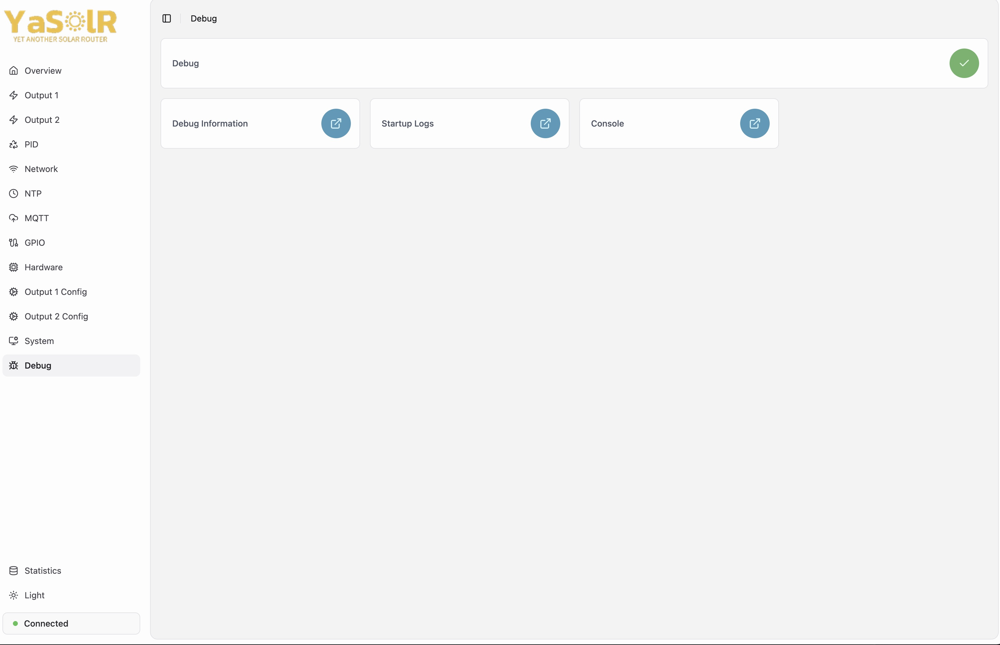](assets/img/screenshots/app-debug.jpeg)

- `Debug`: Activate or deactivate the debug options (restart required).
- `Debug Information`: Outputs useful debug information to give to support.
  **Only available when `Debug` is activated in Hardware section.**
- `Startup Logs`: View startup logs when ESP32 starts. These logs are limited to 32 Kib.
- `Console`: Go to the Web Console page to see the logs
  **Only available when `Debug` is activated in Hardware section.**

> ##### WARNING
>
> Activating debug mode will slow down the startup and overall performance of the router because of the additional logs and flash access required.
> Do not forget to only activate this option temporarily when troubleshooting an issue and deactivate it once finished.
{: .block-warning }

#### Saving logs

If you need to record the logs during a long period of time to troubleshoot an issue, you can activate `Debug` and then stream the logs into a file using `websocat` from another computer.
Make sure the computer won't go to sleep!

```bash
> websocat ws://192.168.125.123/wserial > logs.txt
```

#### Web Console

A Web Console is accessible at: `http://<esp-ip>/console`.
You can see more logs if you activate Debug logging (but it will make the router react a bit more slowly).

[](assets/img/screenshots/app-console.jpeg)

### Statistics

This page shows a lot of statistics and information on the router.

[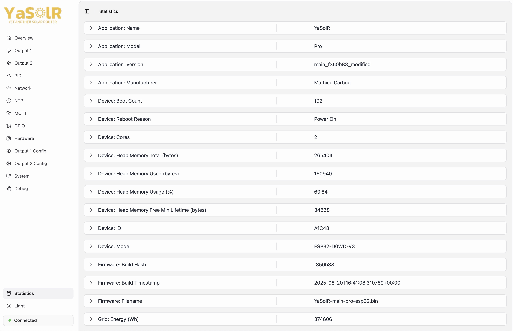](assets/img/screenshots/app-statistics.jpeg)

## Additional Hardware Information

### EV charging box compatibility with Virtual Grid Power

The router exposes through API and MQTT the **Virtual Grid Power**, which is the value of Grid Power you would have if the router was not routing.

You can use this value to inject in the EV box in order to prioritize EV charging over routing to the water tank.

This is usually acceptable to give the EV box a priority over the water tank, because the water tank only need a small amount of routed energy to start heating, while the EV usually requires a threshold to start charging.
So the router will take whatever is not used by the EV box.

> ##### IMPORTANT
>
> `Virtual Grid Power` requires a PZEM or JSY in place to measure the routed power.
{: .block-important }

### Voltage Regulators (LSA, LCTC, etc)

Using voltage regulators such as LSA or LCTC is possible with the help of a conversion board like the one listed in the [hardware page](./build#voltage-regulators).

- The conversion board needs to be powered with a 12V DC input (you can use a Meanwell HDR-15-12 DIN rail for that, installed under a 2A breaker)
- The GND and dimmer output of YaSolr must be connected to the PWM- and PWM+ of the conversion board instead of going to a SSR or RobotDyn
- The output GND (-) and A0 (+) of the conversion board must be connected to the LSA or LCTC voltage regulator, at the 0-10V analog input

**How it works:**

1. The conversion board will transform the 100Hz 3.3V dimmer PWM signal to an analog output, which is a voltage in the range 0-10V
2. The LSA reads this voltage and based on its level it knows how much power he has to let go to the load

**Calibration:**

> ##### TIP
>
> If you use the conversion board listed, you won't need to calibrate: it works out of the box.
>
{: .block-tip }

1. Use the [`Dimmer Range Remapping` feature](#dimmer-range-remapping) to remap the dimmer range if needed to increase the base voltage or decrease the duty cycle
2. Eventually calibrate the conversion board (potentiometer) as described in the manual of the conversion board
3. Adjust the input voltage of the conversion board (HDR-15-12 potentiometer)

**Oscilloscope views:**

Here is what happens when you change the dimmer slider at 10%, 50% and 50%:

|                                     **10%**                                     |                                     **50%**                                     |                                     **90%**                                     |
| :-----------------------------------------------------------------------------: | :-----------------------------------------------------------------------------: | :-----------------------------------------------------------------------------: |
| [](assets/img/measurements/LSA_10p.png) | [](assets/img/measurements/LSA_50p.png) | [](assets/img/measurements/LSA_90p.png) |

- The red line is the input AC voltage
- The yellow line is the Zero-Cross pulse form the ZCD (here I am using the ZCD from Daniel S.)
- The blue line is the PWM signal sent to the conversion board: it is in other term the triac firing delay that would be applied to a triac or random SSR
- The pink line is the current going out from the LSA to the load

We can see that updating the slider in YasolR will change the current going out from the LSA to the load, and the lines are close enough so that the PID algorithm of the router will be able to still work properly.

This could even be tweaked further: ideally, the pink line should match the blue line.

Here, the pink line triggers AFTER the blue line at 10%, which means that the voltage going to the LSA input is not high enough when the duty cycle is low.
The pink line triggers BEFORE the blue line at 90%, which means that the voltage going to the LSA input is too high when the duty cycle in YaSolR is at 90%.

Note: using the `Dimmer Range Remapping` feature won't fix that: this is a calibration that has to be done on conversion board and or by adjusting the HDR-15-12 voltage.

## Help and support

- **Facebook Group**: [https://www.facebook.com/groups/yasolr](https://www.facebook.com/groups/yasolr)

- **GitHub Discussions**: [https://github.com/mathieucarbou/YaSolR/discussions](https://github.com/mathieucarbou/YaSolR/discussions)

- **GitHub Issues**: [https://github.com/mathieucarbou/YaSolR/issues](https://github.com/mathieucarbou/YaSolR/issues)

- **ESP32 Exception Decoder**: [https://maximeborges.github.io/esp-stacktrace-decoder/](https://maximeborges.github.io/esp-stacktrace-decoder/)
