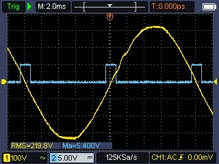
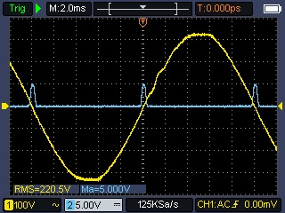
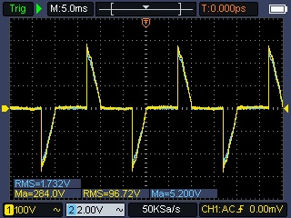

# Overview

- [What is a Solar Router ?](#what-is-a-solar-router-)
- [How a Solar Router work ?](#how-a-solar-router-work-)
  - [Zero-Cross Detection (ZCD)](#zero-cross-detection-zcd)
  - [The Importance of a good ZCD circuit](#the-importance-of-a-good-zcd-circuit)
  - [Robodyn and Solid State Relay (SSR)](#robodyn-and-solid-state-relay-ssr)
- [Phase Control](#phase-control)
  - [Harmonics](#harmonics)
- [Burst Fire Control](#burst-fire-control)
  - [Flickering](#flickering)
- [Recommendations to reduce harmonics and flickering](#recommendations-to-reduce-harmonics-and-flickering)
- [References](#references)
- [Alternatives and Inspirations](#alternatives-and-inspirations)

## What is a Solar Router ?

A _Solar Router_ allows to redirect the solar production excess to some appliances instead of returning it to the grid.
The particularity of a solar router is that it will dim the voltage and power sent to the appliance in order to match the excess production, in contrary to a simple relay that would just switch on/off the appliance without controlling its power.

A _Solar Router_ is usually connected to the resistance of a water tank and will heat the water when there is production excess.

A solar router can also do more things, like controlling (on/off) the activation of other appliances (with the grid normal voltage and not the dimmed voltage) in case the excess reaches a threshold. For example, one could activate a pump, pool heater, etc if the excess goes above a specific amount, so that this appliance gets the priority over heating the water tank.

A router can also schedule some forced heating of the water tank to ensure the water reaches a safe temperature, and consequently bypass the dimmed voltage. This is called a bypass relay.

## How a Solar Router work ?

A router is composed of 2 main pieces:

1. **A bi-directional measurement system** that will detect the solar production excess and the home consumption in Watts: Linky TIC, Shelly EM, JSY, etc

2. A **dimmer system** that will control the voltage and power sent to the resistance of the water tank to match the measured excess: Robodyn AC Dimmer, Random Solid State Relay, etc

The dimmer systems are usually based on TRIAC / Thyristors and are controlling the power through different methods:

|                                                        **Phase Control**                                                        |                                                                                                              **Burst Fire Control**                                                                                                              |
| :-----------------------------------------------------------------------------------------------------------------------------: | :----------------------------------------------------------------------------------------------------------------------------------------------------------------------------------------------------------------------------------------------: |
|                                                                              |                                                                                                                                                                                                         |
| In this mode, the TRIAC lets the current pass at a specific moment within the 2 semi-periods of 10 ms by "cutting" the sin wave |                                                    In this mode, the TRIAC is used like a rapid switch, to let pass a sequence of complete full periods or semi-periods without cutting them                                                     |
|                                            **Used devices:** Robodyn, Random SSR                                             |                                                                                             **Used devices:** Robodyn, Random SSR, Zero-Cross SSR                                                                                             |
|                  **Pros:** More precise routing, can control exactly the right amount of power to let pass                   |                                                                                     **Pros:** Easier to grasp and implement and does not create harmonics                                                                                     |
|          **Cons:** Can cause harmonics that can be difficult to filter out (but effect can be limited or mitigated)          | **Cons:** Less precise routing because each complete period (or semi-period) lets the full power (or half power) pass, and can cause flickering (light bulbs that are close-by can blink because of the fast and successive current switches) |

Other algorithms exist, more or less complex but generally based on these 2 methods.

### Zero-Cross Detection (ZCD)

To know when to switch or cut the voltage wave, routers are using a **Zero-Cross Detection (ZCD) circuit** that will detect when the voltage curve crosses the Zero point (which is twice per period) and will send a pulse to the controller board.
Here are below some examples of how a ZCD circuit works by looking at 2 different implementations: Robodyn and a more specific one from [Daniel S.](https://www.pcbway.com/project/shareproject/Zero_Cross_Detector_a707a878.html).

|                                  **Dedicated ZCD circuit**                                   |                                           **Robodyn ZCD circuit**                                            |
| :------------------------------------------------------------------------------------------: | :----------------------------------------------------------------------------------------------------------: |
|  |  |

When the AC voltage curve crosses the Zero point, the ZCD circuit sends a pulse (with a custom duration) to the controller board, which now knows that the voltage is at zero.
The board then does some calculation to determine when to send the signal to the TRIAC (or Random SSR or Robodyn) to activate it, based on the excess power, or if using burst fire control, to know when to let the current pass and for how many semi-periods.

### The Importance of a good ZCD circuit

Using a good ZCD circuit producing a reliable pulse is very important.

If the pulses are not reliable, some short flickering could be caused by a mis-detection of the zero point or by the existence of spurious pulses (false-positives), and consequently cause the TRIAC to fire at the wrong time, or the calculations for the burst fire sequence to be wrong.
These are visible if you plug an incandescent light bulb to the dimmer output: the bulb will flicker from time to time.
The effect on a water tank resistance is even bigger: it will create some spurious spikes of power consumption, that the router will try to compensate just after by considerably reducing the dimming level.
This creates some waves instead of keeping the import and export at a near-0 level.

These phenomena are not visible with a good ZCD module coupled with a Random SSR.

The Robodyn is such a device that has an unreliable ZC pulse: all experts working on Solar Routers who have measured that correctly, tend to agree with the fact that **the Robodyn is one of the worst device to use because of its unreliable ZC and poor quality circuit and heat sink**.

Here is below a YaSolR screenshot of the Grid Power graph showing the effect of a bad ZCD module on the power consumption and import.
On the lef side, the Robodyn ZCD is used, then I've switched (live) to a dedicated ZCD module.

Here is another example below of th YaSolR PID Tuning view showing the input value of the PID controller.
The dedicated ZCD module was used, then I've switched (live) to a Robodyn ZCD module.
The update rate is high: 3 times per second.
All the JSY measurements are captured and displayed.
You can clearly see the flickering caused by the bad quality of the Robodyn ZCD pulses, which gets compensated just after by the PID controller.

Lastly, here is a graph showing in Home Assistant the effect of the Robodyn ZCD on the dimmer output.
The Robodyn ZCD was used form 11:58 to 12:02, then I've switched (live) to a dedicated ZCD module.

You can read more about these issues here also:

- [About dimmer boards](https://github.com/fabianoriccardi/dimmable-light/wiki/About-dimmer-boards)
- [Notes about specific architectures](https://github.com/fabianoriccardi/dimmable-light/wiki/Notes-about-specific-architectures#esp32)

### Robodyn and Solid State Relay (SSR)

A Solid State Relay is a relay that does not have any moving parts and is based on a semiconductor.
It can be turned on and off very fast.

A **Zero-Cross SSR** is a relay that will only close or open when the voltage curve is at 0.
It won't generate any harmonics and is not able to do Phase Control, but it can be used for Burst Fire Control.

A **Random** SSR is a relay that can be turned on and off at any point in time, at any voltage level.
It can be used for Phase Control and Burst Fire Control.
If activated when the voltage curve is not at 0, it will generate harmonics.

Due to the nature of SSR, the more they are used (switched on/off), the more they will heat up.
So it is recommended to install them on a vertical heat sink.

SSR also have some specifications to take into account for the use of a Solar Router:

- **Type of control**: DA: (DC Control AC)
- **Control voltage**: 3.3V should be in the range (example: 3-32V DC)

**Robodyn** is a device that includes both a ZCD circuit and a TRIAC, which makes it ideal for a Solar Router using Phase Control System.
Using a Random SSR instead of the Robodyn is possible but will require the use of an additional ZCD circuit.

## Phase Control

**Effect on current**

In this mode, the TRIAC lets the current pass at a specific moment within the 2 semi-periods of 10 ms by "cutting" the sin wave.

Here are 3 different views from an Owon VDS6104 oscilloscope of:

1. The AC voltage at dimmer input (red)
2. The ZCD pulse detected by the ESP32 board when the voltage crosses the Zero line (yellow)
3. The control voltage of the random SSR (or Robodyn) that is sent from the ESP32 board. The TRIAC will let the current pass when the control voltage is >= 3.3V (blue)
4. The dimmed AC current at dimmer output (pink)

|                       |                                      **Dimmer Duty 0.24%**                                      |                                         **Dimmer Duty 50%**                                         |                                     **Dimmer Duty 4090 / 4095**                                     |
| :-------------------: | :---------------------------------------------------------------------------------------------: | :-------------------------------------------------------------------------------------------------: | :-------------------------------------------------------------------------------------------------: |
|      **Robodyn**      |  |  |  |
| **Better ZCD Module** |          |          |          |

Dimmer at 50% matches the 90 degrees angle of the voltage curve, so the current is chopped at 50% of the period. This is when the harmonic level is the highest.
We can clearly see the effect of the TRIAC on the voltage curve, and the resulting current curve, which is chopped at the wanted level.

Robodyn as a poor ZCD signal.
If you can, take a better ZCD module.
This will also help ZCD edge detection because the ESP32 is subject to [spurious interrupt issue](https://github.com/fabianoriccardi/dimmable-light/wiki/Notes-about-specific-architectures#interrupt-issue) when detecting ZCD edges.
Hopefully this can be overcome by filtering out the noise in the code.

**Effect on voltage**

Now, let's see what is happening to the input and output voltage when the dimmer is at 20% with a current of about 1.7A.
Measurements are done with the Owon HDS2202S: voltage in yellow and current in blue.

|                                                           **At Router Input**                                                            |                                                 **At Router Output**                                                  |
| :--------------------------------------------------------------------------------------------------------------------------------------: | :-------------------------------------------------------------------------------------------------------------------: |
|                                     |                |
| At Router input, before the dimmer, the voltage curve is normal. But the requested current shape is as defined by the TRIAC activations. | At Router output, after the dimmer, both the voltage and current curves are chopped according to the TRIAC activation |

### Harmonics

The biggest issue with Phase Control is that consecutively chopping the voltage curve creates some spontaneous current request especially at the point when the voltage at its minimum or maximum.
This could be compared to suddenly opening a water valve instead of gradually opening it. The pressure is higher and the water flow will be more turbulent.
These harmonics are bigger when the TRIAC lets the current pass at 90 degrees (50% of the nominal power).

Harmonics are causing a distortion of the voltage and current curves, and are transporting some energy at higher frequencies, multiples of the fundamental frequency (50Hz in Europe, 60Hz in the US).
The power factor is also impacted by harmonics: the more harmonics there are, the more the power factor will be degraded.

Harmonics are not bad, but they can be damaging for some appliances if they are too high, such as motors, UPS, electronic devices, etc.
Harmonics are also regulated according to [CEI 61000-3-2](http://crochet.david.online.fr/bep/copie%20serveur/Normes/cei%2061000-3-2.pdf) (A Solar Router is a Class A device).
This document gives the maximum current allowed for each harmonic level.

Some studies were done to determine the level of harmonics a Solar Router would generate and at which power. Here are some key things to consider:

- The worst case scenario is when the TRIAC angle is at 90 degrees (50% power)
- The Harmonic #15 is the first harmonic level to be reached with a nominal load of about **760 W**
- But H15 is insignificant compared to H3, which is the most significant one in terms of energy transported
- The Harmonic #3 maximum level according to CEI 61000-3-2 is reached with a nominal load of about **1700 W**
- To stay compliant with CEI 61000-3-2, the maximum nominal load should be less than 800 W

|                            **Harmonic #3**                            |                            **Harmonic #15**                             |
| :-------------------------------------------------------------------: | :---------------------------------------------------------------------: |
|  |  |

To put things in perspective, it is important to remember that a Solar Router will adapt the TRIAC angle based on the excess power, so **the router will not always be dimming at 90 degrees**, at the worst case scenario.

## Burst Fire Control

Burst Fire Control will let a complete or half complete voltage curve pass or not, and this control is done from the zero point up to the next.
So the sin wave is not chopped like in Phase Control, but we decide to let pass or not a complete period or half period.

50Hz current has a voltage curve with a period of 20 ms decoupled in 2 half-periods: one positive, one negative, so the zero voltage is crossed twice per period.
A measuring device like JSY makes about 300 ms to see a new value, which gives us 15 full periods and 30 half-periods to re-arrange the current flow, before the next measurement.

This method can use a simple Zero-Cross Solid State Relay: a relay that will only close or open when the voltage curve is at 0.
So there is no load at that time of switching, thus, no harmonics.

**This method is not as accurate as Phase Control, but still provides good results, depending on the load.**

### Flickering

The main problem with Burst Fire Control is that some kind of arrangements can cause flickering when the nominal load is big (big power tanks), visible on light bulbs that are close-by.
This is caused by a sudden voltage drop in the house, caused by a sudden current flow at the request of the big water tank resistance.

## Recommendations to reduce harmonics and flickering

Harmonics and flickering cannot be completely avoided but they can be mitigated or limited by following some recommendations:

1. YaSolR has a "limiter" to prevent the router from dimming more than the limit set.
   For example, if you have a nominal load of 3000W and set the limiter to 50%, the router will not use more than 1500W of excess.

2. Reduce cable length between the router and the resistance to the bare minimum (a few meters) and use wider cables

3. Remove any sensitive equipment close to wires going in the router and out of the router

4. Put your router and resistance circuit as close as possible to the grid entrance and exit (eventually by re-arranging the DIN rail)

5. Change your water tank resistance to a resistance with less nominal load (more ohms) in order to decrease the current load.
   For example, a 3000W resistance with 18 ohms will have a current load of 7.4A when dimmed at 134V for 1000W of excess and will generate more harmonics or will cause more flickering.
   While a 1000W resistance with 53 ohms will have a current load of only 4.3A and will be used at full power.

6. Switch your water tank resistance with a a three-phase resistance in order to be able to control 3 resistances in steps independently: they will be activated step by step. Example:

   - Resistance 1: 800 W connected to the dimmer: the dimmer will route the solar excess from 0 to 800 W to this resistance
   - Resistance 2: 800 W connected to relay 1: when the excess is above 800 W, the relay will activate (all or nothing relay) and the second resistance will receive 800 W of excess.
     The first resistance connected to the Phase Control system (dimmer or Random SSR) will receive what is remaining from the excess.
   - Resistance 3: 800 W connected to relay 2: will work the same and will be activated when the excess will be above 800W.

7. If some devices are impacted by harmonics (such as an EV box restarting), try put an RC Snubber at your dimmer output between phase (going to the load) and neutral.
   It won't solve the harmonic issue but can help mitigate equipments sensible to energy spikes.
   Suggestions often seen are to use a 100 ohms 0.1uF (100nF) RC Snubber (like the ones sold for Shelly devices).

## References

**Solar Routers**

- [Avantage d'un routeur solaire](https://sites.google.com/view/le-professolaire/routeur-professolaire) (Anthony G., _Le Profes'Solaire_)
- [Principe du routeur photovoltaïque](https://f1atb.fr/fr/realisation-dun-routeur-photovoltaique-multi-sources-multi-modes-et-modulaire/) (André B., _[F1ATB](https://github.com/F1ATB)_)

**YouTube videos** explaining the theory behind a Solar Router, harmonics and solutions, with some simulations and practical examples.

- [Installations photovoltaïques](https://www.youtube.com/playlist?list=PLWpzro3Ndk_2PUlQkULUjP6VSzwmFXkPc) (Pierre Chfd)
- [Routeur solaire ongrid](https://www.youtube.com/playlist?list=PL-IXE4AO5wkuxvQLEB-AuwoxZF1ZRzClf) (Sébastien P., _[SeByDocKy](https://github.com/SeByDocKy)_)

**Harmonics**

- [Etude des harmoniques du courant de ligne](https://www.thierry-lequeu.fr/data/TRIAC.pdf) (Thierry Lequeu)
- [Détection et atténuation des harmoniques](https://fr.electrical-installation.org/frwiki/Détection_et_atténuation_des_harmoniques) (Schneider Electric)
- [Router via TRIAC et "Pollution" du réseau](https://forum-photovoltaique.fr/viewtopic.php?t=60521) (Forum photovoltaïque)
- [HARMONICS: CAUSES, EFFECTS AND MINIMIZATION](https://www.salicru.com/files/pagina/72/278/jn004a01_whitepaper-armonics_%281%29.pdf) (Ramon Pinyol, R&D Product Leader SALICRU)
- [HARMONIQUES ET DEPOLLUTION DU RESEAU ELECTRIQUE](http://archives.univ-biskra.dz/bitstream/123456789/21913/1/BELHADJ%20KHEIRA%20ET%20BOUZIR%20NESSRINE.pdf) (BELHADJ KHEIRA ET BOUZIR NESSRINE)
- [Impact de la pollution harmonique sur les matériels de réseau](https://theses.hal.science/tel-00441877/document) (Wilfried Frelin)

**TRIAC and Thyristors**

- [NEW TRIACS: IS THE SNUBBER CIRCUIT NECESSARY?](https://www.thierry-lequeu.fr/data/AN437.pdf) (Thierry Lequeu)
- [Le triac](https://emrecmic.wordpress.com/2017/02/07/le-triac/)
- [Le gradateur](http://philippe.demerliac.free.fr/RichardK/Graduateur.pdf) (Richard KOWAL)
- [Switching Loads with Arduino and Solid State Relay](https://www.luisllamas.es/en/arduino-solid-state-relay-ssr/)

**Technical docs and algorithms**

- [Learn: PV Diversion](https://docs.openenergymonitor.org/pv-diversion/)
- [Optimized Random Integral Wave AC Control Algorithm for AC heaters](https://tsltd.github.io)

## Alternatives and Inspirations

This project was inspired by the following awesome Solar Router projects:

- [Routeur Solaire Apper](https://ota.apper-solaire.org) (Cyril P., _[xlyric](https://github.com/xlyric)_)
- [Routeur Solaire PVbrain](https://github.com/SeByDocKy/pvbrain2) (Sébastien P., _[SeByDocKy](https://github.com/SeByDocKy)_)
- [Routeur Solaire MK2 PV Router](https://www.mk2pvrouter.co.uk) (Robin Emley)
- [Routeur Solaire Mk2 PV Router](https://github.com/FredM67/Mk2PVRouter) (Frédéric M.)
- [Routeur Solaire Tignous](https://forum-photovoltaique.fr/viewtopic.php?f=110&t=40512) (Tignous)
- [Routeur Solaire MaxPV](https://github.com/Jetblack31/MaxPV) (Jetblack31)
- [Routeur solaire "Le Profes'Solaire"](https://sites.google.com/view/le-professolaire/routeur-professolaire) (Anthony G., _Le Profes'Solaire_)
- [Routeur solaire "Le Profes'Solaire"](https://github.com/benoit-cty/solar-router) (Adapation from Benoit C.)
- [Routeur solaire Multi-Sources Multi-Modes et Modulaire](https://f1atb.fr/fr/realisation-dun-routeur-photovoltaique-multi-sources-multi-modes-et-modulaire/) (André B., _[F1ATB](https://github.com/F1ATB)_)
- [Routeur solaire ESP Home](https://domo.rem81.com/index.php/2023/07/18/pv-routeur-solaire/) (Remy)
