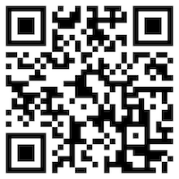
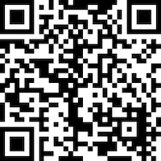
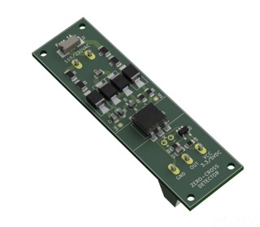

# YaSolR Pro

OSS and Pro firmware are the same, except that the Pro version relies on commercial (paid) libraries which cannot be put in OSS project, but offer a far better UI experience.
They also help provide some additional features linked to the UI such as PID tuning, better graphs, etc.

| Feature                    |                             OSS (Free)                             |      PRO (In Exchange of Sponsoring)       |
| -------------------------- | :----------------------------------------------------------------: | :----------------------------------------: |
| Dashboard                  |                         Overview **only**                          | Full Dashboard as seen in the screenshots  |
| Configuration              |                         Debug Config Page                          |             **From Dashboard**             |
| Energy Reset               |                                 ❌                                 |                     ✅                     |
| GPIO Config and Health     |                                 ❌                                 |                     ✅                     |
| Hardware Config and Health |                                 ❌                                 |                     ✅                     |
| Output Statistics          |                                 ❌                                 |                     ✅                     |
| PID Tuning View            |                                 ❌                                 |                     ✅                     |
| Web Console                | [WebSerial Lite](https://github.com/mathieucarbou/MycilaWebSerial) | [WebSerial Pro](https://www.webserial.pro) |
| Dashboard                  |       [ESP-DASH](https://github.com/ayushsharma82/ESP-DASH)        |    [ESP-DASH Pro](https://espdash.pro)     |

The money helps funding the hardware necessary to test and develop the firmware.

## How to get the Pro version

1. Get a **[Github](https://github.com/)** account so that I can add your GitHub username to the project repository from where you can download all the firmware files.

2. Make a donation of **25 euros (30$ USD) or more** through [Github](https://github.com/sponsors/mathieucarbou) or [Paypal](https://www.paypal.com/donate/?hosted_button_id=QJYRAPXGEDCNS).
   In exchange to any donation of 25 euros (30$ USD) or more to help support my work in Open-Source, I will give you access to the **Pro version and all the upcoming updates for an unlimited time**!

3. The advantage of sponsoring through Github is that it will be displayed in both our profiles.

| **[Using GitHub](https://github.com/sponsors/mathieucarbou)   (Preferred way)** | **[Using Paypal](https://www.paypal.com/donate/?hosted_button_id=QJYRAPXGEDCNS)** |
| :--------------------------------------------------------------------------------: | :-------------------------------------------------------------------------------: |
|                   |                  |

> ##### IMPORTANT
>
> - If you use Paypal, do not forget to add your GitHub username in the form (there will be a comment / note field for that).
>
{: .block-important }

Thanks a lot!

## Available Hardware

### Zero-cross Detection modules

I sometimes order batches of Zero-cross Detection modules from PCBWay for my testing and I have spare ones to resell at cost price.
If you are interested, please contact me.

Here are the availabilities below:

| **Module Picture (from author)**                                            | **Module Link**                                                                                                                                                                                                                            | **Price** | **Availability** |
| :-------------------------------------------------------------------------- | :----------------------------------------------------------------------------------------------------------------------------------------------------------------------------------------------------------------------------------------- | :-------: | :--------------: |
|  | [ZCD module from Daniel S.](https://www.pcbway.com/project/shareproject/Zero_Cross_Detector_a707a878.html) (no enclosure)                                                                                                                  |   10 €    |        18        |
|               | [ZCD module from Daniel S.](https://www.pcbway.com/project/shareproject/Zero_Cross_Detector_a707a878.html) (with DIN Rail enclosure)                                                                                                       |   15 €    |        12        |

You can read more about how important a good ZCD module is in the [Blog](blogs).
