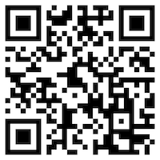
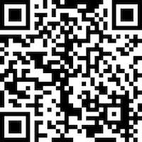
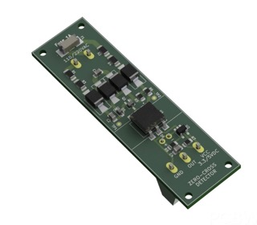
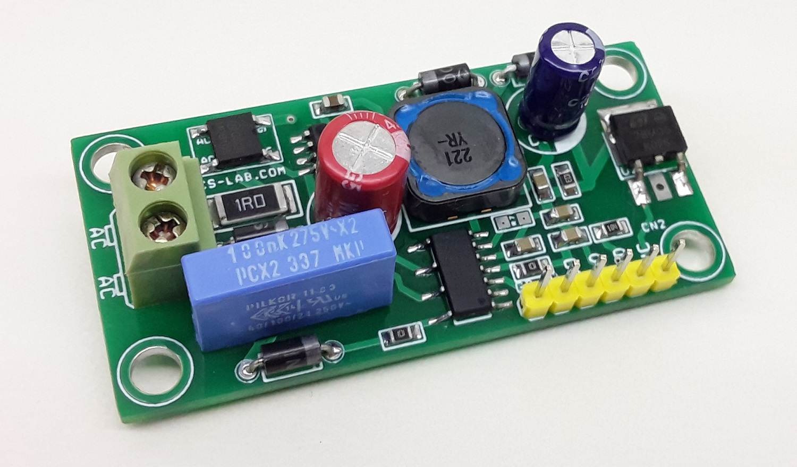

# YaSolR Pro

OSS and Pro firmware are the same, except that the Pro version relies on commercial (paid) libraries which cannot be put in OSS project.
They provide some additional features and a better dashboard.

**Access to all Pro version is given in exchange of a 20 euros sponsoring**.

The Pro version gives access to all the perks of the Pro version below:

| Feature                    |                             OSS (Free)                             |      PRO (In Exchange of Sponsoring)       |
| -------------------------- | :----------------------------------------------------------------: | :----------------------------------------: |
| Dashboard                  |                         Overview **only**                          | Full Dashboard as seen in the screenshots  |
| Configuration              |                         Debug Config Page                          |             **From Dashboard**             |
| Energy Reset               |                                 ❌                                 |                     ✅                     |
| GPIO Config and Health     |                                 ❌                                 |                     ✅                     |
| Hardware Config and Health |                                 ❌                                 |                     ✅                     |
| Output Statistics          |                                 ❌                                 |                     ✅                     |
| PID Tuning View            |                                 ❌                                 |                     ✅                     |
| Web Console                | [WebSerial Lite](https://github.com/mathieucarbou/MycilaWebSerial) | [WebSerial Pro](https://www.webserial.pro) |
| Dashboard                  |       [ESP-DASH](https://github.com/ayushsharma82/ESP-DASH)        |    [ESP-DASH Pro](https://espdash.pro)     |

The money helps funding the hardware necessary to test and develop the firmware.

## How to sponsor:

1. Get a **[Github](https://github.com/)** account so that I can add your GitHub username to the project repository from where you can download all the firmware files.

2. Make a donation of **20 euros or more** (through [Github](https://github.com/sponsors/mathieucarbou) or [Paypal](https://www.paypal.com/donate/?hosted_button_id=QJYRAPXGEDCNS)).
   Any donation of 20 euros or more will give access to the **Pro version and all the upcoming updates for an unlimited time**!

| **[Using GitHub](https://github.com/sponsors/mathieucarbou)   (Preferred way)** | **[Using Paypal](https://www.paypal.com/donate/?hosted_button_id=QJYRAPXGEDCNS)** |
| :--------------------------------------------------------------------------------: | :-------------------------------------------------------------------------------: |
|                   |                  |

> ##### IMPORTANT
>
> - Github is the preferred way to sponsor
>
> - If you prefer Paypal, do not forget to add your GitHub username in the Paypal form (there will be a comment / note field for that).
>
{: .block-important }

Thanks a lot!

# Available Hardware

## Zero-cross Detection modules

I sometimes order batches of Zero-cross Detection modules from PCbWay for my testing and I have spare ones to resell at cost price.
If you are interested, please contact me.

Here are the availabilities below:

| **Module Picture (from author)**                                            | **Module Link**                                                                                                                                                                                                                                                                                                                      | **Price** | **Availability** |
| :-------------------------------------------------------------------------- | :----------------------------------------------------------------------------------------------------------------------------------------------------------------------------------------------------------------------------------------------------------------------------------------------------------------------------------- | :-------: | :--------------: |
|  | [ZCD module from Daniel S.](https://www.pcbway.com/project/shareproject/Zero_Cross_Detector_a707a878.html) (no enclosure)                                                                                                                                                                                                            |   10 €    |        5         |
|               | [ZCD module from Daniel S.](https://www.pcbway.com/project/shareproject/Zero_Cross_Detector_a707a878.html) (with DIN Rail enclosure)                                                                                                                                                                                                 |   15 €    |        5         |
|             | [ZCD module from Rajkumar S](https://www.electronics-lab.com/project/ac-voltage-zero-cross-detector/) based on ROHM BM1Z102FJ dedicated Zero-Cross chip (no enclosure) and needs an [additional optocoupler](https://www.youtube.com/watch?v=1-9yDTj2IQw&lc=UgzWwX5jGTsKvb3e09t4AaABAg.9Vk7pMApNK39VmUSzBJooq) like TLP2630 or 6N136 |   25 €    |        7         |

The price difference accounts for the quality, accuracy and features of these ZCD modules (see the author's pages for more details).

You can read more about how important a good ZCD module is in the [Blog](blogs).

**Shipping fees are not included in the price.**
